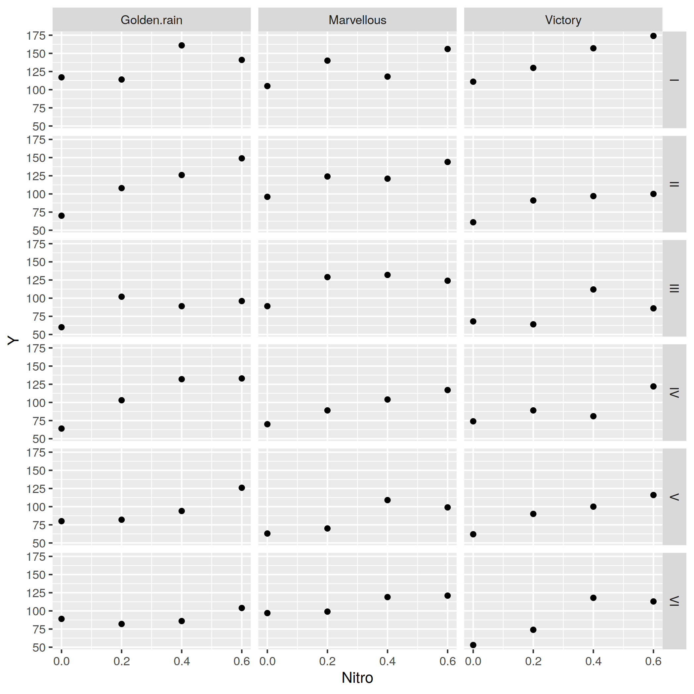

# ggplot2 via RCall {#ggplot2}

It's possible to use `ggplot2` via the functionality provided by the `RCall` package in Julia:


```julia
using RCall
using RDatasets
oats = dataset("MASS", "oats")
oats[:Nitro] = [parse(Float64, split(oats[:N][i], "c")[1]) for i=1:length(oats[:N])]
R"""library(ggplot2)"""
R"""p=ggplot($oats, aes(Nitro, Y))+facet_grid(B~V)+geom_point()"""
R"""ggsave("../Figures/ggplot_oats.png", p)"""
```


