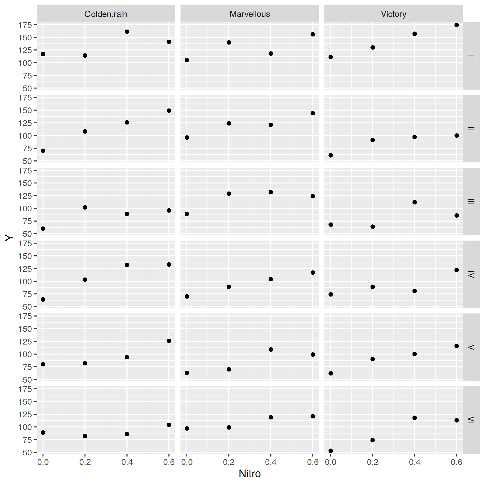

--- 
title: "Julia Notes"
subtitle: ""
author: "Samuele Carcagno"
date: "31/01/2020"

site: bookdown::bookdown_site
output: bookdown::gitbook
documentclass: memoir
classoption: twoside, article
fontsize: 14pt
bibliography: [refslong.bib]
link-citations: yes
github-repo: sam81/julia-notes
geometry: margin=2.5cm
always_allow_html: yes
description: "A test"
---
\pagestyle{bodypagestyle}


	
```{=latex}
\setlength{\parindent}{0pt}
\rule{\textwidth}{0.5mm}
```
Samuele Carcagno: <sam.carcagno@gmail.com>

This work is licensed under the Creative Commons Attribution 4.0 International License. To view a copy of this license, visit [http://creativecommons.org/licenses/by/4.0/](http://creativecommons.org/licenses/by/4.0/).

```{=latex}
\vspace{2em}
```

This document contains some notes on the Julia programming language [@BezansonEtAl2017]. The notes are sketchy and are written mainly for myself, but they may be useful to someone learning the language.

```{=latex}
\rule{\textwidth}{0.5mm}
\vspace{1cm}
% Trigger ToC creation in LaTeX
\begin{KeepFromToc}
  \tableofcontents
\end{KeepFromToc}
\setlength{\parindent}{2em}
```

<!--chapter:end:julia_notes.Rmd-->

# A simple introduction to Julia

It is customary to start a tutorial on a programming language by printing the phrase "Hello world!". We can do that from a julia terminal (also known as REPL, which stands for read–eval–print loop) using the `println` function:


```julia
println("Hello world!")
```

```
## Hello world!
```

but tipically we want to save our programs in a script for later execution. So suppose we have saved our `println("Hello world!")` command in a file called `test_julia.jl`. How do we execute the program? We can use the `include` function for this purpose:


```julia
include("test_julia.jl")
```
 If you're new to programming, it may be helpful to think of julia as a fancy calculator initially, and using it as such to familiarize yourself with it. For example you can perform simple arithmetic operations from the REPL:
 

```julia
5+7
```

```
## 12
```

you can also assign the results of operations to variables, for example:


```julia
x = 5+7
```

```
## 12
```

and use these variables for further operations, such as:


```julia
x/3
```

```
## 4.0
```

Of course julia is much more than just a fancy calculator, and hopefully this tutorial (which is very much of a work in progress, and therefore very patchy) will give and idea of what you can do with julia and how.

If you're new to julia you should be aware that the basic installation only provides a limited set of core functions. Additional functionality is provided by addon packages which need to be installed and initialized in order to be used. More detailed info on installing and managing packages is available in Section \@ref(packageManagement). For a quickstart, suppose that you want to compute the mean of a set of numbers. To do this you need to install the `StatsBase` package first, which provides statistical functions. You can do this with the following command:


```julia
Pkg.install("StatsBase")
```

to use the functions in the package you need to load it into your workspace with the `using` command:


```julia
using StatsBase
```

now you can use the `mean` function, for example:


```julia
mean([1,2,3])
```

```
## 2.0
```

Julia has taken a very modular approach splitting the core language functions from domain specific functions which are provided by add on packages. For example a base installation of julia does not have built in plotting functionality. For this you need to install one of the plotting packages. An overview of some of these packages is provided in other sections of this document: [Gadfly](#gadfly), [PyPlot](#pyplot), [VegaLite](#vegalite). You can also call R from julia, and so you can indirectly use `ggoplot2` from julia. This is illustrated in the [ggplot2](#ggplot2) section.

## Getting help

To get help on a function you can type the question mark (`?`) at the REPL, followed by the name of the function for which you seek help, for example to get help on the `println` function you can type:


```julia
?println
```


<!--chapter:end:simple_intro.Rmd-->

# Data Types

## A quick overview of the most common data types

Julia has a sophisticated type system, and a variety of built-in data types and structures. If you're totally new to programming you may want to learn the basics of how numbers are represented in computers (e.g. learn the difference between integers and floating point numbers) because a basic knowledge of these topics will be very useful, if not essential, when working with Julia. 

You can check the type of an object with the `typeof` function. For example:


```julia
typeof(3) ## this is an integer
```

```
## Int64
```


```julia
typeof(3.0) ## this is a floating point number
```

```
## Float64
```

You can convert easily between the two:


```julia
x = 3
```

```
## 3
```

```julia
x = float(x) ##convert to floating point number
```

```
## 3.0
```


```julia
x = 3.0
```

```
## 3.0
```

```julia
x = round(Int, x) #convert to an integer
```

```
## 3
```

Now that we've seen some numbers let's move on to strings:


```julia
s = "Hello" #this is a string
```

```
## "Hello"
```

```julia
z = "3" #and this is also a string
```

```
## "3"
```

we can convert `z` above to an integer or a floating point number with the `parse` function:


```julia
parse(Int, z) #convert into an integer
```

```
## 3
```

```julia
parse(Float64, z) #convert to a floating point number
```

```
## 3.0
```
One of the most useful data structures are arrays. Arrays are containers that can contain objects of different types. We can initialize arrays of numbers with the `zeros` function:


```julia
x = zeros(5)
```

```
## 5-element Array{Float64,1}:
##  0.0
##  0.0
##  0.0
##  0.0
##  0.0
```

by default this initializes an array of 64-bit floating point numbers, but we can specify a different type if we want to:


```julia
x = zeros(Int, 5) #array of integers
```

```
## 5-element Array{Int64,1}:
##  0
##  0
##  0
##  0
##  0
```

```julia
x = zeros(Float32, 5) #array of 32-bit floats
```

```
## 5-element Array{Float32,1}:
##  0.0
##  0.0
##  0.0
##  0.0
##  0.0
```

we can also intialize arrays with more than one dimension:


```julia
x = zeros(3,3) #3x3 matrix
```

```
## 3×3 Array{Float64,2}:
##  0.0  0.0  0.0
##  0.0  0.0  0.0
##  0.0  0.0  0.0
```

```julia
x = zeros(3,3,3) #3x3x3 array
```

```
## 3×3×3 Array{Float64,3}:
## [:, :, 1] =
##  0.0  0.0  0.0
##  0.0  0.0  0.0
##  0.0  0.0  0.0
## 
## [:, :, 2] =
##  0.0  0.0  0.0
##  0.0  0.0  0.0
##  0.0  0.0  0.0
## 
## [:, :, 3] =
##  0.0  0.0  0.0
##  0.0  0.0  0.0
##  0.0  0.0  0.0
```

Arrays can also contain strings:


```julia
x = ["a", "b", "c"]
```

```
## 3-element Array{String,1}:
##  "a"
##  "b"
##  "c"
```

or be miscellaneous collections of objects of `Any` type (similar to Python lists):


```julia
x = [1, "a", 3.0]
```

```
## 3-element Array{Any,1}:
##  1   
##   "a"
##  3.0
```

including other arrays:


```julia
x = [1, "a", 3.0, [1,2,3]]
```

```
## 4-element Array{Any,1}:
##  1         
##   "a"      
##  3.0       
##   [1, 2, 3]
```

Dictionaries, consisting of key-value pairs, constitute anothe very useful object. The key and the values can be of different types. For example:


```julia
myDict = Dict{String, Any}()
```

will initialize a dictionary with a string key, and a value that can be of any type:


```julia
myDict["a"] = 3
myDict["b"] = "hello"
```

### Arrays

Initializing vectors of a given type:


```julia
x = (Int)[] #integer
```

```
## 0-element Array{Int64,1}
```

```julia
y = (Real)[] #floating point
```

```
## 0-element Array{Real,1}
```

```julia
z = (String)[] # string
```

```
## 0-element Array{String,1}
```

you can then `push!` elements inside the vectors


```julia
push!(x, 3)
```

```
## 1-element Array{Int64,1}:
##  3
```

```julia
push!(y, 3.2)
```

```
## 1-element Array{Real,1}:
##  3.2
```

```julia
push!(z, "abc")
```

```
## 1-element Array{String,1}:
##  "abc"
```

### Dictionaries

Nested dictionaries:


```julia
mydict = Dict{String, Any}()
```

```
## Dict{String,Any} with 0 entries
```

```julia
mydict["nest1"] = Dict{String, Any}()
```

```
## Dict{String,Any} with 0 entries
```

```julia
mydict["nest1"]["nest2"] = [1,2,3]
```

```
## 3-element Array{Int64,1}:
##  1
##  2
##  3
```

<!--chapter:end:datatypes.Rmd-->

# Mutable and immutable objects

\BeginKnitrBlock{rmdwarning}<div class="rmdwarning">This topic can be somewhat mind-boggling! While I strive to write correct definitions and explanations, remember that these are simply my notes on using Julia, and I'm not an expert! So take my words and explanations with a grain of salt, 	and drop me an e-mail or fork these notes on github to fix them if you find errors.</div>\EndKnitrBlock{rmdwarning}
	

Objects in Julia can either be mutable or immutable, you can check whether
an object is immutable with the `isimmutable` function, for example, integers and
floating point numbers are immutable:


```julia
isimmutable(1)
```

```
## true
```


```julia
isimmutable(1.1)
```

```
## true
```

while arrays and dictionaries are mutable:


```julia
isimmutable([1,2,3])
```

```
## false
```


```julia
isimmutable(Dict("a" => 1, "b" => 2, "c" => 3))
```

```
## false
```

Immutable objects cannot be changed, while mutable objects can. Why is this important? Because they behave very differently. For example, suppose that you bind variable `a` to an immutable object:


```julia
a = 1
```

```
## 1
```

then you bind another variable, `b`, to `a`:


```julia
b = a
```

```
## 1
```

you can check that `a` and `b` are bound to the same object:


```julia
println(objectid(a))
```

```
## 11967854120867199718
```

```julia
println(objectid(b))
```

```
## 11967854120867199718
```

```julia
objectid(a) == objectid(b)
```

```
## true
```

now if you change the value of `a`, you're binding it to a new object, while `b` is still bound to the previous one:


```julia
a = 2
```

```
## 2
```

```julia
println(objectid(a))
```

```
## 5352850025288631388
```

```julia
println(b)
```

```
## 1
```

```julia
println(objectid(b))
```

```
## 11967854120867199718
```

so, `a` and `b` now have different values. So far so good, but what happens with variables bound to mutable objects? Let's try to bind `x` to an array, which is mutable, and then bind `y` to `x`:


```julia
x = [1,2,3]
```

```
## 3-element Array{Int64,1}:
##  1
##  2
##  3
```

```julia
y = x
```

```
## 3-element Array{Int64,1}:
##  1
##  2
##  3
```

```julia
println(objectid(x))
```

```
## 15596065500155535289
```

```julia
println(objectid(y))
```

```
## 15596065500155535289
```

now we change the value of the first element of `x`:


```julia
x[1] = 999
```

```
## 999
```

```julia
println(y)
```

```
## [999, 2, 3]
```

```julia
println(objectid(x))
```

```
## 15596065500155535289
```

```julia
println(objectid(y))
```

```
## 15596065500155535289
```

we can see that the first element of `y` has changed as well, and `x` and `y` are still bound to the same object. When we modify the value of the first element of `x` we're not binding `x` to a new object, we're modifying the old one, so `x` and `y` are still bound to the same object, and changing the value of the first element of `x` also changes the value of the first element of `y`. But watch out! If you do:


```julia
x = [1,2,3]
```

```
## 3-element Array{Int64,1}:
##  1
##  2
##  3
```

```julia
y = x
```

```
## 3-element Array{Int64,1}:
##  1
##  2
##  3
```

```julia
println(objectid(x))
```

```
## 7365922990070846502
```

```julia
println(objectid(y))
```

```
## 7365922990070846502
```

```julia
x = [999, 2, 3]
```

```
## 3-element Array{Int64,1}:
##  999
##    2
##    3
```

```julia
println(y)
```

```
## [1, 2, 3]
```

```julia
println(objectid(x))
```

```
## 12877331896388202487
```

```julia
println(objectid(y))
```

```
## 7365922990070846502
```

you're not modifying the mutable object to which `x` was bound, you're binding `x` to a totally new object! So `x` and `y` will be bound to different objects.

\BeginKnitrBlock{rmdtip}<div class="rmdtip">It may help to think of a mutable object as a container of items.</div>\EndKnitrBlock{rmdtip}
	
When you change an item in the container the binding of a variable to the container doesn't change, but if you change the container... the binding will change. Here's anothe example in which we change the container:


```julia
x = [1,2,3]
```

```
## 3-element Array{Int64,1}:
##  1
##  2
##  3
```

```julia
y = x
```

```
## 3-element Array{Int64,1}:
##  1
##  2
##  3
```

```julia
x = [1,2,3] #it looks the same but we're changing the container!
```

```
## 3-element Array{Int64,1}:
##  1
##  2
##  3
```

```julia
objectid(y) == objectid(x) #not the same object
```

```
## false
```

despite the fact that they have the same value:

```julia
x==y
```

```
## true
```

All this may seem abstract and, and may seem to be touching edge cases, but it has important consequences. One of these is that if you pass a mutable object to a function as an argument, and you modify that object inside the function, the object will be modified even though you may not explicitly return it. For example, suppose that we write a function to sum two arrays, and in case the first array is longer than the second one we remove elements from it until their length matches:


```julia
function foo(x,y)
    while length(x) > length(y)
        pop!(x)
    end
    z = x+y
    return z
end    
```

note that the function does not explicitly return `x`, but will nontheless modify it. Now let's call the function with the following arguments:


```julia
x = [1,1,1,1];
y = [2,2];
z = foo(x, y)
```

```
## 2-element Array{Int64,1}:
##  3
##  3
```

we get the value of `z` which we explicitly returned, but if we check what value now `x` has:


```julia
x
```

```
## 2-element Array{Int64,1}:
##  1
##  1
```

we can see that it has been modified as well. This doesn't happen with immutable objects. Let's check it with another very contrived example:


```julia
function foo(x,y)
    while x > y
        x = x-1
    end
    z = x+y
    return z
end    
```


```julia
x = 8; y=3;
foo(x, y)
```

```
## 6
```

the function returns the expected value, and if we check what's the value of `x`:


```julia
x
```

```
## 8
```

we can see that it has not changed. That's because `x` is bound to an immutable object in this case, and the variable `x` inside the function is in a different scope from the variable `x` outside the function.

\BeginKnitrBlock{rmdimportant}<div class="rmdimportant">The moral of the story above is: Watch out when you pass mutable objects as function arguments!</div>\EndKnitrBlock{rmdimportant}
	
Another important side effect of the difference between mutable and immutable objects involves the local scope introduced by certain code blocks, such as `for` loops. Variables from the global scope are available for reading in the local scope, but not for writing. So for example the `x` in the `for` loop below will be bound to a new object in the local scope of the loop:


```julia
x = 0;
for i=1:3
    x = i
    println(x)
end
```

```
## 1
## 2
## 3
```

we can check that the `x` in the global scope has not been modified:


```julia
x
```

```
## 0
```

But if `x` is a mutable object, and we modify one of its elements inside the loop:


```julia
x = [0,0,0];
for i=1:3
    x[2] = i
    println(x)
end
```

```
## [0, 1, 0]
## [0, 2, 0]
## [0, 3, 0]
```

this will be reflected in the global scope:


```julia
x
```

```
## 3-element Array{Int64,1}:
##  0
##  3
##  0
```

<!--chapter:end:mutable_immutable.Rmd-->

# Installing and managing packages {#packageManagement}

There are two ways of installing and managing packages in Julia. One is through functions at the Julia REPL, the other is through the *package manager REPL*. For example, to install the `Gadfly` package from the Julia REPL you can use the `Pkg.add` function:


```julia
Pkg.add("Gadfly")
```

to do the same from the package manager REPL you need to first access the package manager REPL by typing `]` in the Julia REPL. Once you've entered the package manager REPL, which should show `pkg>` in the prompt, you can install a package using the `add` command:


```julia
add Gadfly
```

Passing the name of the package to install, as shown in the examples above works for packages registered in the Julia package database. If you want to install unregistered packages that are available on GitHub or other git repositories you need to pass the git URL of the package that you want to install. For example, you can install the [SndLib.jl](https://github.com/sam81/SndLib.jl) package from the Julia REPL as follows:


```julia
Pkg.add("git@github.com:sam81/SndLib.jl.git")
```

To update your packages to their latest version you can use the `Pkg.update()` command from the julia REPL, or the `up` command from the package manager REPL.

To remove a package you can use the `Pkg.rm("packageName")` command from the Julia REPL, or the `rm packageName` command from the package manager REPL.

<!--chapter:end:installing_packages.Rmd-->

# DataFrames

In Julia dataframes are handled by an addon package. It can be installed with:

```julia
Pkg.add("DataFrames")
```
it's very likely that you will want to read and write dataframes as CSV files at some stage. This functionality is provided by the `CSV.jl` package, so you should install it as well:

```julia
Pkg.add("CSV")
```
to use the `DataFrames` and `CSV` packages you need to load them:

```julia
using CSV
using DataFrames
```
	
For the examples we'll use the `iris` dataset from the `RDatasets` package, so
we'll need to install it first if it's not already installed:
      

```julia
Pkg.add("RDatasets")
```
we can now load it and load the `iris` dataset:
   

```julia
using RDatasets
iris = dataset("datasets", "iris")
```

```
## 150×5 DataFrame
## │ Row │ SepalLength │ SepalWidth │ PetalLength │ PetalWidth │ Species      │
## │     │ Float64     │ Float64    │ Float64     │ Float64    │ Categorical… │
## ├─────┼─────────────┼────────────┼─────────────┼────────────┼──────────────┤
## │ 1   │ 5.1         │ 3.5        │ 1.4         │ 0.2        │ setosa       │
## │ 2   │ 4.9         │ 3.0        │ 1.4         │ 0.2        │ setosa       │
## │ 3   │ 4.7         │ 3.2        │ 1.3         │ 0.2        │ setosa       │
## │ 4   │ 4.6         │ 3.1        │ 1.5         │ 0.2        │ setosa       │
## │ 5   │ 5.0         │ 3.6        │ 1.4         │ 0.2        │ setosa       │
## │ 6   │ 5.4         │ 3.9        │ 1.7         │ 0.4        │ setosa       │
## │ 7   │ 4.6         │ 3.4        │ 1.4         │ 0.3        │ setosa       │
## ⋮
## │ 143 │ 5.8         │ 2.7        │ 5.1         │ 1.9        │ virginica    │
## │ 144 │ 6.8         │ 3.2        │ 5.9         │ 2.3        │ virginica    │
## │ 145 │ 6.7         │ 3.3        │ 5.7         │ 2.5        │ virginica    │
## │ 146 │ 6.7         │ 3.0        │ 5.2         │ 2.3        │ virginica    │
## │ 147 │ 6.3         │ 2.5        │ 5.0         │ 1.9        │ virginica    │
## │ 148 │ 6.5         │ 3.0        │ 5.2         │ 2.0        │ virginica    │
## │ 149 │ 6.2         │ 3.4        │ 5.4         │ 2.3        │ virginica    │
## │ 150 │ 5.9         │ 3.0        │ 5.1         │ 1.8        │ virginica    │
```
	
let's create a numeric vector and a string vector of the same length, and then put them in a dataframe:


```julia
y = rand(10)
```

```
## 10-element Array{Float64,1}:
##  0.35980655374348225
##  0.30914613783299005
##  0.7305710415910236 
##  0.28772472645844993
##  0.7304237025238804 
##  0.8263018940027678 
##  0.3042506763452575 
##  0.7658358345495233 
##  0.4057944014256023 
##  0.8265083273898153
```

```julia
cnd = [["a" for i=1:5]; ["b" for i=1:5]]
```

```
## 10-element Array{String,1}:
##  "a"
##  "a"
##  "a"
##  "a"
##  "a"
##  "b"
##  "b"
##  "b"
##  "b"
##  "b"
```

```julia
resFrame =  DataFrame(y=y, cnd=cnd)
```

```
## 10×2 DataFrame
## │ Row │ y        │ cnd    │
## │     │ Float64  │ String │
## ├─────┼──────────┼────────┤
## │ 1   │ 0.359807 │ a      │
## │ 2   │ 0.309146 │ a      │
## │ 3   │ 0.730571 │ a      │
## │ 4   │ 0.287725 │ a      │
## │ 5   │ 0.730424 │ a      │
## │ 6   │ 0.826302 │ b      │
## │ 7   │ 0.304251 │ b      │
## │ 8   │ 0.765836 │ b      │
## │ 9   │ 0.405794 │ b      │
## │ 10  │ 0.826508 │ b      │
```

to access the columns of a dataframe use the following syntax:


```julia
resFrame[!,:y] #retrieves the column named `y`
resFrame[!,:cnd] #retrieves the column named `cnd`
```

note that `:y` or `:cnd` are *Symbols*:


```julia
typeof(:y)
```

```
## Symbol
```

sometimes it is necessary to access the column of a dataframe using a string. You can do so by converting a string to a symbol:


```julia
resFrame[!,Symbol("y")]
```

you can also retrieve a column by its column number


```julia
resFrame[!,1]
```

to write a dataframe to a text of CSV file, use:


```julia
CSV.write("dataframe.csv", resFrame)
```

it is also possible to specify a separator, note that the separator character must be enclosed by
single ticks `''`:


```julia
CSV.write("dataframe.csv", resFrame, delim=';')
```

To read a dataframe from a text file, use:

```julia
dat = CSV.read("dataframe.csv", delim=';')
```


### Displaying data on screen

To show the first few rows of a dataframe on screen you can use the `first`
function, which takes as arguments the name of the dataframe and the number of
rows that you want to show:
     	 

```julia
first(iris, 4)
```

```
## 4×5 DataFrame
## │ Row │ SepalLength │ SepalWidth │ PetalLength │ PetalWidth │ Species      │
## │     │ Float64     │ Float64    │ Float64     │ Float64    │ Categorical… │
## ├─────┼─────────────┼────────────┼─────────────┼────────────┼──────────────┤
## │ 1   │ 5.1         │ 3.5        │ 1.4         │ 0.2        │ setosa       │
## │ 2   │ 4.9         │ 3.0        │ 1.4         │ 0.2        │ setosa       │
## │ 3   │ 4.7         │ 3.2        │ 1.3         │ 0.2        │ setosa       │
## │ 4   │ 4.6         │ 3.1        │ 1.5         │ 0.2        │ setosa       │
```

similarly to show the last few columns you can use the `last` command:
	  

```julia
last(iris, 4)
```

```
## 4×5 DataFrame
## │ Row │ SepalLength │ SepalWidth │ PetalLength │ PetalWidth │ Species      │
## │     │ Float64     │ Float64    │ Float64     │ Float64    │ Categorical… │
## ├─────┼─────────────┼────────────┼─────────────┼────────────┼──────────────┤
## │ 1   │ 6.3         │ 2.5        │ 5.0         │ 1.9        │ virginica    │
## │ 2   │ 6.5         │ 3.0        │ 5.2         │ 2.0        │ virginica    │
## │ 3   │ 6.2         │ 3.4        │ 5.4         │ 2.3        │ virginica    │
## │ 4   │ 5.9         │ 3.0        │ 5.1         │ 1.8        │ virginica    │
```

If you have a dataframe with too many columns to fit the screen some will be truncated. To get around this you can use:
   

```julia
##create dataframe with lost of columns
df = DataFrame((Symbol('a' + i) => rand(10) for i in 0:100)...)
show(df, allcols=true)
```
		  
## Selecting rows

We've already seen how we can select a given column of a dataframe. Selecting
rows of a dataframe on the basis of one or more conditions is another fundamental
operation. The following command returns a boolean vector indicating whether 
each element in the `Species` column of the iris datasets is "setosa" or not:


```julia
idx = iris[!,:Species] .== "setosa"
```

```
## 150-element BitArray{1}:
##  1
##  1
##  1
##  1
##  1
##  1
##  1
##  1
##  1
##  1
##  ⋮
##  0
##  0
##  0
##  0
##  0
##  0
##  0
##  0
##  0
```

we can use this vector to select the corresponding rows of the dataframe:
   	

```julia
iris[idx, :];
```

or more succintly we could achieve the same result with a single command:
   

```julia
iris[(iris[!,:Species] .== "setosa"), :];
```

we can also setect rows on the basis of multiple conditions, for example
only the ones for the setosa specimens with a petal length greater than 1.5:
     	

```julia
iris[(iris[!,:Species] .== "setosa") .& (iris[!,:PetalLength] .> 1.5), :]	    
```

```
## 13×5 DataFrame
## │ Row │ SepalLength │ SepalWidth │ PetalLength │ PetalWidth │ Species      │
## │     │ Float64     │ Float64    │ Float64     │ Float64    │ Categorical… │
## ├─────┼─────────────┼────────────┼─────────────┼────────────┼──────────────┤
## │ 1   │ 5.4         │ 3.9        │ 1.7         │ 0.4        │ setosa       │
## │ 2   │ 4.8         │ 3.4        │ 1.6         │ 0.2        │ setosa       │
## │ 3   │ 5.7         │ 3.8        │ 1.7         │ 0.3        │ setosa       │
## │ 4   │ 5.4         │ 3.4        │ 1.7         │ 0.2        │ setosa       │
## │ 5   │ 5.1         │ 3.3        │ 1.7         │ 0.5        │ setosa       │
## │ 6   │ 4.8         │ 3.4        │ 1.9         │ 0.2        │ setosa       │
## │ 7   │ 5.0         │ 3.0        │ 1.6         │ 0.2        │ setosa       │
## │ 8   │ 5.0         │ 3.4        │ 1.6         │ 0.4        │ setosa       │
## │ 9   │ 4.7         │ 3.2        │ 1.6         │ 0.2        │ setosa       │
## │ 10  │ 4.8         │ 3.1        │ 1.6         │ 0.2        │ setosa       │
## │ 11  │ 5.0         │ 3.5        │ 1.6         │ 0.6        │ setosa       │
## │ 12  │ 5.1         │ 3.8        │ 1.9         │ 0.4        │ setosa       │
## │ 13  │ 5.1         │ 3.8        │ 1.6         │ 0.2        │ setosa       │
```

The `DataFramesMeta` package also provides convenient functions for selecting rows
of a dataframes on the basis of one or more conditions.


```julia
using DataFramesMeta
@where(iris, :Species .== "setosa")
```

```
## 50×5 DataFrame
## │ Row │ SepalLength │ SepalWidth │ PetalLength │ PetalWidth │ Species      │
## │     │ Float64     │ Float64    │ Float64     │ Float64    │ Categorical… │
## ├─────┼─────────────┼────────────┼─────────────┼────────────┼──────────────┤
## │ 1   │ 5.1         │ 3.5        │ 1.4         │ 0.2        │ setosa       │
## │ 2   │ 4.9         │ 3.0        │ 1.4         │ 0.2        │ setosa       │
## │ 3   │ 4.7         │ 3.2        │ 1.3         │ 0.2        │ setosa       │
## │ 4   │ 4.6         │ 3.1        │ 1.5         │ 0.2        │ setosa       │
## │ 5   │ 5.0         │ 3.6        │ 1.4         │ 0.2        │ setosa       │
## │ 6   │ 5.4         │ 3.9        │ 1.7         │ 0.4        │ setosa       │
## │ 7   │ 4.6         │ 3.4        │ 1.4         │ 0.3        │ setosa       │
## ⋮
## │ 43  │ 4.4         │ 3.2        │ 1.3         │ 0.2        │ setosa       │
## │ 44  │ 5.0         │ 3.5        │ 1.6         │ 0.6        │ setosa       │
## │ 45  │ 5.1         │ 3.8        │ 1.9         │ 0.4        │ setosa       │
## │ 46  │ 4.8         │ 3.0        │ 1.4         │ 0.3        │ setosa       │
## │ 47  │ 5.1         │ 3.8        │ 1.6         │ 0.2        │ setosa       │
## │ 48  │ 4.6         │ 3.2        │ 1.4         │ 0.2        │ setosa       │
## │ 49  │ 5.3         │ 3.7        │ 1.5         │ 0.2        │ setosa       │
## │ 50  │ 5.0         │ 3.3        │ 1.4         │ 0.2        │ setosa       │
```
	

```julia
@where(iris, :Species .== "setosa", :PetalLength .> 1.5)
```

```
## 13×5 DataFrame
## │ Row │ SepalLength │ SepalWidth │ PetalLength │ PetalWidth │ Species      │
## │     │ Float64     │ Float64    │ Float64     │ Float64    │ Categorical… │
## ├─────┼─────────────┼────────────┼─────────────┼────────────┼──────────────┤
## │ 1   │ 5.4         │ 3.9        │ 1.7         │ 0.4        │ setosa       │
## │ 2   │ 4.8         │ 3.4        │ 1.6         │ 0.2        │ setosa       │
## │ 3   │ 5.7         │ 3.8        │ 1.7         │ 0.3        │ setosa       │
## │ 4   │ 5.4         │ 3.4        │ 1.7         │ 0.2        │ setosa       │
## │ 5   │ 5.1         │ 3.3        │ 1.7         │ 0.5        │ setosa       │
## │ 6   │ 4.8         │ 3.4        │ 1.9         │ 0.2        │ setosa       │
## │ 7   │ 5.0         │ 3.0        │ 1.6         │ 0.2        │ setosa       │
## │ 8   │ 5.0         │ 3.4        │ 1.6         │ 0.4        │ setosa       │
## │ 9   │ 4.7         │ 3.2        │ 1.6         │ 0.2        │ setosa       │
## │ 10  │ 4.8         │ 3.1        │ 1.6         │ 0.2        │ setosa       │
## │ 11  │ 5.0         │ 3.5        │ 1.6         │ 0.6        │ setosa       │
## │ 12  │ 5.1         │ 3.8        │ 1.9         │ 0.4        │ setosa       │
## │ 13  │ 5.1         │ 3.8        │ 1.6         │ 0.2        │ setosa       │
```

### Summarizing data

Summarizing data with the functions providing in the `DataFrames` package is
somwhat verbose:	   
	    

```julia
using Statistics	
summIris = by(iris, [:Species], df -> DataFrame(meanPetalWidth=mean(df[!,:PetalWidth])))
```

```
## 3×2 DataFrame
## │ Row │ Species      │ meanPetalWidth │
## │     │ Categorical… │ Float64        │
## ├─────┼──────────────┼────────────────┤
## │ 1   │ setosa       │ 0.246          │
## │ 2   │ versicolor   │ 1.326          │
## │ 3   │ virginica    │ 2.026          │
```
	
using the macros in `DataFramesMeta` is much better


```julia
summIris = @linq iris |> groupby(:Species) |> based_on(x = mean(:PetalWidth))
```

```
## 3×2 DataFrame
## │ Row │ Species      │ x       │
## │     │ Categorical… │ Float64 │
## ├─────┼──────────────┼─────────┤
## │ 1   │ setosa       │ 0.246   │
## │ 2   │ versicolor   │ 1.326   │
## │ 3   │ virginica    │ 2.026   │
```

there are slightly different ways of achieving the same result:


```julia
@linq iris |> by(:Species, x=mean(:SepalWidth))
```

```
## 3×2 DataFrame
## │ Row │ Species      │ x       │
## │     │ Categorical… │ Float64 │
## ├─────┼──────────────┼─────────┤
## │ 1   │ setosa       │ 3.428   │
## │ 2   │ versicolor   │ 2.77    │
## │ 3   │ virginica    │ 2.974   │
```
	  	
or:
		

```julia
@based_on(groupby(iris, :Species), x=mean(:PetalWidth))		 	
```

```
## 3×2 DataFrame
## │ Row │ Species      │ x       │
## │     │ Categorical… │ Float64 │
## ├─────┼──────────────┼─────────┤
## │ 1   │ setosa       │ 0.246   │
## │ 2   │ versicolor   │ 1.326   │
## │ 3   │ virginica    │ 2.026   │
```
		

<!--chapter:end:dataframes.Rmd-->

# Random Numbers and Sampling

One of the fundamental functions to generate random number and random sampling in Julia is `rand`. This function picks random elements from a collection of items. If the function is called without arguments it will generate a random 64-bit floating point number between 0 and 1 because that is the default collection:


```julia
rand()
```

```
## 0.4023878488048531
```

to generate a random integer between say 1 and 100 we need to pass that collection as an argument:


```julia
rand(1:100)
```

```
## 85
```

the collection to sample from could be something different than numbers. For example we can generate a sequence of letters and sample from it:


```julia
lettersSeq = ["a", "b", "c", "d"];
rand(lettersSeq)
```

```
## "a"
```

to generate more than one element we need to specify the dimensions of the vector or matrix of elements that we want to generate:


```julia
#generate a 10-elements vector of
#random integers between 1 and 100
rand(1:100, 10)
```

```
## 10-element Array{Int64,1}:
##  84
##  58
##  89
##  82
##  32
##  14
##  85
##  26
##  72
##  61
```

```julia
#generate a 2x5 matrix of
#random integers between 1 and 100
rand(1:100, 2, 5) 
```

```
## 2×5 Array{Int64,2}:
##  95  13   6  83  57
##  93  79  80  76  81
```

note that sampling is done with replacement:

```julia
rand(["a", "b", "c", "d"], 4)
```

```
## 4-element Array{String,1}:
##  "d"
##  "b"
##  "c"
##  "b"
```

```julia
rand(["a", "b", "c", "d"], 10)
```

```
## 10-element Array{String,1}:
##  "a"
##  "d"
##  "b"
##  "a"
##  "c"
##  "b"
##  "c"
##  "d"
##  "c"
##  "d"
```

the [StatsBase.jl](https://github.com/JuliaStats/StatsBase.jl) package provides convenient functions to sample with or without replacement. For example, to sample without replacement:


```julia
using StatsBase
sample(["a", "b", "c", "d"], 4, replace=false)
```

```
## 4-element Array{String,1}:
##  "b"
##  "d"
##  "c"
##  "a"
```

	
## Setting the random seed

It is sometimes desirable that a call to a random number generator actually generates the same "random" sequence each time it is called at a specific point in a script (e.g. to make an example reproducible). To achieve this it is necessary to explicitly initialize the random number generator with a ["seed"](https://en.wikipedia.org/wiki/Random_seed). In julia this can be done with the `Random.seed!` function in the standard library package `Random`:
   

```julia
import Random
Random.seed!(375)
```

## Working with distributions

The `Distributions.jl` package provides functions to sample from various distributions. For example, to sample from a normal distribution with mean=10, and sd=2, we first instantiate it:


```julia
using Distributions
d = Normal(10, 2)
```

```
## Normal{Float64}(μ=10.0, σ=2.0)
```

then we sample from it with `rand`:


```julia
rand(d, 10)
```

```
## 10-element Array{Float64,1}:
##  13.097676249974274
##  11.757335823480798
##  12.237501126505748
##  13.168175635876224
##  11.14411361628477 
##  10.67240877975671 
##  10.150159377468727
##   5.931032863139524
##  11.139710601976821
##  11.021572604999648
```

we would do the same more succintly with:


```julia
rand(Normal(10,2), 10)
```

To sample from a uniform distribution:


```julia
rand(Uniform(20, 30), 5)
```

```
## 5-element Array{Float64,1}:
##  24.767443081616506
##  26.203224039053918
##  23.73620344244641 
##  29.20225681258401 
##  21.679924712717167
```

<!--chapter:end:random.Rmd-->

# Workflow

## Environment customization

You can customize your Julia environment by inserting code in the `startup.jl` file located in `~.julia/config/` (create both the directory tree and the file if they don't yet exist in your system), which is run each time Julia starts up. You could use this to load packages that you use frequently, define functions or set variables that you use often in your interactive sessions. Below is an example of a `startup.jl` file:


```julia
push!(LOAD_PATH, "/path/to/my/modules/")
using Pkg
```

the first line appends the directory path to local modules to the `LOAD_PATH` environment variable, so that they can be loaded if needed. The second line loads the `Pkg` module, something that may be useful if you frequently install/update packages on your system and find it annoying to load the module manually each time.

<!--chapter:end:workflow.Rmd-->

# PlotlyJS {#plotlyJS}


[PlotlyJS.jl](https://github.com/sglyon/PlotlyJS.jl) is a Julia package generate interactive html figures. The figures can be saved to disk either as html pages, or in a variety of formats (pdf, png, etc...) through the [ORCA.jl](https://github.com/sglyon/ORCA.jl) package.

\BeginKnitrBlock{rmdnote}<div class="rmdnote">The figures shown in the html version of this document will not have interactive features because they've been saved as png files.</div>\EndKnitrBlock{rmdnote}
	
PlotlyJS can display plots in a window either through [ElectronDisplay.jl](https://github.com/queryverse/ElectronDisplay.jl), or through [Blink.jl](https://github.com/JunoLab/Blink.jl). In sum, for a full setup you may want to install the following three packages:


```julia
Pkg.add(["PlotlyJS", "ElectronDisplay", "ORCA"])
```

and then load them with:


```julia
using PlotlyJS
using ORCA
#using ElectronDisplay
```

there are some convenience methods that allow you to quickly plot a line plot or a scatter plot. For example:


```julia
x = collect(0:0.1:2*pi);
p = plot(x, sin.(x)); #line plot from two arrays
```


for a scatterplot:


```julia
x = rand(10); y=rand(10);
p = plot(x, y, mode="markers", marker_color="black"); #line plot from two arrays
```


however, generally you will have to use a slightly more verbose syntax to fully leverage the features of plotlyJS. In particular, you need to pass two arguments to the `plot` command. The first consists of one or more *traces*, and the second one of a *layout* specification. With this syntax you can generate a line plot as follows:


```julia
x = collect(0:0.1:2*pi);
s1 = scatter(;x=x, y=cos.(x));
ly = Layout(;title="cosine", xaxis_title="x axis", yaxis_title="y axis");
p = plot([s1], ly);
```


you can add more than one trace to a plot:


```julia
s2 = scatter(;x=x, y=sin.(x));
ly = Layout(;title="sine & cosine", xaxis_title="x axis", yaxis_title="y axis");
p = plot([s1,s2], ly);
```


you can tweak several aspects of the plots. We'll start with changing some of the default options that I don't really like. For example, the default option when hovering with the mouse on the plot is set to `compare`, which may be useful to compare two traces, but I find generally less useful than the other option, which is to show the values of the closest data point. You can change this by passing an option in the layout:


```julia
ly = Layout(;title="sine & cosine", xaxis_title="x axis",
            yaxis_title="y axis",
            hovermode="closest");
```

another default that I tipically change is removing the line intercepting the y axis at zero, again you can do that from the call to `Layout`:


```julia
ly = Layout(;title="sine & cosine", xaxis_title="x axis",
            yaxis_title="y axis",
            hovermode="closest",
            yaxis_zeroline=false);
```

I also find it useful to have a line at the edge of both the x, and y axes, you can set this with `xaxis_showline` and `yaxis_showline`:


```julia
ly = Layout(;title="sine & cosine", xaxis_title="x axis",
            yaxis_title="y axis",
            hovermode="closest",
            yaxis_zeroline=false,
            xaxis_showline=true,
            yaxis_showline=true);
```

<!--chapter:end:plotlyJS.Rmd-->

# Gadfly {#gadfly}


```julia
using Gadfly

x = collect(0:0.1:2*pi)
plot(x=x, y=sin.(x), Geom.line,
     Guide.xlabel("Angle (radians)"), Guide.ylabel("Amplitude"));
```


```julia
using RDatasets
iris = dataset("datasets", "iris")
plot(iris, x="SepalLength", y="SepalWidth", color="Species", Geom.point);
```

Facets:


```julia
plot(iris, xgroup="Species", x="SepalLength", y="SepalWidth", Geom.subplot_grid(Geom.point));
```


```julia
oats = dataset("MASS", "oats")
oats[:Nitro] = [parse(Float64, split(oats[:N][i], "c")[1]) for i=1:length(oats[:N])]
set_default_plot_size(16cm, 16cm)
plot(oats, xgroup="V", ygroup="B", x="Nitro", y="Y", Geom.subplot_grid(Geom.point, Geom.line), Guide.xlabel("Nitro by Variety"), Guide.ylabel("Yeld By Block"));
```

<!--chapter:end:gadfly.Rmd-->

# ggplot2 via RCall {#ggplot2}

It's possible to use `ggplot2` via the functionality provided by the `RCall` package in Julia:


```julia
using RCall
using RDatasets
oats = dataset("MASS", "oats")
oats[:Nitro] = [parse(Float64, split(oats[:N][i], "c")[1]) for i=1:length(oats[:N])]
R"""library(ggplot2)"""
R"""p=ggplot($oats, aes(Nitro, Y))+facet_grid(B~V)+geom_point()"""
R"""ggsave("../Figures/ggplot_oats.png", p)"""
```



<!--chapter:end:ggplot2.Rmd-->

# Vegalite {#vegalite}


[VegaLite.jl](https://github.com/fredo-dedup/VegaLite.jl) is a plotting package for Julia based on [Vega-Lite](https://vega.github.io/vega-lite/). Its two most notable features are that 1) it is based on a grammar of graphics, like the `ggplot2` R package; 2) it produces interactive html graphics (but they can also be saved on disk in other static formats such as pdf or png).

Using Vegalite.jl feels a lot like using `ggplot2`, so users of `ggplot2` in R will feel right at home.


```julia
using VegaLite
using RDatasets
iris = dataset("datasets", "iris")

p = iris |> @vlplot(:point,
                    x=:SepalLength,
                    y=:SepalWidth,
                    color=:Species,
                    width=250,
                    height=250
                    )
```


Note that you may need to either call `p` or `p |> display` to show the plot. Depending on whether you're using the terminal or a IDE the plot may open up in a browser window. The [ElectronDisplay.jl](https://github.com/queryverse/ElectronDisplay.jl) package provides a convenient plotting window that can show VegaLite plots.


Now that we have this first plot, let's make a few tweaks it to improve its appearance. Currently by the default when you hover with the mouse on the points nothing happens, but you can enable tooltips as follows:


```julia
p = iris |> @vlplot(:point,
                    x=:SepalLength,
                    y=:SepalWidth,
                    color=:Species,
                    width=400,
                    height=400,
                    tooltip=[{field="SepalLength"}, {field="SepalWidth"}]
                    )
```

By default, the axes start from zero. If you do not want the axes to start from zero you need to specify this as follows:


```julia
p = iris |> @vlplot(:point,
                           x={:SepalLength, scale={zero=false}},
                           y={:SepalWidth, scale={zero=false}},
                           color=:Species,
                           width=400,
                           height=400,
                           tooltip=[{field="SepalLength"}, {field="SepalWidth"}]
                           )
```

We can add prettier labels to the x and y axis as follows:


```julia
p = iris |> @vlplot(:point,
                           x={:SepalLength, 
                              scale={zero=false},
                              axis={title="Sepal Length (cm)"}},
                           y={:SepalWidth, 
                              scale={zero=false},
                              axis={title="Sepal Width (cm)"}},
                           color=:Species,
                           width=400,
                           height=400,
                           tooltip=[{field="SepalLength"}, {field="SepalWidth"}]
                           )
```

We can remove the grid as well:


```julia
p = iris |> @vlplot(:point,
                           x={:SepalLength, 
                              scale={zero=false},
                              axis={title="Sepal Length (cm)",
                                    grid=false}
                             },
                           y={:SepalWidth, 
                              scale={zero=false},
                              axis={title="Sepal Width (cm)",
                              grid=false}
                             },
                           color=:Species,
                           width=400,
                           height=400,
                           tooltip=[{field="SepalLength"}, {field="SepalWidth"}]
                           )
```


## Faceting


```julia
oats = dataset("MASS", "oats")
oats[:Nitro] = [parse(Float64, split(oats[:N][i], "c")[1]) for i=1:length(oats[:N])]

p = oats |> @vlplot(:point,
                    x=:Nitro,
                    y=:Y,
                    row=:B,
                    column=:V)
```


<!--chapter:end:vegalite.Rmd-->

# PyPlot (matplotlib) {#pyplot}


```julia
using PyCall
using PyPlot
x = collect(0:0.1:2*pi)
plot(x, sin.(x))
```


### Saving multiple plots in one pdf with PyPlot


```julia
backend_pdf = pyimport("matplotlib.backends.backend_pdf")

pdf_pages = backend_pdf.PdfPages("multipage_pdf.pdf")
x = collect(0:0.1:2*pi)
plot(x, sin.(x))
savefig(pdf_pages, format="pdf")
close()
plot(x, cos.(x))
savefig(pdf_pages, format="pdf")
close()
pdf_pages.close()
```

<!--chapter:end:pyplot.Rmd-->

# Parallel Processing

The BLAS library automatically makes use of multiple cores in your machine. You can tell it how many threads to use with the `BLAS.set_num_threads` function in `LinearAlgebra`:


```julia
using LinearAlgebra
BLAS.set_num_threads(8)
```


<!--chapter:end:parallel_processing.Rmd-->

# Generating packages 

To generate an empty package skeleton use:


```julia
Pkg.generate("packageName")
```

or `generate packageName` from the package manager shell.

<!--chapter:end:generating_packages.Rmd-->

# Working with sound

Julia has fairly good support for working with sound. The [WAV.jl](https://github.com/dancasimiro/WAV.jl) package can be used to read and write WAV files. The [DSP.jl](https://github.com/JuliaDSP/DSP.jl) package provides functions for digital signal processing. My [SndLib.jl](https://github.com/sam81/SndLib.jl) package provides functions to synthesize and process various sounds commonly used in psychoacoustic experiments.

<!--chapter:end:sound.Rmd-->

# References {-}

<!--chapter:end:references.Rmd-->

