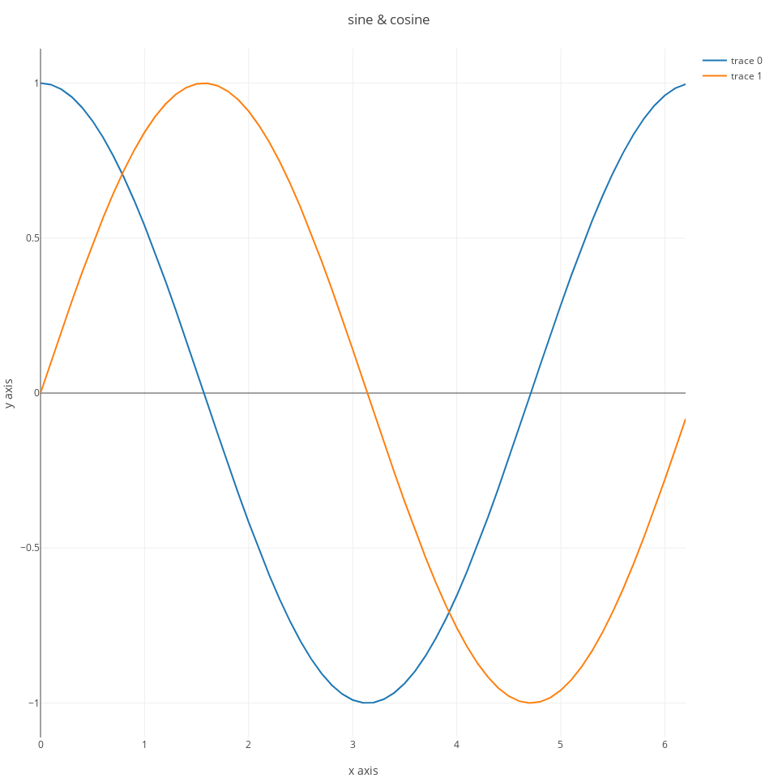

# PlotlyJS {#plotlyJS}


[PlotlyJS.jl](https://github.com/sglyon/PlotlyJS.jl) is a Julia package generate interactive html figures. The figures can be saved to disk either as html pages, or in a variety of formats (pdf, png, etc...) through the [ORCA.jl](https://github.com/sglyon/ORCA.jl) package.

\BeginKnitrBlock{rmdnote}<div class="rmdnote">The figures shown in the html version of this document will not have interactive features because they've been saved as png files.</div>\EndKnitrBlock{rmdnote}
	
PlotlyJS can display plots in a window either through [ElectronDisplay.jl](https://github.com/queryverse/ElectronDisplay.jl), or through [Blink.jl](https://github.com/JunoLab/Blink.jl). In sum, for a full setup you may want to install the following three packages:


```julia
Pkg.add(["PlotlyJS", "ElectronDisplay", "ORCA"])
```

and then load them with:


```julia
using PlotlyJS
using ORCA
#using ElectronDisplay
```

there are some convenience methods that allow you to quickly plot a line plot or a scatter plot. For example:


```julia
x = collect(0:0.1:2*pi);
p = plot(x, sin.(x)); #line plot from two arrays
```


for a scatterplot:


```julia
x = rand(10); y=rand(10);
p = plot(x, y, mode="markers", marker_color="black"); #line plot from two arrays
```


however, generally you will have to use a slightly more verbose syntax to fully leverage the features of plotlyJS. In particular, you need to pass two arguments to the `plot` command. The first consists of one or more *traces*, and the second one of a *layout* specification. With this syntax you can generate a line plot as follows:


```julia
x = collect(0:0.1:2*pi);
s1 = scatter(;x=x, y=cos.(x));
ly = Layout(;title="cosine", xaxis_title="x axis", yaxis_title="y axis");
p = plot([s1], ly);
```


you can add more than one trace to a plot:


```julia
s2 = scatter(;x=x, y=sin.(x));
ly = Layout(;title="sine & cosine", xaxis_title="x axis", yaxis_title="y axis");
p = plot([s1,s2], ly);
```




you can tweak several aspects of the plots. We'll start with changing some of the default options that I don't really like. For example, the default option when hovering with the mouse on the plot is set to `compare`, which may be useful to compare two traces, but I find generally less useful than the other option, which is to show the values of the closest data point. You can change this by passing an option in the layout:


```julia
ly = Layout(;title="sine & cosine", xaxis_title="x axis",
            yaxis_title="y axis",
            hovermode="closest");
```

another default that I tipically change is removing the line intercepting the y axis at zero, again you can do that from the call to `Layout`:


```julia
ly = Layout(;title="sine & cosine", xaxis_title="x axis",
            yaxis_title="y axis",
            hovermode="closest",
            yaxis_zeroline=false);
```

I also find it useful to have a line at the edge of both the x, and y axes, you can set this with `xaxis_showline` and `yaxis_showline`:


```julia
ly = Layout(;title="sine & cosine", xaxis_title="x axis",
            yaxis_title="y axis",
            hovermode="closest",
            yaxis_zeroline=false,
            xaxis_showline=true,
            yaxis_showline=true);
```
