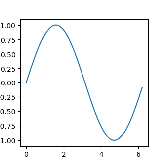

# PyPlot (matplotlib) {#pyplot}


```julia
using PyCall
using PyPlot
x = collect(0:0.1:2*pi)
plot(x, sin.(x))
```





### Saving multiple plots in one pdf with PyPlot


```julia
backend_pdf = pyimport("matplotlib.backends.backend_pdf")

pdf_pages = backend_pdf.PdfPages("multipage_pdf.pdf")
x = collect(0:0.1:2*pi)
plot(x, sin.(x))
savefig(pdf_pages, format="pdf")
close()
plot(x, cos.(x))
savefig(pdf_pages, format="pdf")
close()
pdf_pages.close()
```
