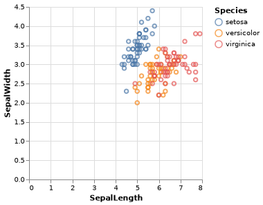
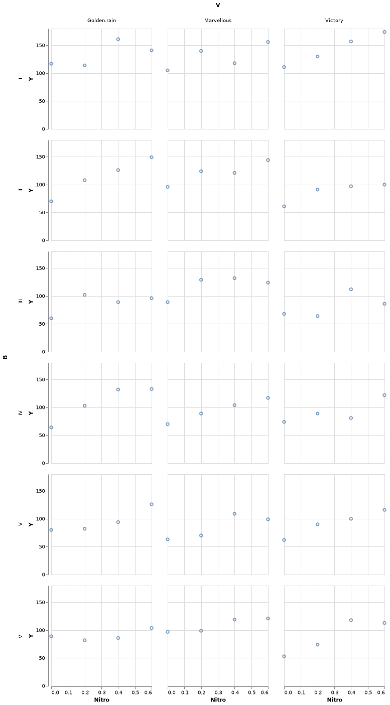

# Vegalite {#vegalite}


[VegaLite.jl](https://github.com/fredo-dedup/VegaLite.jl) is a plotting package for Julia based on [Vega-Lite](https://vega.github.io/vega-lite/). Its two most notable features are that 1) it is based on a grammar of graphics, like the `ggplot2` R package; 2) it produces interactive html graphics (but they can also be saved on disk in other static formats such as pdf or png).

Using Vegalite.jl feels a lot like using `ggplot2`, so users of `ggplot2` in R will feel right at home.


```julia
using VegaLite
using RDatasets
iris = dataset("datasets", "iris")

p = iris |> @vlplot(:point,
                    x=:SepalLength,
                    y=:SepalWidth,
                    color=:Species,
                    width=250,
                    height=250
                    )
```


Note that you may need to either call `p` or `p |> display` to show the plot. Depending on whether you're using the terminal or a IDE the plot may open up in a browser window. The [ElectronDisplay.jl](https://github.com/queryverse/ElectronDisplay.jl) package provides a convenient plotting window that can show VegaLite plots.




Now that we have this first plot, let's make a few tweaks it to improve its appearance. Currently by the default when you hover with the mouse on the points nothing happens, but you can enable tooltips as follows:


```julia
p = iris |> @vlplot(:point,
                    x=:SepalLength,
                    y=:SepalWidth,
                    color=:Species,
                    width=400,
                    height=400,
                    tooltip=[{field="SepalLength"}, {field="SepalWidth"}]
                    )
```

By default, the axes start from zero. If you do not want the axes to start from zero you need to specify this as follows:


```julia
p = iris |> @vlplot(:point,
                           x={:SepalLength, scale={zero=false}},
                           y={:SepalWidth, scale={zero=false}},
                           color=:Species,
                           width=400,
                           height=400,
                           tooltip=[{field="SepalLength"}, {field="SepalWidth"}]
                           )
```

We can add prettier labels to the x and y axis as follows:


```julia
p = iris |> @vlplot(:point,
                           x={:SepalLength, 
                              scale={zero=false},
                              axis={title="Sepal Length (cm)"}},
                           y={:SepalWidth, 
                              scale={zero=false},
                              axis={title="Sepal Width (cm)"}},
                           color=:Species,
                           width=400,
                           height=400,
                           tooltip=[{field="SepalLength"}, {field="SepalWidth"}]
                           )
```

We can remove the grid as well:


```julia
p = iris |> @vlplot(:point,
                           x={:SepalLength, 
                              scale={zero=false},
                              axis={title="Sepal Length (cm)",
                                    grid=false}
                             },
                           y={:SepalWidth, 
                              scale={zero=false},
                              axis={title="Sepal Width (cm)",
                              grid=false}
                             },
                           color=:Species,
                           width=400,
                           height=400,
                           tooltip=[{field="SepalLength"}, {field="SepalWidth"}]
                           )
```


## Faceting


```julia
oats = dataset("MASS", "oats")
oats[:Nitro] = [parse(Float64, split(oats[:N][i], "c")[1]) for i=1:length(oats[:N])]

p = oats |> @vlplot(:point,
                    x=:Nitro,
                    y=:Y,
                    row=:B,
                    column=:V)
```




