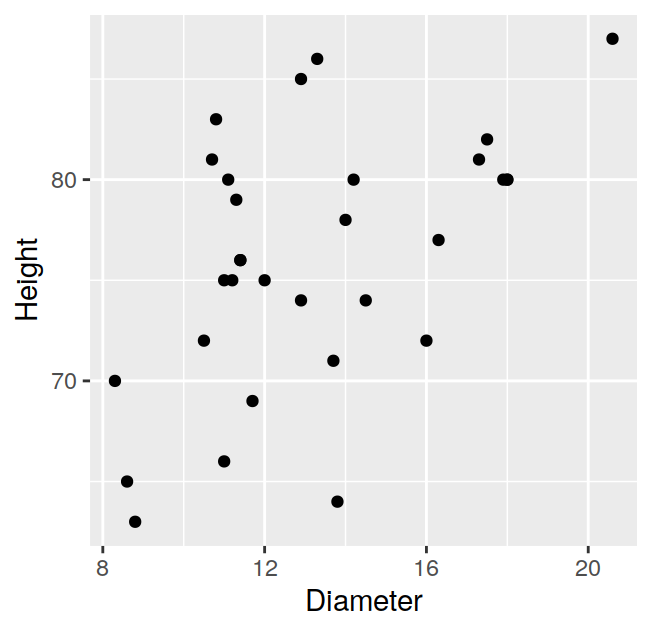
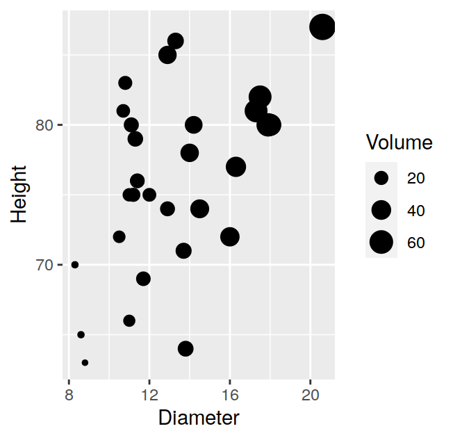
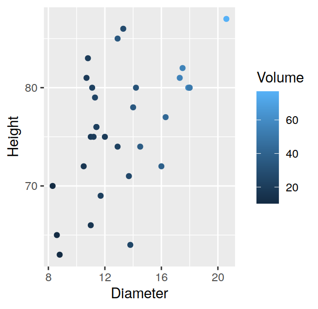
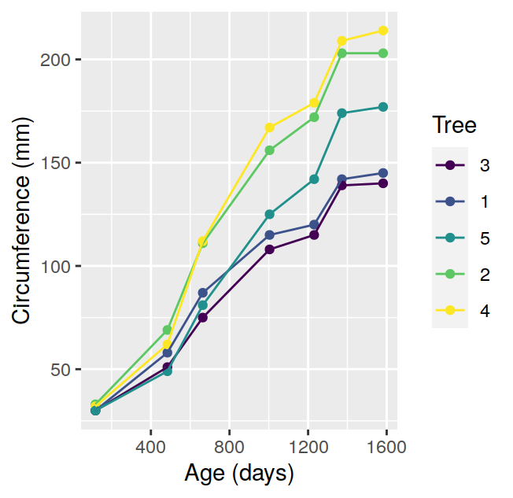
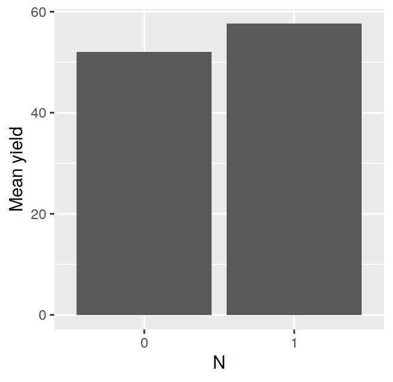
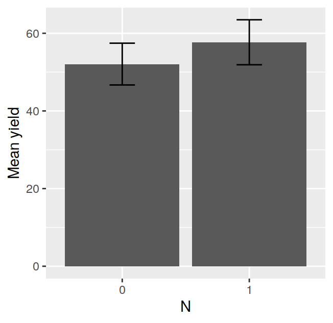
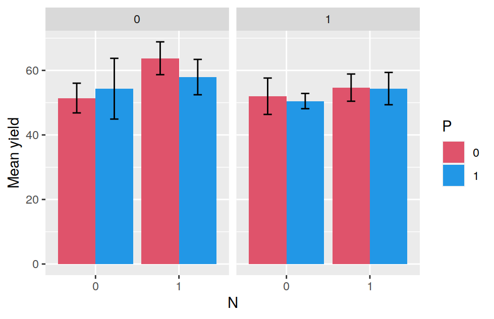
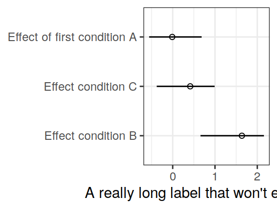
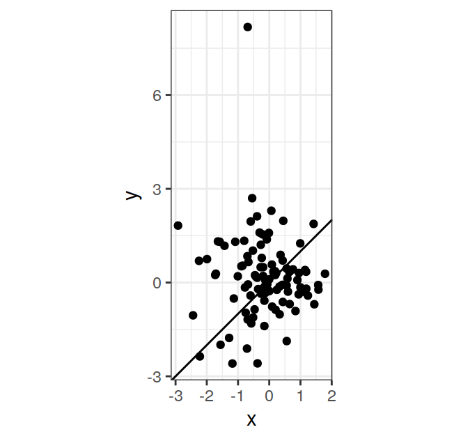

# ggplot2 {#ggplot2}


`ggplot2` is an add-on R library for generating plots. It differs radically from traditional plotting libraries, such as the base R graphics library, because it is based on a formal high-level model of statistical graphics, the "grammar of graphics" [@Wilkinson2005]. This makes `ggplot2` very powerful because it provides a language for succintly translating statistical ideas directly onto graphs. On the other hand, the significant departure of `ggplot2` from traditional graphics models can make its learning curve somewhat harder, especially if you're used to traditional graphics models.

The `ggplot2` book by @Wickham2009 is the best reference for learning ggplot2. The draft of the third edition of the book is freely available [here](https://ggplot2-book.org/index.html). Other useful resources include [`ggplot2` tutorial](http://www.ling.upenn.edu/~joseff/avml2012/) by Josef Fruehwald, which is one of the best introductions to `ggplot2` I've come across. A more recent version of this tutorial is available [here](http://jofrhwld.github.io/teaching/courses/2017_lvc/practicals/7_practical_r.html#inheritance).

All the examples in this chapter assume that `ggplot2` has been installed and is loaded in your R session. If not, you can install it with:

```r
install.packages("ggplot2")
```

and load it with:


```r
library(ggplot2)
```

At its essence a plot is a mapping of certain properties of the data to certain visual properties of the medium (paper, screen, etc...) on which it appears. For example, a variable such as blood pressure, may be mapped to the coordinate of a point in the y axis, and another variable such as time, may be mapped to the coordinate of a point on the x axis. Sometimes variables may be mapped to other graphical aspects, such as the color of points, the type (solid, dashed, etc...) of a line, or the size of a point. ggplot2 implements a "grammar" of graphics that allows you to express and control this mappings with a high-level language. Compared to traditional plotting systems (such as base R graphics) this typically allows you to express these mappings concisely; if you master the grammar it may also allow to do it more quickly.

Two basic elements of ggplot2 are *aesthetics*, and *geometries*. Aesthetics in ggplot2 define the ways in which data properties are conceptually mapped to graphical elements (e.g. by position, color, shape, size, etc...). Geometries, on the other hand, represent the actual geometrical elements (e.g. points, lines, bars, etc...) used to implement these mappings. Let's move on to some examples to clarify this. For these examples we'll use the `trees` built-in R dataset, which contains measurements of the diameter, height and volume of 31 black cherry trees:

```r
data(trees)
head(trees)
```

```
##   Girth Height Volume
## 1   8.3     70   10.3
## 2   8.6     65   10.3
## 3   8.8     63   10.2
## 4  10.5     72   16.4
## 5  10.7     81   18.8
## 6  10.8     83   19.7
```

the documentation for the dataset (see `?trees`) tells us that the diameter (in inches) was erroneously labelled "Girth" in the data, so we'll correct the column name in the dataset:

```r
trees = trees %>% rename(Diameter=Girth)
```

We can visualize the diameter and height data, and their relation, by mapping the diameter to position on the x axis, and the height to position on the y axis, then use points to implement these mapping. In ggplot2 we would write:

```r
ggplot(data=trees, mapping=aes(x=Diameter, y=Height)) + geom_point()
```

<div class="figure">

<p class="caption">(\#fig:ggtrees1)Diameter and height of 31 black cherry trees.</p>
</div>

the resulting plot is shown in Figure \@ref(fig:ggtrees1). Note how the `ggplot` function takes two arguments, `data` must be a dataframe holding the variables of interest; the `mapping` argument takes a function called `aes` that specifies the aesthetic mappings. The geometry is "added" later with the `+` operator. From now on we will omit for brevity the argument names and simply write:

```r
ggplot(trees, aes(x=Diameter, y=Height)) + geom_point()
```

One way to map the data on the volume of the trees onto the current graph could be to vary the size of the points depending on the volume:

```r
ggplot(trees, aes(x=Diameter, y=Height, size=Volume)) + geom_point()
```

<div class="figure">

<p class="caption">(\#fig:ggtrees2)Diameter, height, and volume of 31 black cherry trees. The volume of the trees is represented by the size of the plotting points.</p>
</div>

the resulting plot is shown in Figure \@ref(fig:ggtrees2). Yet another way to map the data on the volume of the trees onto the plot could be to set the color of the points depending on the value of the volume:

```r
ggplot(trees, aes(x=Diameter, y=Height, color=Volume)) + geom_point()
```

<div class="figure">

<p class="caption">(\#fig:ggtrees3)Diameter, height, and volume of 31 black cherry trees. The volume of the trees is represented by the color of the plotting points.</p>
</div>

The resulting plot is shown in Figure \@ref(fig:ggtrees3). for this last plot we may want to increase the size of *all* points to make their color easier to see. We can do this by passing a `size` argument to `geom_point` (plot shown in Figure \@ref(fig:ggtrees4)):

```r
ggplot(trees, aes(x=Diameter, y=Height, color=Volume)) + geom_point(size=3)
```

<div class="figure">

<p class="caption">(\#fig:ggtrees4)Diameter, height, and volume of 31 black cherry trees. The volume of the trees is represented by the color of the plotting points. The points have been set to a relatively large size to make it easier to see their color.</p>
</div>

although by doing this we are modifying an aesthetic quality of the plot, this does not generate an *aesthetic mapping* between the data and the graphic in the sense of the grammar of graphics. 

<div class="rmdimportant">
<p>Aesthetic <em>mappings</em> always go within an <code>aes</code> call, while changes of the visual properties of the plot that are not aesthetic mappings go outside <code>aes</code> calls.</p>
</div>

Check what happens if we pass the call to change the size of all the points (not an aesthetic mapping) inside the `aes`:

```r
# wrong!
ggplot(trees, aes(x=Diameter, y=Height, color=Volume, size=3)) + geom_point() 
```

Some common aesthetics are listed in Table \@ref(tab:aes), while Table \@ref(tab:geoms) lists some common geometries.

Aesthetic 
------------- ---
`color`
`fill`
`shape` 
`size`
`linetype`

Table: (\#tab:aes) Common `ggplot2` aesthetics.

Geometry
----------------- ---
`geom_point`
`geom_line`
`geom_path`
`geom_bar` 
`geom_col`
`geom_errorbar`
`geom_smooth`
`geom_hline`
`geom_vline`
`geom_abline`

Table: (\#tab:geoms) Common `ggplot2` geometries.

## Common charts {#ggcommon}

### Scatterplots

We've already seen some scatterplots at the beginning of this chapter. We'll show some new ones in this section using the `iris` dataset, which contains measurements of various physical properties of 150 flowers from three different species of iris:

```r
data(iris)
head(iris)
```

```
##   Sepal.Length Sepal.Width Petal.Length Petal.Width Species
## 1          5.1         3.5          1.4         0.2  setosa
## 2          4.9         3.0          1.4         0.2  setosa
## 3          4.7         3.2          1.3         0.2  setosa
## 4          4.6         3.1          1.5         0.2  setosa
## 5          5.0         3.6          1.4         0.2  setosa
## 6          5.4         3.9          1.7         0.4  setosa
```

We'll start with a scatterplot of petal length by petal width (shown in Figure \@ref(fig:ggiris1)):

```r
p = ggplot(iris, aes(Petal.Width, Petal.Length)) + geom_point()
p = p + xlab("Petal Width (cm)") + ylab("Petal Length (cm)")
p
```

<div class="figure">

<p class="caption">(\#fig:ggiris1)Scatterplot of petal length by petal width for the `iris` dataset.</p>
</div>

Next we'll map the species of each flower to color (plot shown in Figure \@ref(fig:ggiris2)):

```r
p = ggplot(iris, aes(Petal.Width, Petal.Length, color=Species)) + geom_point()
p = p + xlab("Petal Width (cm)") + ylab("Petal Length (cm)")
p
```

<div class="figure">

<p class="caption">(\#fig:ggiris2)Scatterplot of petal length by petal width for the `iris` dataset. Species is mapped to color.</p>
</div>

### Time series {#ggtimeseries}

We'll plot a time series using the `Orange` built-in R datasets, which contains data on the growth of five orange trees. The result can be seen in Figure \@ref(fig:ggorange1).


```r
p = ggplot(Orange, aes(age, circumference, color=Tree)) + geom_point()
p = p + geom_path()
p = p + xlab("Age (days)") + ylab("Circumference (mm)")
p
```

<div class="figure">

<p class="caption">(\#fig:ggorange1)Growth of orange trees: trunk circumference by age (in days) for five trees.</p>
</div>

### Barplots {#ggbarplots}

For the following examples we'll use the `npk` dataset, which contains data from a factorial experiment on the effects of N, P, K (nitrogen, phosphate, potassium) on the growth of peas.

```r
data(npk)
head(npk)
```

```
##   block N P K yield
## 1     1 0 1 1  49.5
## 2     1 1 1 0  62.8
## 3     1 0 0 0  46.8
## 4     1 1 0 1  57.0
## 5     2 1 0 0  59.8
## 6     2 1 1 1  58.5
```

in the dataset `N`, `P`, and `K` are indicator variables for the application of the respective element (0=no, 1=yes). We'll first plot the mean yield as a function of N, averaging across the levels of the other factors. In order to do this we'll generate a summary data set:

```r
npk_summ_N = npk %>% group_by(N) %>% summarize(mean_yield=mean(yield),
                                               sd_yield=sd(yield))
```

the barplot can be generated using `geom_col` (plot shown in Figure \@ref(fig:npkp1)):

```r
p1 = ggplot(npk_summ_N, aes(N, mean_yield)) + geom_col()
p1 = p1 + ylab("Mean yield")
p1
```

<div class="figure">

<p class="caption">(\#fig:npkp1)Yield as a function of nitrogen application.</p>
</div>

we can add error bars showing the standard deviation using `geom_errorbar` (plot shown in Figure \@ref(fig:npkp1e)):

```r
p1e = ggplot(npk_summ_N, aes(N, mean_yield)) + geom_col()
p1e = p1e + geom_errorbar(aes(ymin=mean_yield-sd_yield,
                              ymax=mean_yield+sd_yield),
                          width=0.2)
p1e = p1e + ylab("Mean yield")
p1e
```

<div class="figure">

<p class="caption">(\#fig:npkp1e)Yield as a function of nitrogen application.</p>
</div>

Next, we'll plot the mean yield as a function of both N and P. We first generate a summary dataset as a function of both N and P with:

```r
npk_summ_NP = npk %>% group_by(N,P) %>% summarize(mean_yield=mean(yield),
                                                  sd_yield=sd(yield))
```

and then generate the barplot (shown in Figure \@ref(fig:npkp2)):

```r
p2 = ggplot(npk_summ_NP, aes(N, mean_yield, fill=P))
p2 = p2 + geom_col()
p2 = p2 + ylab("Mean yield")
p2
```

<div class="figure">

<p class="caption">(\#fig:npkp2)Stacked barplot showing yield as a function of nitrogen and phosphate application.</p>
</div>

the code above generates a stacked barplot. To generate a barplot with the bars "side to side" rather than stacked on top of each other we have to use `position_dodge` to offset the position of the bars relative to each other:

```r
dodge_size = 0.9
p2d = ggplot(npk_summ_NP, aes(N, mean_yield, fill=P))
p2d = p2d + geom_col(position=position_dodge(dodge_size))
p2d = p2d + geom_errorbar(aes(ymin=mean_yield-sd_yield,
                              ymax=mean_yield+sd_yield),
                          position=position_dodge(dodge_size),
                          width=0.2)
p2d = p2d + scale_fill_manual(name="P", values=palette()[c(2,4)])
p2d = p2d + ylab("Mean yield")
p2d
```

<div class="figure">

<p class="caption">(\#fig:npkp2d)Barplot with bars side by side showing yield as a function of nitrogen and phosphate application.</p>
</div>

the resulting plot is shown in Figure \@ref(fig:npkp2d). Again we added some error bars; note how we had to set the `position` argument also for `geom_errorbar` to make sure the error bars are aligned to the bars of the barplot. We also changed the colors of the bars with `scale_fill_manual`.

We can visualize the effect of all three factors (N, P, K) by showing mean values of K along different panels. We'll first generate a summary dataset as a function of all three factors:

```r
npk_summ_NPK = npk %>% group_by(N,P,K) %>% summarize(mean_yield=mean(yield),
                                                     sd_yield=sd(yield))
```

and then generate the plot (shown in Figure \@ref(fig:npkp3)):

```r
p3 = ggplot(npk_summ_NPK, aes(N, mean_yield, fill=P))
p3 = p3 + geom_col(position=position_dodge(dodge_size))
p3 = p3 + facet_wrap(~K)
p3 = p3 + geom_errorbar(aes(ymin=mean_yield-sd_yield,
                              ymax=mean_yield+sd_yield),
                          position=position_dodge(dodge_size),
                          width=0.2)
p3 = p3 + scale_fill_manual(name="P", values=palette()[c(2,4)])
p3 = p3 + ylab("Mean yield")
p3
```

<div class="figure">

<p class="caption">(\#fig:npkp3)Barplot showing yield as a function of nitrogen and phosphate application. Panels plot mean yield as a function of the application of potassium (0=no, 1=yes).</p>
</div>

Besides `geom_col` there is a `geom_bar` that can generate barplots. This geometry, combined with the "identity" stat (`geom_bar(stat="identity")`) will produce the same plot as `geom_col`. However, the default `stat` for `geom_bar` is `count`, so it will plot the count of cases of a certain factor. For example Figure \@ref(fig:ggmpg1) plots the number of cars for each manufacturer in the `mpg` dataset, and was obtained with the code below:

```r
data(mpg)
p = ggplot(mpg, aes(manufacturer)) + geom_bar()
p = p + theme(axis.text.x = element_text(angle = 45, hjust = 1))
p
```

<div class="figure">

<p class="caption">(\#fig:ggmpg1)Number of cars by manufacturer in the `mpg` dataset.</p>
</div>

Figure \@ref(fig:ggmpg2) instead, plots the number of cars by manufacturer and type of transmission, and was obtained with the following code:

```r
p = ggplot(mpg, aes(manufacturer, fill=trans))
p = p + geom_bar(position=position_dodge(0.9))
p = p + theme(axis.text.x = element_text(angle = 45, hjust = 1))
p
```

<div class="figure">

<p class="caption">(\#fig:ggmpg2)Number of cars by manufacturer and type of transmission in the `mpg` dataset.</p>
</div>

### Interaction plots {#ggintplots}

For the next example we'll use the `ToothGrowth` built-in R dataset, which contains measurements of the length of odontoblasts (cells responsible for tooth growth) in 60 guinea pigs. Each guinea pig had received one of three doses of vitamin C (0.5, 1, and 2 mg/day) by one of two delivery methods, orange juice (OJ) or ascorbic acid (VC). 


```r
data(ToothGrowth)
head(ToothGrowth)
```

```
##    len supp dose
## 1  4.2   VC  0.5
## 2 11.5   VC  0.5
## 3  7.3   VC  0.5
## 4  5.8   VC  0.5
## 5  6.4   VC  0.5
## 6 10.0   VC  0.5
```

we'll first generate a summary dataset as a function of delivery method (`supp` variable), and dose:

```r
ToothGrowthSumm = ToothGrowth %>% group_by(supp, dose) %>%
                                  summarize(meanLen=mean(len))
ToothGrowthSumm$dose = factor(ToothGrowthSumm$dose)
```

now we can generate the plot (shown in Figure \@ref(fig:ggtoothgrowth)) with the following code:

```r
p = ggplot(ToothGrowthSumm, aes(x=supp, y=meanLen,
                                shape=dose, linetype=dose, group=dose))
p = p + geom_point()
p = p + geom_line()
p = p + theme_classic()
p = p + scale_shape_discrete(name="Dose")
p = p + scale_linetype_discrete(name="Dose")
p = p + xlab("Delivery method")
p = p + ylab("Mean growth")
p
```

<div class="figure">

<p class="caption">(\#fig:ggtoothgrowth)Tooth growth by vitamin C dose and delivery method in guinea pigs.</p>
</div>

## Scales

### Log axis with pretty tickmarks {#gglogticks}

The `annotation_logticks` function can be used to generate "pretty" tickmarks for axes on a log10 scale. An example is given in the code below (plot shown in Figure \@ref(fig:gglogticks)):

```r
x = c("cnd1", "cnd2")
y = c(0.4, 80)

dat = data.frame(x=x, y=y)

p = ggplot(dat, aes(x=x, y=y)) + geom_point()
p = p + scale_y_continuous(trans="log10")
p = p + annotation_logticks(sides="l")
p = p + theme_bw(base_size=12)
p
```

<div class="figure">

<p class="caption">(\#fig:gglogticks)Log axis with pretty tickmarks</p>
</div>

## Themes {#ggtheming}

`ggplot2` ships with a number of themes included. The [`ggthemes`](https://cran.r-project.org/web/packages/ggthemes/index.html) package provides a number of additional themes.


## Tips and tricks {#ggtipstricks}

### Fixing labels that won't fit

Sometimes an axis label may be clipped off as in the next example:

```r
set.seed(260420)
y=rnorm(3)
dd = data.frame(x=c("Effect of first condition A",
                    "Effect condition B",
                    "Effect condition C"),
                y=y, lower=y-runif(3, 0.5, 1),
                upper=y+runif(3, 0.5, 1))
p = ggplot(dd, aes(x,y)) + geom_point(shape=1)
p = p + geom_errorbar(aes(ymin=lower, ymax=upper), width=0)
p = p + coord_flip() + theme_bw() + xlab(NULL)
p = p + ylab("A really long label that won't easily fit!")
p
```

<div class="figure">

<p class="caption">(\#fig:unnamed-chunk-15)Example of axis label tha doesn't fit</p>
</div>

the label can be shifted by changing the value of `hjust` for the `element_text` or the `axis.title.x`:

```r
p = p + theme(axis.title.x = element_text(hjust=1))
p
```

<div class="figure">

<p class="caption">(\#fig:unnamed-chunk-16)Fitting a long label with `hjust`</p>
</div>

alternatively we can use the `draw_label` function from the `cowplot` package to fine tune the label position:


```r
library(cowplot)
p = ggplot(dd, aes(x,y)) + geom_point(shape=1)
p = p + geom_errorbar(aes(ymin=lower, ymax=upper), width=0)
p = p + coord_flip() + theme_bw() + xlab(NULL)
p = p + ylab("")
p = ggdraw(p) + draw_label("A really long label that won't easily fit!",
                           x = 0.025, y = 0.1, hjust = 0, vjust = 1,
                           size = 12)
p
```

<div class="figure">

<p class="caption">(\#fig:unnamed-chunk-17)Fitting a long label with `draw_label` from `cowplot`</p>
</div>

### Setting the aspect ratio {#ggasp}

In the following plot (Figure \@ref(fig:ggasp1)) the `x` and `y` variables are roughly on the same scale, but we've purposefully added an outlier so that the two axes have different ranges:

```r
x = rnorm(100) #simulate data
y = rnorm(100)
y[1] = y[1] + 10 #add outlier
dat = data.frame(x=x, y=y)
p = ggplot(dat, aes(x, y)) + geom_point()
p = p + geom_abline(slope=1, intercept=0)
p = p + theme_bw()
p
```

<div class="figure">

<p class="caption">(\#fig:ggasp1)A scatterplot. The aspect ratio is not fixed.</p>
</div>

we can set the aspect ratio to 1 with `p = p + coord_fixed(ratio=1)`:

```r
p = p + coord_fixed(ratio=1)
p
```

<div class="figure">

<p class="caption">(\#fig:ggasp2)A scatterplot with aspect ratio fixed to 1.</p>
</div>

this fixes the aspect ratio to 1, but the plot, shown in Figure \@ref(fig:ggasp2), looks somewhat odd because it is not square. To fix this we need to calculate the ranges of both axes and set them at their max/min:

```r
p = ggplot(dat, aes(x, y)) + geom_point()
p = p + geom_abline(slope=1, intercept=0)
xmax = max(layer_scales(p)$x$range$range)
ymax = max(layer_scales(p)$y$range$range)
xymax = max(xmax,ymax)
xmin = min(layer_scales(p)$x$range$range)
ymin = min(layer_scales(p)$y$range$range)
xymin = min(xmin,ymin)
p = p + coord_equal(xlim=c(xymin,xymax), ylim=c(xymin,xymax))
p = p + theme_bw()
p
```

<div class="figure">

<p class="caption">(\#fig:ggasp3)A scatterplot with aspect ratio fixed to 1, and a square plotting area.</p>
</div>

in this way we obtain the plot shown in Figure \@ref(fig:ggasp3), which looks better.

## Further resources {#ggres}

### Books, articles, and tutorials

[Creating publication quality graphs in R](https://moc.online.uni-marburg.de/gitbooks/publicationQualityGraphics/_book/index.html) by Tim Appelhans, provides useful notes on both `lattice` and `ggplot2`, including ways to manipulate and arrange plots using `grid`. The git repository of the tutorial is available [here](https://github.com/tim-salabim/publication-quality-graphics).

### Related packages

- [egg](https://cran.r-project.org/web/packages/egg/index.html)
- [gridExtra](https://cran.r-project.org/web/packages/gridExtra/index.html)
- [gtable](https://cran.r-project.org/web/packages/gtable/index.html)
- [cowplot](https://cran.r-project.org/web/packages/cowplot/index.html)
- [patchwork](https://cran.r-project.org/web/packages/patchwork/index.html)
