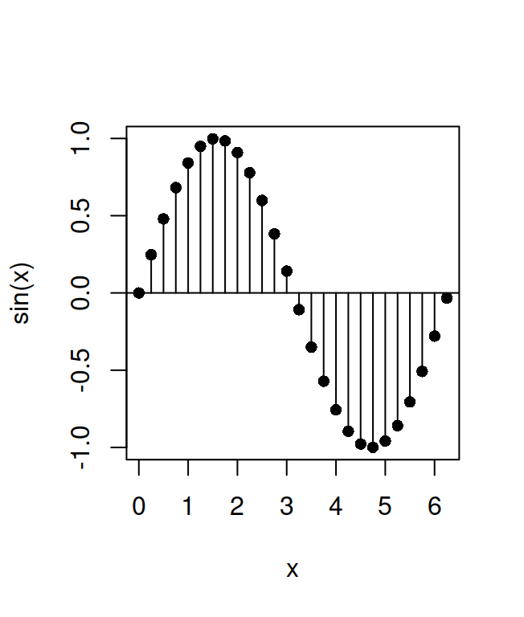
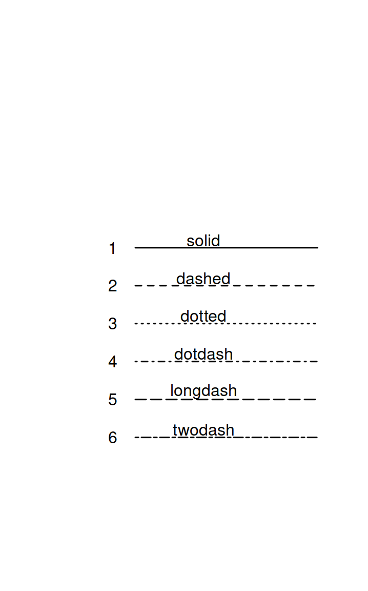
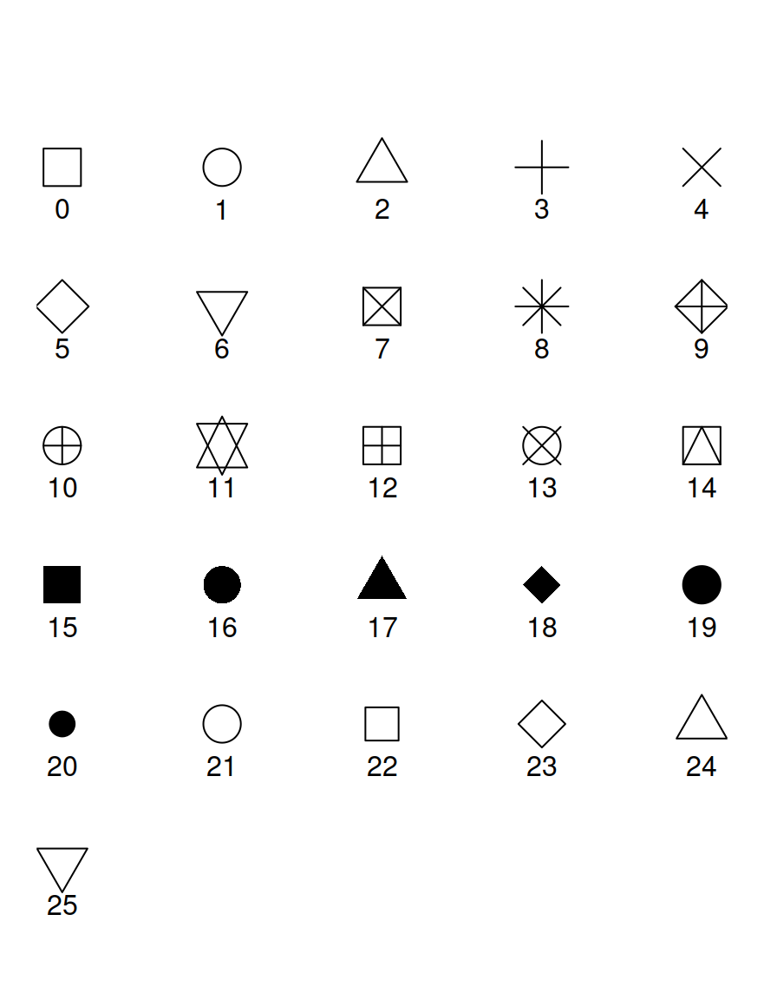
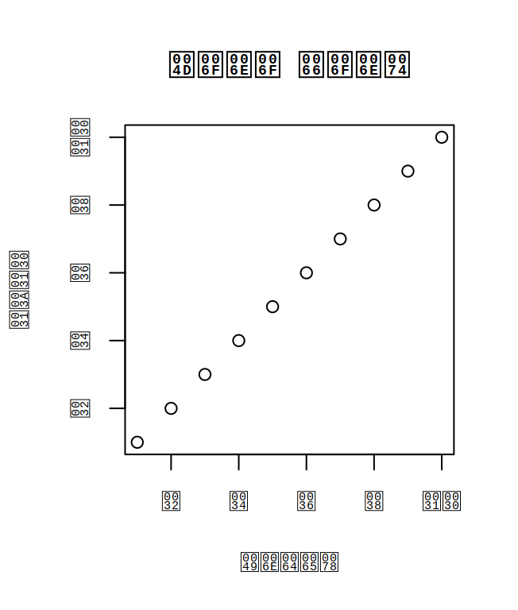
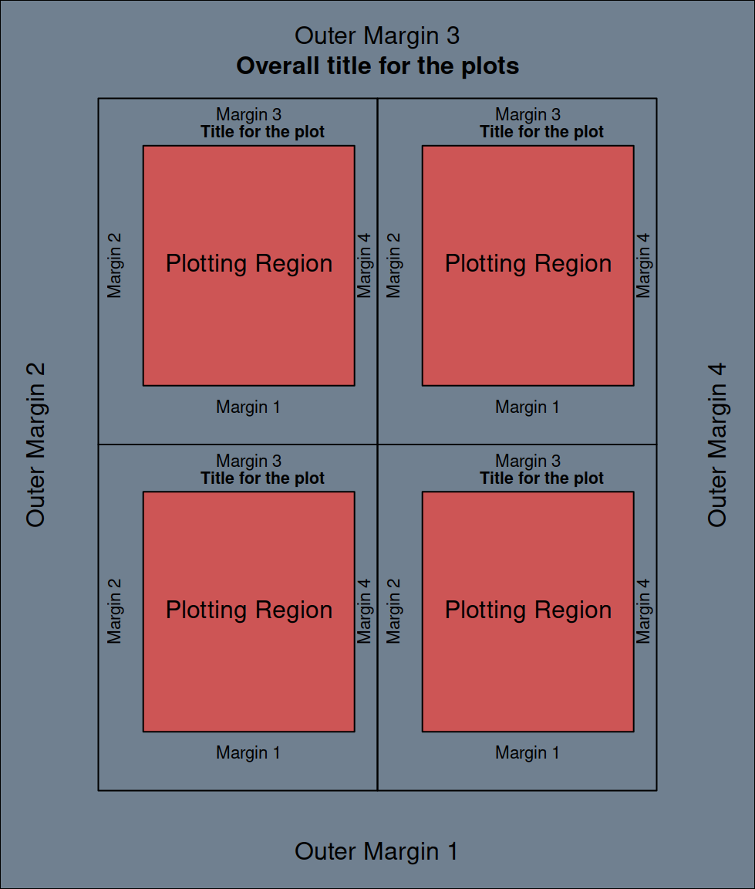

# Graphics


There are four main plotting libraries that can be used in R. The first is the base graphics system that comes builtin with every R installation and will be described in this chapter. The other three main plotting libraries (`ggplot2`, `lattice`, and `plotly`), can be installed as additional packages. Each of these libraries provides a complete, independent system to generate plots in R. 

Choosing one plotting library over the other is mostly a matter of personal preference because pretty much any graphic that can be built with one library can also be built with the others. Some graphics are easier to build with one library than another and vice-versa. In recent years `ggplot2` has gained lots of popularity and `lattice` is less popular than it was some years ago. Despite the increasing popularity of `ggplot2` the base R graphics that are described in this chapter are still widely used. `plotly` is a recent entry and is somehow a special case because it is primarily designed to generate interactive graphics that can be displayed on html pages, while the other plotting libraries have very limited interactive functionality and are primarily designed to generate static high-quality graphics. `plotly` is also special because through the `ggplotly` function it can convert a `ggplot2` graph into an interactive `plotly` graphic.

Because the base R graphics library is still widely used and (in my opinion) is somewhat simpler to use for beginners, I would recommend learning it first. The `ggplot2` library is described in Chapter \@ref(ggplot2), the `lattice` graphics library is described in Chapter \@ref(lattice), and the `plotly` library is described in Chapter \@ref(plotly). Chapter \@ref(graphicscommon) covers some plotting aspects (choosing colors, fonts, and using mathematical expressions in labels) that are common/similar across the different the different R plotting libraries. Chapter \@ref(graphicspublications) gives tips and indications for preparing graphics for academic journal publications, using any of the R graphics libraries.

## Overview of R base graphics functions

R base graphics has a number of "high-level" plotting functions. Some of these are listed in Table   \@ref(tab:baseplotfuncs), and will be described in detail in the following sections. Graphics can also be produced using "low-level" plotting functions; these are introduced in Section \@ref(plotfromscratch).

  Function
  --------
  `plot`
  `barplot`
  `boxplot`
  `histogram`
  `matplot`
  `stripchart`
  `interaction.plot`
  
  Table: (\#tab:baseplotfuncs) Some "high-level" plotting functions in the base R graphics system.
  
## The `plot` function {#plot}

The `plot` function is most commonly used to draw a scatterplot of two variables, however if given a R object with a plot method as an argument  it will produce different types of graphics depending on the object it is plotting.
Let's see an example of a scatterplot with some simulated data:

```r
  a = rnorm(5, 1.6, n=50)
  b = rnorm(15, 4.3, n=50)
```
this creates two vectors of length 50 with values normally distributed, now we can plot the values of vector `b`, against the values of vector `b` with:

```r
plot(x=a, y=b) ## or for short plot(a, b)
```

<div class="figure">

<p class="caption">(\#fig:scatterplot)A scatterplot.</p>
</div>

the resulting scatterplot appears in Figure \@ref(fig:scatterplot).

If we were to plot the change of a variable over time it could be a good idea to connect the values at different time points in the plot with lines, this is easily achieved setting the option `type`. Below is an example, the result is shown in Figure \@ref(fig:timewlines).

```r
ti = 1:50
b = rnorm(15, 4.3, n=50)
plot(ti, b, type="l")
```

<div class="figure">

<p class="caption">(\#fig:timewlines)Values connected by lines.</p>
</div>

Some other possible values for the option `type` are `p` for points (the default), `b` for *both* points and lines, and `o` for overplotted points and lines (very similar to `b`).

## Drawing functions

The `plot` function can be used for drawing mathematical functions, for example:

```r
vec = seq(from=0, to=4*pi, length=120)
plot(vec, sin(vec), type="l")
```

<div class="figure">

<p class="caption">(\#fig:drawfunction)Drawing a mathematical function.</p>
</div>

in this case we use `l` for the plot type in order to obtain a continuous line rather than discrete points. It is also possible to plot markers at the points in which the function is actually evaluated. Using the option `b` for the plot type, both a continuous line and point markers are plotted. There are lots of options to define the appearance of a plot. Many of these options are presented in Section \@ref(par).

### The `matplot` function

The `matplot` function can be used to plot the columns of a matrix against the columns of another once. The following example plots the sine and cosine functions together using the `matplot` function, the result is shown in Figure \@ref(fig:sincos)


```r
a= seq(from=0, to= 2*pi, length=20)
s = sin(a)
c = cos(a)
aa = cbind(a, a) #matrix of hor coord
cs = cbind(c, s) #matrix of vert coord
matplot(x=aa, y=cs, type="l", lwd=1.8, ylab="sine and cosine functions")
```

<div class="figure">

<p class="caption">(\#fig:sincos)Sine and cosine functions with `matplot`.</p>
</div>

## Barplots

Barplots sometimes come in handy when you want to summarise your data. Suppose we have administered a test to three different groups of people, which we will designate as `a`, `b` and `c`. We want to summarise and compare the performance of each group with a nice graph, a barplot will make it. The data are stored in the file `test.txt`, in the format shown in Table \@ref(tab:test).

**a** **b** **c**
----- ----- -----
4     6     5
5     8     3
3     7     8
6     5     4
5     9     9
7     7     8
5     6     5
8     5     7
5     8     6
4     10    4

Table: (\#tab:test) Data for the test example.


We can read in the file directly as a dataframe:


```r
test = read.table("datasets/test.txt", header=TRUE)
```

We want to use the `tapply` function to get quickly summary tables with the means and standard deviations for the three groups. However the format of the data frame at this point is not suitable for the `tapply` function, because it has 3 observations for each row, and the `tapply` function can be used only with the format "one row per observation", in which we have the values of the observations in one column and a set of "labels" identifying the group to which a given observation belongs to in another column. Fortunately, we can easily change the format of our dataframe with the `stack` command. What it does is just to create a single "values" vector from the three columns we had previously, and to add automatically another "index"  vector with the labels we need:

```r
test2 = stack(test)
```

we can have a look at the first elements of the new dataframe typing:

```r
head(test2, n=10)
```

```
##    values ind
## 1       4   a
## 2       5   a
## 3       3   a
## 4       6   a
## 5       5   a
## 6       7   a
## 7       5   a
## 8       8   a
## 9       5   a
## 10      4   a
```

note that the `stack` function has automatically named the two vectors `values` and `ind`, we need to know these names to use the `tapply` function.

Now we'll create the two summary tables using the `tapply` function, one with the means and one with the standard deviations for the three groups:


```r
test_means = tapply(X=test2$values, IND=test2$ind, FUN=mean)
test_sd = tapply(X=test2$values, IND=test2$ind, FUN=sd)
```

Now we can draw a simple barplot displaying the means for each group:

```r
barplot(test_means, col=c("darkred", "salmon2", "plum4"))
```

<div class="figure">

<p class="caption">(\#fig:barplotsimple)Simple barplot.</p>
</div>

we've added colors to the graph using the `col` option. You can look at the resulting graph in Figure \@ref(fig:barplotsimple).

You can control the width of the bars specifying the `width` option, and setting the range for the x axis with the `xlim` option, specifying only the width does nothing, you must also set the `xlim`. You set `xlim` with a vector of the form `xlim = c(from, to)`, in which `from` is the origin and `to` is the end of the axis. In the example below we will set `xlim` to go from 0 to 3 and the bars to have a width of 0.5:


```r
barplot(test_means,col=c("darkred", "salmon2", "plum4"),
        xlim = C(0,3), width=0.5)
```

this sets the width of all bars at 0.5, we could specify the width for each single bar instead, by giving to `width` a vector with the width values for each bar.

You can also control the spacing between the bars with the `space` option. The default is set to 0.2.

### Barplots with error bars

Now let's say we want to get the same barplot but with error bars showing the standard deviation for each group. We could achieve this result adding lines to the current graph, but there is a better option, we can use the `barplot2` command, which comes with the `gplots` library and provides an easy way of adding error bars to a barplot. So once we have the `gplots} package installed we first load it:


```r
library(gplots)
```

and then we can draw our barplot with error bars. To get them, we need to set the option `plot.ci=TRUE` and then specify the upper and lower bounds of the error bars with the `ci.u` and `ci.l` commands. So we first create the values for `ci.u` and `ci.l`, so that the error bars represent one standard deviation around the mean. We'll use the values from the two tables we had created before, with means and standard deviations for the three groups:


```r
upper = test_means + (test_sd)
lower = test_means - (test_sd)
```

Now we can draw our barplot, you can see the result in Figure \@ref(fig:barplotbars):


```r
barplot2(test_means, col=c("darkred", "salmon2", "plum4"),
         plot.ci=TRUE, ci.u=upper, ci.l=lower)
```

<div class="figure">

<p class="caption">(\#fig:barplotbars)Barplot with error bars.</p>
</div>

## Boxplots

Boxplots can be used to visualise the central tendency and the dispersion of the data for a given sample, and to directly compare these same characteristics for different samples. Let's look at one of them, the data are organised in a dataframe in the file `boxplot1.txt`. They are the scores for two different groups (group a and group b) in a test. With the boxplot we want to see how the scores are distributed in the two groups. The dataframe contains a column `score`, with the score for each subject and another column `group` that defines the group a given observation comes from. So we first read in the dataframe, and then ask for the boxplots with the distribution of scores, as a function of the group they belong to.


```r
dat = read.table("datasets/boxplot1.txt", header=TRUE)
boxplot(dat$score~dat$group, names=c("group a", "group b"))
```

<div class="figure">

<p class="caption">(\#fig:boxplot1)Boxplots comparing the distribution for two groups.</p>
</div>

The results are in Figure \@ref(fig:boxplot1), the thick black lines in the middle of the boxes represent the median, if this is about the middle of the box, it is consisten with the data having a normal distribution. The two lines that delimit the box are called "hinges", and they are approximately the first and the third quartiles. The horizontal lines that form the `Ts' above and below the box are called ``whiskers'', and inside them are contained all the observations that fall within a distance of 1.5 times the size of the box, upwards or downwards. Points that fall outside this distance are outliers and they are represented as a circle. In our case there are two outliers in group a. Apart from checking if the distribution is normal, you can also check if the variances are approximately equal, by comparing the size of the boxes (the distance between the hinges). If one boxplot is clearly bigger than the other one (for example two times bigger), then the variances for the two groups are likely not to be equal.

## Histograms

Histograms can be used to visualise the distribution of a sample, the function `hist`, can be used to plots a histogram of frequencies (counts) of the sample, or of its density function (setting the option `freq=F`). Let's first create a sample with a normal distribution, and then plot its histogram, the result is in Figure \@ref(fig:hist).

```r
my_distr = rnorm(100, 5, 1.7)
hist(my_distr)
```

<div class="figure">

<p class="caption">(\#fig:hist)Frequency distribution of a random sample.</p>
</div>

## Stripcharts

If the groups  contain a small number of observations, it might be better to use  a stripchart to visualise their distributions. In a stripchart each point represents a single observation. By default they are drawn on a line, so if two observations have the same score, they overlap. To avoid this problem you can give a certain amount of jitter to the plot, so that observations with the same score are scattered a little and can be easily distinguished. Here's the code for producing a stripchart, the data are in the file `stripchart1.txt` and they are arranged in the same way as the data in `boxplot1.txt`, just the sample sizes are smaller, with 6 observations per group.

```r
stripchart(dat$score~dat$group, method="jitter",
           jitter=0.1, pch=1, vertical=TRUE)
```

<div class="figure">

<p class="caption">(\#fig:stripchart1)Stripchart example.</p>
</div>

## Interaction Plots {#interactionplots}

Interaction plots can be used to visualise the means for the levels of a factor, at the levels of another factor. In a two-way ANOVA design this type of plot would allow you to spot possible interactions between the two factors involved. To illustrate interaction plots we'll use the built in R dataset `ToothGrowth`:


```r
data(ToothGrowth) #load dataset
head(ToothGrowth)
```

```
##    len supp dose
## 1  4.2   VC  0.5
## 2 11.5   VC  0.5
## 3  7.3   VC  0.5
## 4  5.8   VC  0.5
## 5  6.4   VC  0.5
## 6 10.0   VC  0.5
```

that contains measurements of the length of odontoblasts (cells responsible for tooth growth) in 60 guinea pigs. Each guinea pig had received one of three doses of vitamin C (0.5, 1, and 2 mg/day) by one of two delivery methods, orange juice (OJ) or ascorbic acid (VC).

```r
interaction.plot(x.factor=ToothGrowth$supp,
                 trace.factor=ToothGrowth$dose,
                 response=ToothGrowth$len,
                 ylab="Mean growth", xlab="Delivery",
                 trace.label="Dose")
```

<div class="figure">

<p class="caption">(\#fig:int)Interaction plot with different line types.</p>
</div>

The first argument is the factor that will be represented on the x axis; the second argument is the *trace factor*, whose levels will be represented as lines of a different type, or of different colors. The third argument is the response variable. Note that we didn't pass the mean of the response variable to the function, we passed the raw data and the function computed the mean for us. Optionally we can also set the x and y labels, as done in the example, and the `trace.label`, that sets the title of the legend.  The plot is shown in Figure \@ref(fig:int). It suggests the presence of an interaction because while at the lower doses OJ results in higher mean growth VC, at the highest dose the mean growth appears similar whichever delivery method is used.

The placement of the legend with `interaction.plot` is not always ideal. We can fix that by setting the `legend` argument to `FALSE`, and supplying a legend manually:


```r
par(oma=c(0, 0, 0, 2.2))
interaction.plot(x.factor=ToothGrowth$supp,
                 trace.factor=ToothGrowth$dose,
                 response=ToothGrowth$len,
                 ylab="Mean growth", xlab="Delivery",
                 trace.label="Dose", legend=F)
legend(2.1, 27, legend=c("2", "1", "0.5"), lty=c(1,2,3),
       title="Dose", xpd=NA, bty="n")
```

<div class="figure">

<p class="caption">(\#fig:intmanleg)Interaction plot with manual legend.</p>
</div>

Note how we also set the `oma` parameter to add an outer margin on the right side, so as to have enough space to place the legend outside the plot. We also set the `xpd` graphics parameter to `NA` so that the legend would not be clipped. Graphics parameters will be explained in Section \@ref(par).

Another good way to represent the levels for the trace factor, is through the use of symbols and/or colors, in the following graph (see the result in Figure \@ref(fig:intb)) line type `lty`, symbols `pch`, and colors are used to differentiate between the levels of the trace factor. In order to get this you need to set the option `type` to `b`: that means use both line type and points (symbols); setting this option to `l` will give just different line types while setting it to `p`, will give just different symbols. In these examples I specified the line types and the symbols to use, but this is not necessary, if you don't, R will cycle through different line types and/or symbols as needed to represent all the levels of the trace factor. See Section \@ref(lty) for a description of the different line types, and Section \@ref(secpch) for a description of the different symbols available in R.


```r
par(oma=c(0, 0, 0, 2.25))
interaction.plot(x.factor=ToothGrowth$supp,
                 trace.factor=ToothGrowth$dose,
                 response=ToothGrowth$len,
                 type="b", lty=c(3,2,1), pch=c(16,15,17),
                 col=c("gray60", "gray40", "gray10"),
                 ylab="Mean growth", xlab="Delivery",
                 trace.label="Dose", legend=F)
legend(2.2, 27, legend=c("2", "1", "0.5"), lty=c(1,2,3), pch=c(17,15,16),
       col=c("gray10", "gray40", "gray60"),
       title="Dose", xpd=NA, bty="n")
```

<div class="figure">

<p class="caption">(\#fig:intb)Interaction plot with different line types and different symbols.</p>
</div>

## Stem (lollipop) plots {#stemplot}

There is no function in base R to generate a stem plot, also known as a "lollipop" plot. However, Matti Pastel [published in his blog](http://mpastell.com/2009/09/11/matlab-style-stem-plot-with-r/) the following function to generate one:

```r
stem = function(x, y, pch=16, linecol=1, clinecol=1, ...){
    if (missing(y)){
        y = x
        x = 1:length(x)
    }
    plot(x, y, pch=pch, ...)
    for (i in 1:length(x)){
        lines(c(x[i], x[i]), c(0,y[i]), col=linecol)
    }
    lines(c(x[1]-2,x[length(x)]+2), c(0,0), col=clinecol)
}
```

Figure \@ref(fig:stemplot1) shows a stem plot generated with this function using the code below:

```r
x = seq(0, 2*pi, 0.25)
y = sin(x)
stem(x, y, xlab="x", ylab="sin(x)")
```

<div class="figure">

<p class="caption">(\#fig:stemplot1)Stem plot.</p>
</div>

## Setting graphics parameters {#par}

Graphics parameters allow you to tweak many elements of a plot, such as the font for the labels, the symbols or line types to use and so on, see `?par` to get a full list and description of these parameters. Graphics parameters can be set and accessed with the function `par`, called without arguments, as `par()`, it will give you a full list of the current defaults, if you want to query only one or a few parameters use:

```r
par("lwd")          ## see current line width
```

```
## [1] 1
```

```r
par(c("lwd","pch")) ## see lwd and plotting symbols
```

```
## $lwd
## [1] 1
## 
## $pch
## [1] 1
```

to change the value of a parameter you can use:


```r
par(lwd=1.4)       ## change line width
par(pch="*",       ## change plotting symbol
    bg ="gray80")  ## use a light gray background
```

Moreover, most plotting functions like `plot`, and `barplot`, allow you to set some of the parameters for the current plot as an argument to the function itself, for example in `plot` you can choose the type of plot (points vs lines) and the plotting symbol as options with `type` and `pch`:


```r
d = rnorm(15,4,2)
e = rnorm(15,9,3)
plot(d~e, type="p", pch=3)
```

The following sections will give a more in depth explanation of some graphics parameters. Before that, however, we'll have a closer look at how to use `par`.

### Saving and restoring graphics parameters

Often you'll want to change the graphics parameters only for a few plots, and then reset them back to the defaults. The function `par` when used to change the value of some graphics parameters returns a list with the *old* values of the graphics parameters that have changed:


```r
par("lwd", "col") #these are the default parameters
```

```
## $lwd
## [1] 1
## 
## $col
## [1] "black"
```

```r
oldpar = par(lwd=2, col="red") #while changing the parameters
                                #we store the old values in a list
oldpar
```

```
## $lwd
## [1] 1
## 
## $col
## [1] "black"
```

```r
s = seq(0, 10, .1) 
plot(s, sin(s))           #we plot something
```

```r
par(oldpar)              # and then we restore the old parameters
```

note that calling `par`, opens a graphics device if one is not already open, the changes you do using `par` apply only to this graphics device, any other new graphic device that you open will have the default graphics parameters. 

### Line type with the `lty` parameter {#lty}

There are six line types that you can call in R just with names or numbers (actually there are seven, the first one is "blank" or 0 which just draws nothing). These are listed in Table \@ref(tab:lty) and shown in Figure \@ref(fig:lty). There is a different, more complicated way for setting many more line types, please, consult the manual for further information on that.

No.  Name
---  ---------
1    solid
2    dashed
3    dotted
4    dotdash
5    longdash
6    twodash

Table: (\#tab:lty) The six default line types in R.

<div class="figure">

<p class="caption">(\#fig:lty)The six default line types in R</p>
</div>

### Symbols with the `pch` parameter {#secpch}

`pch` is a graphical parameter for changing the way points are plotted in certain graphical functions. This parameter can be set in two ways, the first one is to give a symbol to be plotted as a character, for example 

```r
pch="+"
pch="T"
pch="*"
pch="3" 
```

in this case you enclose the character you want to use between quotes, you can't use more than a single character. The other way to set the `pch` is to use a number between 0 and 25, which will select one of 26 special symbols available for plotting (see Figure \@ref(fig:pch)), like circles, triangles, and so on:


```r
pch=1
pch=3
pch=5
```

<div class="figure">

<p class="caption">(\#fig:pch)Plotting symbols from 0 to 25</p>
</div>

### Fonts {#parfonts}

The `par` interface can be used to set a number of font parameters. One thing to keep in mind is that certain font properties can also be set at the device (X11, pdf, png, etc...) level. Properties set with `par` after opening the device will override properties set at the device level. Additionally, each device deals with fonts differently, and setting a given font family with `par` for a given deice (e.g. X11) will not necessarily work for other devices (e.g. pdf). The font parameters that can be set through the `par` interface are listed in Table \@ref(tab:parfonts)

Parameter   Function
---------   ------------------------------------------
`family`    font family (e.g. "sans", "serif", "mono")
`font`       font type for text (1=plain, 2=bold, 3=italic, 4=bold italic)
`font.axis` font type for axis annotation (1=plain, 2=bold, 3=italic, 4=bolditalic)
`font.lab`  font type for x and y labels (1=plain, 2=bold, 3=italic, 4=bolditalic)
`font.main` font type for main titles (1=plain, 2=bold, 3=italic, 4=bolditalic)
`font.sub`  font type for sub titles (1=plain, 2=bold, 3=italic, 4=bolditalic)
`ps`          point size of text

Table: (\#tab:parfonts) Parameters for fonts.

The various parameters starting with "font" (`font`, `font.axis`, `font.lab`, etc...) do not change the *family*, they change the *style* (e.g. plain, bold, italic). These parameters are set via a number; a value of 1 corresponds to a normal (or plain) style, 2 to bold, 3 to italics, 4 to bold italics, and 5 will map the font to a symbol, an usage example is show below (the resulting plot is shown in Figure \@ref(fig:chfontstyle)):

```r
x = seq(0, 2*pi, 0.1)
y = sin(x)
par(font=3)
plot(x, y, xlab="x-axis label", ylab="y-axis label", main="Sin(x)", type="b")
text(1.5, -0.5, "Some text \nin italics")
```

<div class="figure">

<p class="caption">(\#fig:chfontstyle)Changing font style.</p>
</div>

Note that setting `font` only changes the font style of plotted text. If you want to change the font style of other textual elements such as the axis labels or the plot title you have to set the corresponding graphics parameters, as shown in the example below (the resulting plot is shown in Figure \@ref(fig:chfontstyle2)):

```r
par(font=3, font.axis=3, font.lab=3, font.main=4, font.sub=2)
plot(x, y, xlab="x-axis label", ylab="y-axis label",
     main="Sin(x)", sub="subtitle", type="b")
text(1.5, -0.5, "Some text \nin italics")
```

<div class="figure">

<p class="caption">(\#fig:chfontstyle2)Changing font style for other textual elements.</p>
</div>

The `ps` parameters sets the *base* point size of the font; the final pointsize is scaled by the `cex` parameter (i.e. text size = `ps`*`cex`), so if `cex` is different than 1, the final pointsize will not be equal to `ps`. Note that `ps` changes only the size of the text font:

```r
x = seq(0, 2*pi, 0.1)
y = sin(x)
pdf(file="test_plot.pdf", pointsize=12)
plot(x, y, xlab="x-axis label", ylab="y-axis label", main="Sin(x)", type="b")
dev.off()
```

while setting the `pointsize` when opening certain graphics devices, such as the `pdf` device, changes the size of both the font and the plotting symbols:

```r
x = seq(0, 2*pi, 0.1)
y = sin(x)
pdf(file="test_plot.pdf", pointsize=24)
plot(x, y, xlab="x-axis label", ylab="y-axis label", main="Sin(x)", type="b")
dev.off()
```

The documentation for the graphics parameter `ps` also says that "unlike the pointsize argument of most devices, this does not change the relationship between `mar` and `mai` (nor `oma` and `omi`).". I'm not sure what this means, but just be aware setting `ps` with a call to `par` or setting `pointsize` when opening a graphics device are not equivalent. Also, keep in mind that if you set the font size when you open a graphics device, the setting may be overridden by subsequent calls to `par`:


```r
pdf(file="test_plot.pdf", pointsize=12) #set font and symbol size in `pdf` call
par(ps=24) #overrides the `pointsize` setting for font (but not plotting symbols)
plot(x, y, xlab="x-axis label", ylab="y-axis label", main="Sin(x)", type="b")
dev.off()
```

`cex` also overrides the graphics device settings:


```r
pdf(file="test_plot.pdf", pointsize=24) #set font and symbol size in `pdf` call to 24
par(cex=0.5) #scale the `pointsize` by half, so now it is 12
plot(x, y, xlab="x-axis label", ylab="y-axis label", main="Sin(x)", type="b")
dev.off()
```

The `par` setting `family` can be used to choose a `serif`, `sans`, or `mono` font. The following example shows how to make a plot (displayed in Figure \@ref(fig:figuremono)), with a `mono` family font:

```r
par(family="mono")
plot(1:10, main="Mono font")
```

<div class="figure">

<p class="caption">(\#fig:figuremono)Changing font family.</p>
</div>

Note that `serif`, `sans`, or `mono` are generic font families. The actual font family (e.g. Helvetica, Arial, Times New Roman, etc...) that gets used depends on a mapping, which is different between graphics devices, between these generic names and an actual system font. It is possible to directly specify a system font when calling `par`. Figure \@ref(fig:figurepalatino) shows a plot with the Palatino font set through `par`:

```r
plot.new(); plot.window(xlim=c(1,10), ylim=c(1, 10))
par(family="Palatino")
plot(1:10)
```

<div class="figure">

<p class="caption">(\#fig:figurepalatino)Plot with Palatino font.</p>
</div>

however, this may or may not work depending on 1) whether the font is actually installed on your system 2) the graphics device (not all graphics devices have access to all installed system fonts). More information on how to use system fonts is available in Chapter \@ref(fonts).

<div class="rmdwarning">
<p>Not all graphics devices have access to all installed system fonts. For workarounds see Chapter @ref(fonts).</p>
</div>
	
### Colors {#parcolors}

Table \@ref(tab:parcolors) lists a number of color parameters that can be set through the `par` interface. See Section \@ref(colorscommon) for indications on how to speficy colors in R.

Parameter      Function
----------    --------------------------
`col`          plotting color
`col.axis`    color for axis annotation 
`col.lab`     color for x and y labels 
`col.main`    color for main title 
`col.sub`     color for sub-titles 
`bg`           background color
`fg`           foreground color

Table: (\#tab:parcolors) Color parameters that can be set through the `par` interface.	

```{=latex}
\clearpage
```

## Adding elements to a plot

### Adding a legend {#legend}

Some plotting functions (e.g. `interaction.plot`) by default add a legend to the graph, or allow you to add a legend by setting an option inside the function (e.g. `barplot`). However, the default settings for the legend, such as positioning, text or symbols, might not be suitable for your graph, in which case you need to turn off the default legend, and add a customised legend with the `legend` function. You may also need the `legend` function if the plotting function that you're using does not automatically add a legend, or if you're plotting from scratch. Figure \@ref(fig:irislegend1) shows a plot with a legend for the different plotting symbols:


```r
data(iris)
d_set = iris[iris$Species=="setosa",]
d_ver = iris[iris$Species=="versicolor",]
d_vir = iris[iris$Species=="virginica",]
ylim = c(min(iris$Sepal.Length), max(iris$Sepal.Length))
xlim = c(min(iris$Petal.Length), max(iris$Petal.Length))
plot(d_set$Petal.Length, d_set$Sepal.Length, xlim=xlim, ylim=ylim, pch=15,
     xlab="Petal Length", ylab="Sepal Length")
points(d_ver$Petal.Length, d_ver$Sepal.Length, pch=16)
points(d_vir$Petal.Length, d_vir$Sepal.Length, pch=17)
legend("topleft", legend=c("Setosa", "Versicolor", "Virginica"),
       pch=c(15, 16, 17))
```

<div class="figure">

<p class="caption">(\#fig:irislegend1)Plot with legend for plotting symbols.</p>
</div>

The last two lines of code add the legend. The first argument given to the `legend` function, `topright`, indicates the position where we want the legend to appear, other possible values are `bottomright`, `bottomleft`, `right`, `bottom`, `center` and so on. It is also possible to specify the position of the legend by giving the coordinates of its top-left corner, for the above example we might have written:


```r
legend(x=2.5, y=7, legend=c("Setosa", "Versicolor", "Virginica"),
       pch=c(15, 16, 17))
```

The text of the legend is passed as a character vector, each element of the vector represents one item of the legend. The next argument, `pch` indicates that we want each element to represent different plotting symbols, and specifies the plotting symbols to use (15, 16, and 17).

If you do not want a box around the legend, you can set the `bty` argument to `n` (default setting is `o`, which adds the box). If you choose to enclose the legend into a box, you can set its background color through the `bg` argument.

Sometimes we can encode groupings by more than one dimension. Figure \@ref(fig:irislegend2) shows the data plotted previously with iris species differentiated by both plotting symbols and colors:

```r
library(RColorBrewer)
pal = brewer.pal(3, "Pastel1")
plot(d_set$Petal.Length, d_set$Sepal.Length, xlim=xlim, ylim=ylim, pch=15,
     xlab="Petal Length", ylab="Sepal Length", col=pal[1])
points(d_ver$Petal.Length, d_ver$Sepal.Length, pch=16, col=pal[2])
points(d_vir$Petal.Length, d_vir$Sepal.Length, pch=17, col=pal[3])
legend("topleft", legend=c("Setosa", "Versicolor", "Virginica"),
       pch=c(15, 16, 17), col=pal)
```

<div class="figure">

<p class="caption">(\#fig:irislegend2)Plot with legend for plotting symbols and colors.</p>
</div>

the only difference with the previous legend is that now we pass an additional argument, `col` to indicate that we want each element to represent different colors, and specifies the colors to use (those in the `pal` vector).

We've already seen an example of a complex legend specifying different plotting symbols, line types, and colors for its elements in Section \@ref(interactionplots).

Figure \@ref(fig:barplotlegend) shows an example of a legend for a barplot. In this case the legend was positioned outside the plot. Note how we set the `xpd` argument to `NA` to avoid the legend being clipped inside the plotting area. Depending on the size and placement of the legend we may also need to enlarge either the margings (`mar`) or the outer margins (`oma`) to leave enough room for the legend. An example where this was needed was given in Section \@ref(interactionplots); for an overwiew of plotting regions and margins see Section \@ref(grdevregions). Finally, note how we set the `ncol` argument to indicate that the legend should have 4 columns:

```r
data(HairEyeColor)
par(mfrow=c(1,2))
barplot2(HairEyeColor[,,"Male"], beside=T, xlab="Eye color", ylab="# cases",
         col=c("black", "brown", "red", "gold"), ylim=c(0, 72), las=3)
title(main="Males", line=-1)
box()
legend(8, 90, legend=c("Black", "Brown", "Red", "Blond"),
       fill=c("black", "brown", "red", "gold"),
       title="Hair color", ncol=4, xpd=NA, bty="n")

barplot2(HairEyeColor[,,"Female"], beside=T, xlab="Eye color", ylab="# cases",
         col=c("black", "brown", "red", "gold"), ylim=c(0, 72), las=3)
title(main="Females", line=-1)

box()
```

<div class="figure">

<p class="caption">(\#fig:barplotlegend)Barplot with a legend outside the plot.</p>
</div>

### Adding text

You can insert text in a graph with the `text` function, you have just to specify the x and y coordinates of the point on which to center the text:

```r
plot(x, y)
text(x=3, y=1.5, "mean for control group")
```
if you want to use mathematical symbols you can use the `expression` function:

```r
text(x=3, y=1.5, expression(alpha))
```

more details on how to use mathematical symbols are given in Section \@ref(plotmath) .
           
### Adding a grid {#addgrid}

A grid can be easily added to an existing plot with the function `grid`

```r
s = seq(from=0, to=2*pi, length=100)
plot(s, sin(s))
plot(s, sin(s), type="l")
grid() ##add the grid
```

The default color for the grid is lightgray, you can choose another color setting the `col` option:

```r
grid(col="red")
```

### Setting the axes {#axes}

If you don't like the way the axes are set for a given plot, you can draw the plot without them first, and then add customised axes with the `axis+ function. There are several ways to get rid of the default axes on a plot:


```r
plot(1:10, axes=FALSE) #do not draw any axes or box around
                       # the plot
plot(1:10, xaxt="n")   #don't draw the x axis 
plot(1:10, yaxt="n")   #don't draw the y axis 
```

Once you've removed of one or more axes you can draw them calling the `axis` function:

```r
axis(1, at=seq(1, 10, 3), labels=as.character(seq(1, 10, 3)))
```

the first argument specifies the side on which the axis should be drawn, 1 means the bottom axis, 2 the left axis, 3 the top axis, and 4 the right axis. See `?axis` for other arguments to the function.

## Creating layouts for multiple graphs {#glayout}

### `mfrow` and `mfcol` {#mfrowmfcol}

The parameters `mfrow` and `mfcol` allow you to divide the graphics device you're using (e.g. `X11` or `pdf`) into multiple boxes, each box will contain a new figure. These parameters are set giving a vector of the form:

```r
par(mfrow=c(n_rows,n_columns))
```

where `n_rows` is the number of rows and `n_columns` is the number of columns you want for your layout. For example, the following will create a layout with 2 rows and 3 columns as you can see in Figure \@ref(fig:mfrow23):

```r
par(mfrow=c(2,3))
symb = as.character(1:6)
for(i in 1:6){
    plot(1, 1, pch=symb[i], xlab="", ylab="")
} 
```

<div class="figure">

<p class="caption">(\#fig:mfrow23)A 2x3 Layout with `mfrow`</p>
</div>

`mfcol` works exactly the same way as `mfrow`, but the figures are drawn in sequence by column rather than by row, for example the following code yields Figure \@ref(fig:mfcol23)

```r
par(mfcol=c(2, 3))
symb<-as.character(1:6)
for(i in 1:6){
  plot(1, 1, pch=symb[i], xlab='', ylab='')
} 
```

<div class="figure">

<p class="caption">(\#fig:mfcol23)A 2x3 Layout with `mfcol`</p>
</div>

of course you can get other layouts, try:

```r
par(mfrow=c(2,2)) ## 4 boxes
par(mfrow=c(1,3)) ## one row, 3 cols
```

Rather than having the figures drawn sequentially, following the order determined by `mfrow` or `mfcol`, it is possible to specify directly the position for the next figure using the `mfg` parameter. The next example will draw the plot in the slot defined by the crossing between the second row and the first column of a 2x2 layout:

```r
par(mfrow=c(2,2)) ##create 2x2 layout
par(mfg=c(2,1))   ##set next fig at 2dn row, 1st col
plot(1:100, sin(1:100))
```

### `layout` {#layout}

A more flexible way to divide a graphics device into multiple plotting regions is given by the `layout` function. With the `layout` function, the graphics device is divided into a matrix of *n_rows x n_cols* sub-regions, and each figure is assigned to one or more of these sub-regions. Let's look at an example:

```r
m = matrix(c(1,2,3,4), nrow=2, byrow=TRUE)
m
```

```
##      [,1] [,2]
## [1,]    1    2
## [2,]    3    4
```

```r
layout(m)
```

the matrix `m` we've created, completely defines our layout for the graphics window. The window is divided into 2 x 2=4 sub-regions. Moreover, the first figure is assigned the sub-region on the top-left of the  window, the second figure the sub-region at the top-right, the third the region at the bottom-left, and the fourth the region at the bottom-right. This example is in itself not very different from what we would get with `mfrow`, however two key differences make `layout` more powerful than `mfrow`. First, it is possible to assign more than a single sub-region to a figure, for example:

```r
m = matrix(c(1,1,2,3), nrow=2, byrow=TRUE)
m
```

```
##      [,1] [,2]
## [1,]    1    1
## [2,]    2    3
```

```r
layout(m)
```

divides the graphics window into 4 sub-regions as above, but the first figure is assigned the two sub-regions on top, while the bottom-left sub-region is assigned to the second figure, and the bottom-right to the third.

The second key difference with `mfrow` is that with `layout` it is possible to define the width of the columns, and the height of the rows composing the array of sub-regions in the graphics window. Width and height are given as vectors of *relative* widths and heights. For example:

```r
m = matrix(c(1,1,2,3), nrow=2, byrow=TRUE)
m
```

```
##      [,1] [,2]
## [1,]    1    1
## [2,]    2    3
```

```r
layout(m, width=c(1/4,3/4), height=c(2/3,1/3))
```

will make the first column 1/4 of the total width, and the second column the other 3/4, the same reasoning applies to the row heights.
The command `layout.show(n)`, where `n` is the number of $n^{th}$ figure that is going to be plotted, will show the outline of its layout in the graphics window.


## Graphics device regions and coordinates {#grdevregions}

In traditional R graphics the graphics device (e.g. the `X11` window where your plot and annotations appear) is divided into different regions (see Figure \@ref(fig:figureregion)):

- the *plotting region* is the area in which the drawing of points or lines representing your data occur. The plotting region is contained into the *figure region*
- the *figure region* is composed of the plotting regions plus the margins where the plot can be annotated with labels for the axes, a title etc...
- the *outer margins* surround the figure region. The outer margins are usually set to zero (i.e. there are no outer margins), they become useful, however, for annotating multiple plots that appear on the same page (e.g.~plots generated with `mfrow+). When multiple plots are arranged on the same page (or device), each is assigned  a *figure region* with its own margins, so the outer margins can be used for annotating the overall page (see Figure \@ref(fig:figureregionsubplot)).

<div class="figure">

<p class="caption">(\#fig:figureregion)The figure region includes the plotting region and the margins.</p>
</div>

<div class="figure">

<p class="caption">(\#fig:figureregionsubplot)Device with outer margins and multiple figure regions.</p>
</div>
  
The width and height of the device is usually specified when the device is opened, for example:

```r
X11(width=8, height=8)
```

opens a `X11` device measuring 8x8 inches. The size of an open device can be queried with `par("din")`, this is a read only graphics parameter, which I guess means that once a certain device is opened its size cannot be changed (an `X11` window however can be re-sized with the mouse, and `par("din")` correctly reports the new size). 
Different units of measure can be used to specify the size of the areas inside a device, some of these units will be shortly introduced here, others will be explained when they are first used:

- *inches*: an inch is 2.54 centimetres (notice that the actual physical measure of what you see on your monitor may depend on your monitor's settings, e.g. dpi, screen resolution, etc...)
- *lines of text*: this measure depends on the value of `cex` and `pointsize`
- *Normalised Device Coordinates (NDC)*: the device region is 1x1 NDC whatever the actual physical measure. The lower left corner has coordinates (x=0, y=0) and the upper right corner (x=1, y=1). Using NDC thus the size of regions inside the device can be specified in relative terms to the device size.


In the next paragraphs the graphics parameters for controlling the different regions inside the device will be explained. Always keep in mind the layout of a graphics device in R (see Figure \@ref(fig:figureregion) and  Figure \@ref(fig:figureregionsubplot)).

#### Figure region

The figure region can be set either in inches or in normalised device coordinates. 

- `fig`: NDC coordinates of the device in the form `c(x1, x2, y1, y2)`, where (x1, y1) are the coordinates of the lower left corner, and (x2, y2) are the coordinates of the upper right corner). Example:


```r
par(fig=c(0.1, 0.5, 0.1, 0.6)) 
plot(1:10)
par(fig=c(0.5, 1, 0.1, 0.6)) # the next call to plot will erase the
                             # current plot
plot(1:10)
par(fig=c(0, 0.5, 0.1, 0.6), new=TRUE) # the next call to plot will not 
                                       # erase the current plot
plot(1:10)
```
as shown in the example to change the figure region without starting a new plot add `new=TRUE`, this may be used for creating complex arrangements for multiple plots within the same device. 

- `fin`: the figure region dimension (width, height) in inches. Example:


```r
par(fin=c(5,5))
```

#### Plotting region

-  `plt`: a vector of the form `c(x1, x2, y1, y2)` giving the coordinates of the plot region as fractions of the current figure region
- `pin`: the current plot dimensions, `(width,height)`, in inches

#### Margins

- `mar`: the width of the margins for the four sides of the plot, specified in terms of *lines of text*. The margins are specified in the form `c(bottom, left, top, right)`. The default is `c(5,4,4,2) + 0.1`. Example:

```r
par("mar") # get current margins size
par(mar=c(6, 2, 3, 0) + 0.1) #set new margins size
```
- `mai`: the same as `mar`, but the unit of measure is inches rather than lines of text

#### Outer margins

- `oma`: a vector of the form `c(bottom, left, top, right)` giving the size of the outer margins in lines of text
- A vector of the form `c(bottom, left, top, right)` giving the size of the outer margins in inches
- A vector of the form `c(x1, x2, y1, y2)` giving the outer margin region in normalised device coordinates (NDC)

  
## Plotting from scratch {#plotfromscratch}

The high-level plotting functions such as `plot`, `histogram`, `barplot` and so on, provide a good and quick way to produce graphs. Plotting from scratch, using the low-level plotting commands is generally not necessary, unless you want to create some new, customised plotting functions. Learning to plot "from scratch", however is a very good way to learn how graphics parameters work, which is often necessary to customise plots created with the high-level plotting functions.

We'll start with a very simple example of a scatterplot:

```r
plot.new()
plot.window(xlim=c(0,10), ylim=c(0,10))
```

the `plot.new()` command creates a frame for plotting, and opens a graphics device if one is not already opened. `plot.window` defines the limits for the x and y axes, points outside these limits will not appear in the plot. After these two commands we're ready to do the actual drawing:


```r
points(x=c(1,2,3,4,5,9), y=c(2,5,3,4,5,3))
axis(side=1)
axis(side=2)
```

`points` will draw points at the coordinates given in the `x` an `y` arguments. To complete this very minimal plot you need at least some axes. The `axis` function adds the axis, the `side` argument specifies where the axis should be drawn, 1 means at the "bottom", 2 at the "left" side, and so on in a clockwise fashion.

## Managing graphic devices

### Opening another graphics window

When you issue the command for a graph R opens a window to show it, if you afterwards issue another command for a graph, if the previous window is still open, R doesn't open another one, but rather replaces the old graph with the new one. If you wish to show the new graph in a separate window, you have to open the graphic device yourself, this is accomplished with the command `X11` under Unix and with the command `windows` under the Windows OS. The device window can also be closed from the command line with:


```r
dev.off()
```

if you have many device windows open and you want to close them all at once use:


```r
graphics.off()
```
For further functions to manage multiple device windows see `?dev.set`.

### Exporting graphics

With R it's also possible to export your graphics in different file formats, such as JPEG or postscript files. To do this, you need to open first the graphics device you want to use, then insert the command for the graphic, and finally turn off the graphic device. Here's an example of how to produce a graphic in JPEG format: 


```r
jpeg(file="plot.jpeg")
plot(x,y)
dev.off()
```

Other devices you can use, with their corresponding file format are `pdf`, `postscript`, `png` and `bitmap`.


