# ggplot2 {#ggplot2}


The book "ggplot2. Elegant graphics for data analysis" [@Wickham2009] is the best reference for learning ggplot2

Other useful resources include:

- AVML 2012: ggplot2 http://www.ling.upenn.edu/~joseff/avml2012/ by
  Josef Fruehwald. This is one of the best introductions to ggplot2,
  highly recommended! There is a more recent version of this tutorial
  also here: http://jofrhwld.github.io/teaching/courses/2017_lvc/practicals/7_practical_r.html#inheritance

All the examples in this chapter assume that ggplot2 has been
installed and is loaded in your R session. If not, you can install it with:

```r
install.packages("ggplot2")
```

and load it with:


```r
library(ggplot2)
```

At its essence a plot is a mapping of certain properties of the data to certain visual properties of the medium (paper, screen, etc...) on which it appears. For example, a variable such as blood pressure, may be mapped to the coordinate of a point in the y axis, and another variable such as time, may be mapped to the coordinate of a point on the x axis. Sometimes variables may be mapped to other graphical aspects, such as the color of points, the type (solid, dashed, etc...) of a line, or the size of a point. ggplot2 implements a "grammar" of graphics that allows you to express and control this mappings with a high-level language. Compared to traditional plotting systems (such as base R graphics) this typically allows you to express these mappings concisely; if you master the grammar it may also allow to do it more quickly.

Two basic elements of ggplot2 are "aesthetics", and "geometries". Aesthetics in ggplot2 define the ways in which data properties are conceptually mapped to graphical elements (e.g. by position, color, shape, etc...). Geometries, on the other hand, represent the actual geometrical elements (e.g. points, lines, bars, etc...) used to implement these mappings. Let's move on to some examples to clarify this. We'll first simulate a dataset containing the measured height, width, and weight of some objects:

```r
set.seed(790); n = 20
height = rnorm(n, 60, 10)
width = height + rnorm(n, mean=0, sd=2.2)
weight = (width+height)/3 + rnorm(n, mean=0, sd=4)
dat = data.frame(height=height, weight=weight, width=width)
```

we can visualize the width and height data, and their relation, by mapping width to position on the x axis, and height to position on the y axis, then use points to implement these mapping. In ggplots we would write:


```r
ggplot(data=dat, mapping=aes(x=width, y=height)) + geom_point()
```

<div class="figure">
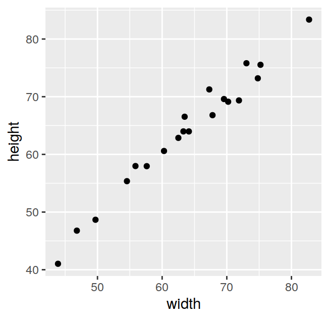
<p class="caption">(\#fig:unnamed-chunk-4)Width and height of some objects</p>
</div>

note how the `ggplot` function takes two arguments, `data` must be a dataframe holding the variables of interest; the `mapping` argument takes a function called `aes` that specifies the aesthetic mappings. The geometry is "added" later with the `+` operator. From now on we will omit for brevity the argument names and simply write:

```r
ggplot(dat, aes(x=width, y=height)) + geom_point()
```

one way to map the weight data onto the current graph could be to set the size of the points depending on the weight value:

```r
ggplot(dat, aes(x=width, y=height, size=weight)) + geom_point()
```

<div class="figure">
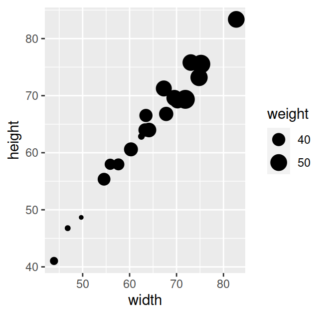
<p class="caption">(\#fig:unnamed-chunk-6)Width and height of some objects</p>
</div>

yet another way could be to set the color of the points depending on the weight value:

```r
ggplot(dat, aes(x=width, y=height, color=weight)) + geom_point()
```

<div class="figure">
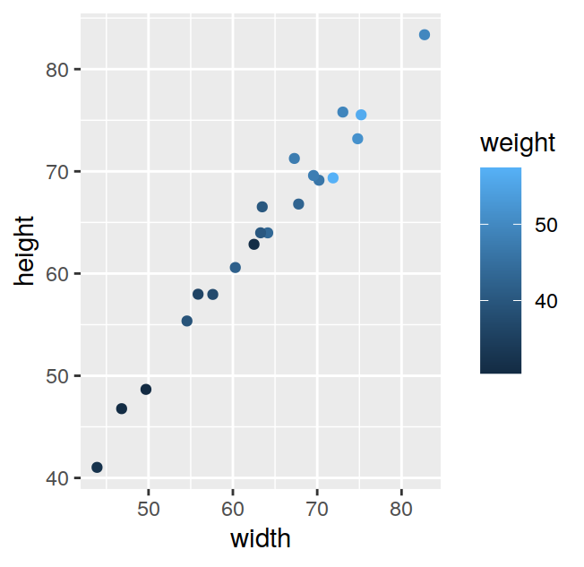
<p class="caption">(\#fig:unnamed-chunk-7)Width and height of some objects</p>
</div>

for this last plot we may want to increase the size of *all* points to make their color easier to see. We can do this by passing a `size` argument to `geom_point`:


```r
ggplot(dat, aes(x=width, y=height, color=weight)) + geom_point(size=3)
```

<div class="figure">

<p class="caption">(\#fig:unnamed-chunk-8)Width and height of some objects</p>
</div>

although by doing this we are modifying an aesthetic quality of the plot, this does not generate an *aesthetic mapping* between the data and the graphic in the sense of the grammar of graphics. Aesthetic mappings always go within an `aes` call, while changes of the visual properties of the data that are not aesthetic mappings go outside it.

## Common charts

### Barplots

Barplots can be obtained with `geom_col`. We'll first generate a dataset with three factors to use for the examples:

```r
set.seed(1714)
y = rnorm(20, mean=2, sd=0.25)
fac1 = rep(c("C1", "C2"), each=10)
fac2 = rep(rep(c("D1", "D2"), each=5), 2)
fac3 = rep(c("E1", "E2"), 10)
dd = data.frame(y, fac1, fac2, fac3)
```

next we'll summarize `y` by one, two, or all three factors:

```r
ddSumm1 = dd %>% group_by(fac1) %>% summarize(mny=mean(y),
                                              sdy=sd(y))
ddSumm2 = dd %>% group_by(fac1, fac2) %>% summarize(mny=mean(y),
                                                    sdy=sd(y))
ddSumm3 = dd %>% group_by(fac1, fac2, fac3) %>% summarize(mny=mean(y),
                                                          sdy=sd(y))
```

the simplest barplot is the one showing the mean value of `y` as a function of `fac1` alone:

```r
p1 = ggplot(ddSumm1, aes(fac1, mny))
p1 = p1 + geom_col()
p1
```

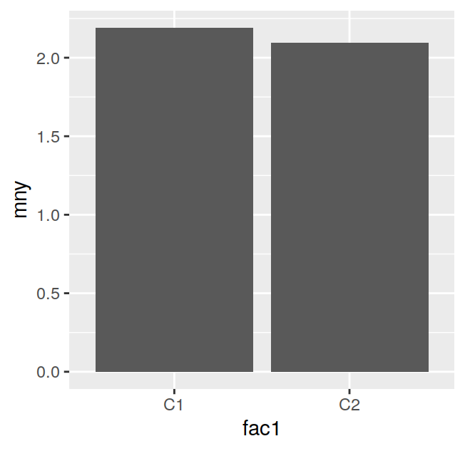

we can add error bars wth `geom_errorbar`:

```r
p1 = p1 + geom_errorbar(aes(ymin=mny-sdy, ymax=mny+sdy),
                        width=0.2)
p1
```

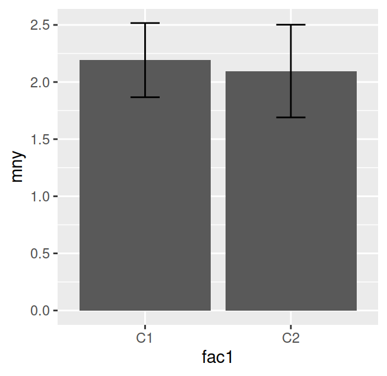

next we'll plot `y` as a function of both `fac1` and `fac2`, by using the `fill` aesthetic to map `fac2` to the color of the bars:

```r
p2 = ggplot(ddSumm2, aes(fac1, mny, fill=fac2))
p2 = p2 + geom_col()
p2
```

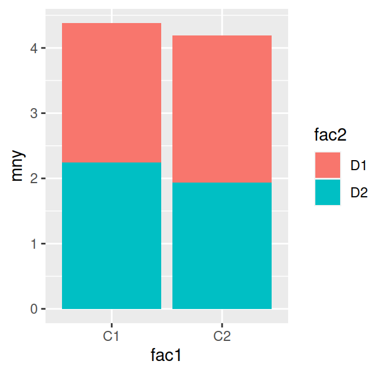

the code above generates a stacked barplot. To generate a barplot with the bars side to side rather than stacked we have to use `position_dodge` to offset the position of the bars relative to each other:

```r
dodge_size=0.9
p2 = ggplot(ddSumm2, aes(fac1, mny, fill=fac2))
p2 = p2 + geom_col(position=position_dodge(dodge_size))
p2 = p2 + geom_errorbar(aes(ymin=mny-sdy, ymax=mny+sdy),
                        width=0.2,
                        position=position_dodge(dodge_size))
p2 = p2 + scale_fill_manual(name="Fac. #2", values=palette()[c(2,4)])
p2
```

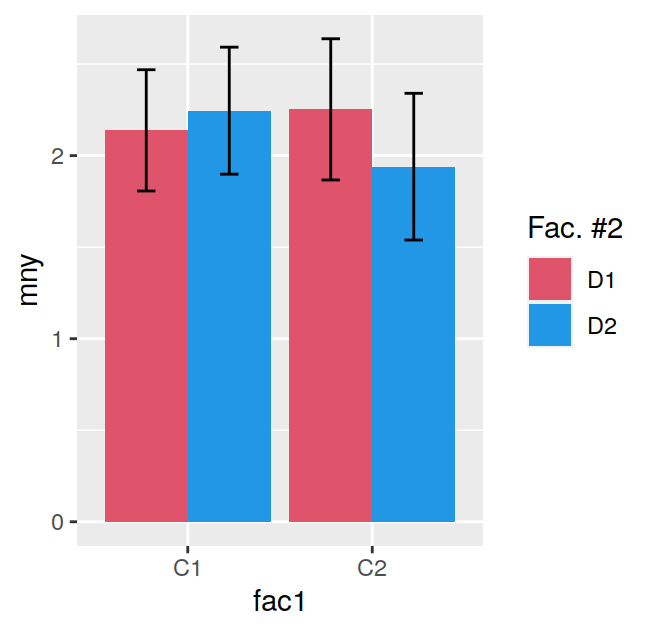

again we've added some error bars; note how we need to set the `position` argument also for `geom_errorbar` to make sure the error bars are aligned to the bars of the barplot. We've also changed the colors of the bars with `scale_fill_manual`.

If we have want to map all three factors to the barplot we can plot `fac3` along different panels using `geom_wrap`:


```r
dodge_size=0.9
p3 = ggplot(ddSumm3, aes(fac1, mny, fill=fac2))
p3 = p3 + geom_col(position=position_dodge(dodge_size))
p3 = p3 + facet_wrap(~fac3)
p3 = p3 + geom_errorbar(aes(ymin=mny-sdy, ymax=mny+sdy),
                        width=0.2,
                        position=position_dodge(dodge_size))
p3 = p3 + scale_fill_manual(name="Fac. #2", values=palette()[c(2,4)])
p3
```

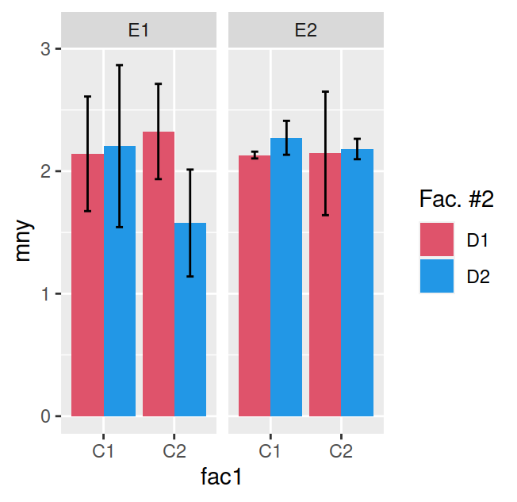

Besides `geom_col` there is a `geom_bar` that can generate barplots; `geom_bar(stat="identity)"` will produce the same plot as `geom_col`, however, the default `stat` for `geom_bar` is `count`, so it will plot the count of cases of a certain factor. For example the following chart will plot the number of cars for each manufacturer in the `mpg` dataset:

```r
p = ggplot(mpg, aes(manufacturer)) + geom_bar()
p = p + theme(axis.text.x = element_text(angle = 45, hjust = 1))
p
```

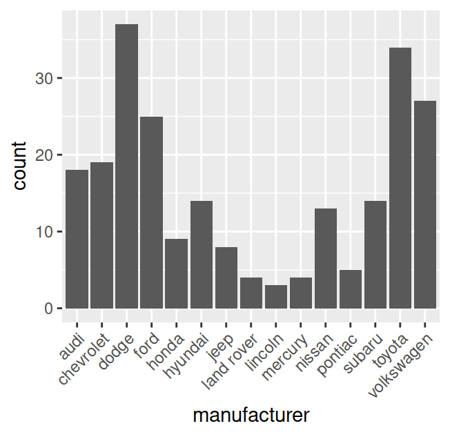

and the following one will count the number of cars by manufacturer and type of transmission:

```r
p = ggplot(mpg, aes(manufacturer, fill=trans)) + geom_bar(position=position_dodge(0.9))
p = p + theme(axis.text.x = element_text(angle = 45, hjust = 1))
p
```

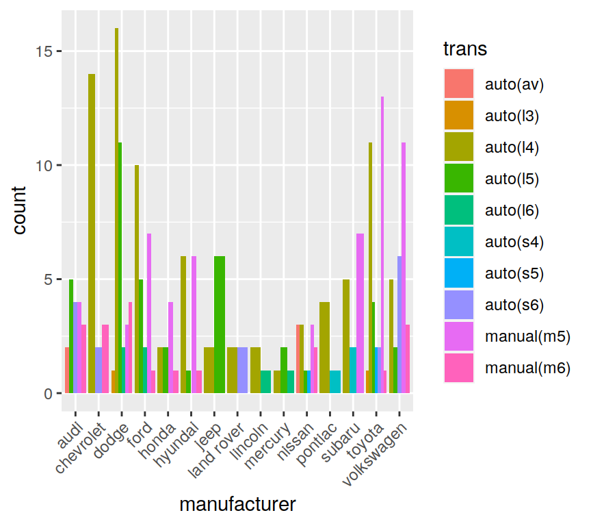


## Scales

### Log axis with pretty tickmarks


```r
x = c("cnd1", "cnd2")
y = c(0.4, 80)

dat = data.frame(x=x, y=y)

p = ggplot(dat, aes(x=x, y=y)) + geom_point()
p = p + scale_y_continuous(trans="log10")
p = p + annotation_logticks(sides="l")
p = p + theme_bw(base_size=12)
p
```

<div class="figure">

<p class="caption">(\#fig:unnamed-chunk-18)Log axis with pretty tickmarks</p>
</div>

## Themes

`ggplot2` ships with a number of themes included. The [`ggthemes`](https://cran.r-project.org/web/packages/ggthemes/index.html) package provides a number of additional themes.


## Tips and tricks

### Fixing labels that won't fit

Sometimes an axis label may be clipped off as in the next example:

```r
set.seed(260420)
y=rnorm(3)
dd = data.frame(x=c("Effect of first condition A",
                    "Effect condition B",
                    "Effect condition C"),
                y=y, lower=y-runif(3, 0.5, 1),
                upper=y+runif(3, 0.5, 1))
p = ggplot(dd, aes(x,y)) + geom_point(shape=1)
p = p + geom_errorbar(aes(ymin=lower, ymax=upper), width=0)
p = p + coord_flip() + theme_bw() + xlab(NULL)
p = p + ylab("A really long label that won't easily fit!")
p
```

<div class="figure">
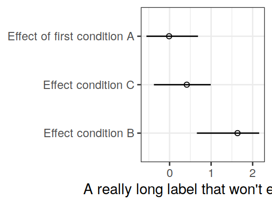
<p class="caption">(\#fig:unnamed-chunk-19)Example of axis label tha doesn't fit</p>
</div>

the label can be shifted by changing the value of `hjust` for the `element_text` or the `axis.title.x`:

```r
p = p + theme(axis.title.x = element_text(hjust=1))
p
```

<div class="figure">

<p class="caption">(\#fig:unnamed-chunk-20)Fitting a long label with `hjust`</p>
</div>

alternatively we can use the `draw_label` function from the `cowplot` package to fine tune the label position:


```r
library(cowplot)
p = ggplot(dd, aes(x,y)) + geom_point(shape=1)
p = p + geom_errorbar(aes(ymin=lower, ymax=upper), width=0)
p = p + coord_flip() + theme_bw() + xlab(NULL)
p = p + ylab("")
p = ggdraw(p) + draw_label("A really long label that won't easily fit!",
                           x = 0.025, y = 0.1, hjust = 0, vjust = 1,
                           size = 12)
p
```

<div class="figure">

<p class="caption">(\#fig:unnamed-chunk-21)Fitting a long label with `draw_label` from `cowplot`</p>
</div>

### Setting the aspect ratio

In the following plot the `x` and `y` variables are on the same scale, but we've purposefully added an outlier:

```r
x = rnorm(100)
y = rnorm(100)
y[1] = y[1]+10
dat = data.frame(x=x, y=y)
p = ggplot(dat, aes(x, y)) + geom_point()
p = p + geom_abline(slope=1, intercept=0)
p
```

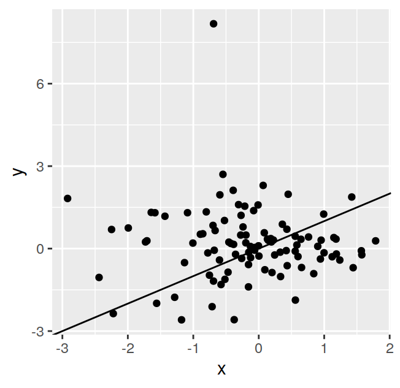

we can set the aspect ratio to 1 with `p = p + coord_fixed(ratio=1)`


```r
p = p + coord_fixed(ratio=1)
p
```

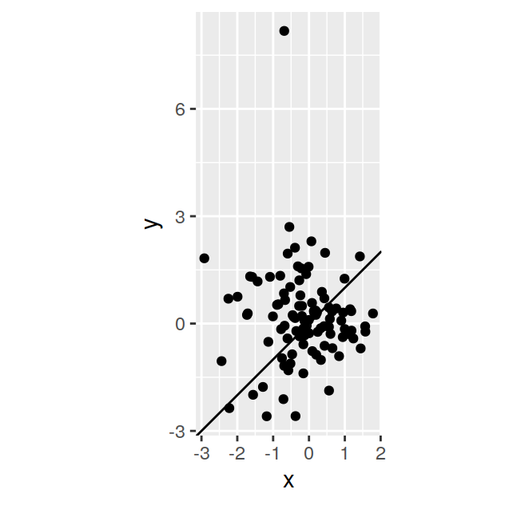

this fixes the aspect ratio to 1, but the plot looks somewhat odd because it is not square. To fix this we need to calculate the ranges of both axes and set them at their max/min:

```r
p = ggplot(dat, aes(x, y)) + geom_point()
p = p + geom_abline(slope=1, intercept=0)
xmax = max(layer_scales(p)$x$range$range)
ymax = max(layer_scales(p)$y$range$range)
xymax = max(xmax,ymax)
xmin = min(layer_scales(p)$x$range$range)
ymin = min(layer_scales(p)$y$range$range)
xymin = min(xmin,ymin)
p = p + coord_equal(xlim=c(xymin,xymax), ylim=c(xymin,xymax))
p
```

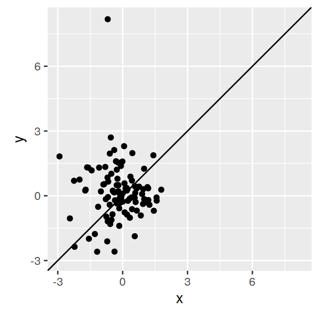
