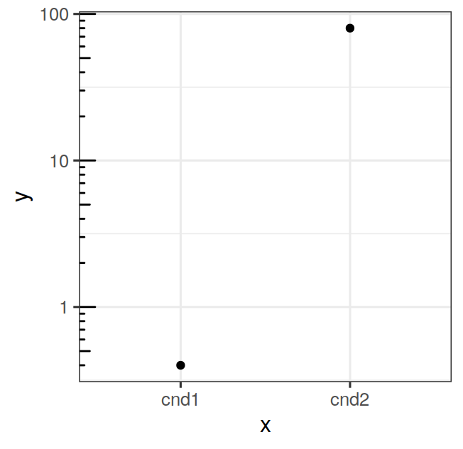

# ggplot2 {#ggplot2}


The book "ggplot2. Elegant graphics for data analysis" [@Wickham2009] is the best reference for learning ggplot2

Other useful resources include:

- AVML 2012: ggplot2 http://www.ling.upenn.edu/~joseff/avml2012/ by
  Josef Fruehwald. This is one of the best introductions to ggplot2,
  highly recommended! There is a more recent version of this tutorial
  also here: http://jofrhwld.github.io/teaching/courses/2017_lvc/practicals/7_practical_r.html#inheritance

All the examples in this chapter assume that ggplot2 has been
installed and is loaded in your R session. If not, you can install it with:

```r
install.packages("ggplot2")
```

and load it with:


```r
library(ggplot2)
```

At its essence a plot is a mapping of certain properties of the data to certain visual properties of the medium (paper, screen, etc...) on which it appears. For example, a variable such as blood pressure, may be mapped to the coordinate of a point in the y axis, and another variable such as time, may be mapped to the coordinate of a point on the x axis. Sometimes variables may be mapped to other graphical aspects, such as the color of points, the type (solid, dashed, etc...) of a line, or the size of a point. ggplot2 implements a "grammar" of graphics that allows you to express and control this mappings with a high-level language. Compared to traditional plotting systems (such as base R graphics) this typically allows you to express these mappings concisely; if you master the grammar it may also allow to do it more quickly.

Two basic elements of ggplot2 are "aesthetics", and "geometries". Aesthetics in ggplot2 define the ways in which data properties are conceptually mapped to graphical elements (e.g. by position, color, shape, etc...). Geometries, on the other hand, represent the actual geometrical elements (e.g. points, lines, bars, etc...) used to implement these mappings. Let's move on to some examples to clarify this. We'll first simulate a dataset containing the measured height, width, and weight of some objects:

```r
set.seed(790); n = 20
height = rnorm(n, 60, 10)
width = height + rnorm(n, mean=0, sd=2.2)
weight = (width+height)/3 + rnorm(n, mean=0, sd=4)
dat = data.frame(height=height, weight=weight, width=width)
```

we can visualize the width and height data, and their relation, by mapping width to position on the x axis, and height to position on the y axis, then use points to implement these mapping. In ggplots we would write:


```r
ggplot(data=dat, mapping=aes(x=width, y=height)) + geom_point()
```

<div class="figure">

<p class="caption">(\#fig:unnamed-chunk-4)Width and height of some objects</p>
</div>

note how the `ggplot` function takes two arguments, `data` must be a dataframe holding the variables of interest; the `mapping` argument takes a function called `aes` that specifies the aesthetic mappings. The geometry is "added" later with the `+` operator. From now on we will omit for brevity the argument names and simply write:

```r
ggplot(dat, aes(x=width, y=height)) + geom_point()
```

one way to map the weight data onto the current graph could be to set the size of the points depending on the weight value:

```r
ggplot(dat, aes(x=width, y=height, size=weight)) + geom_point()
```


yet another way could be to set the color of the points depending on the weight value:

```r
ggplot(dat, aes(x=width, y=height, color=weight)) + geom_point()
```


for this last plot we may want to increase the size of *all* points to make their color easier to see. We can do this by passing a `size` argument to `geom_point`:


```r
ggplot(dat, aes(x=width, y=height, color=weight)) + geom_point(size=3)
```


although by doing this we are modifying an aesthetic quality of the plot, this does not generate an *aesthetic mapping* between the data and the graphic in the sense of the grammar of graphics. Aesthetic mappings always go within an `aes` call, while changes of the visual properties of the data that are not aesthetic mappings go outside it.

### Log axis with pretty tickmarks


```r
x = c("cnd1", "cnd2")
y = c(0.4, 80)

dat = data.frame(x=x, y=y)

p = ggplot(dat, aes(x=x, y=y)) + geom_point()
p = p + scale_y_continuous(trans="log10")
p = p + annotation_logticks(sides="l")
p = p + theme_bw(base_size=12)
p
```

<div class="figure">

<p class="caption">(\#fig:unnamed-chunk-9)Log axis with pretty tickmarks</p>
</div>
