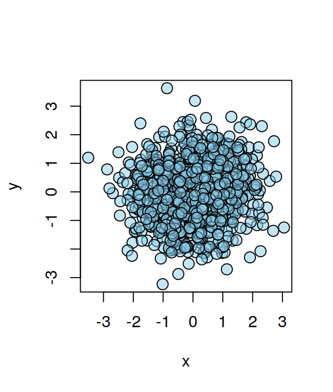
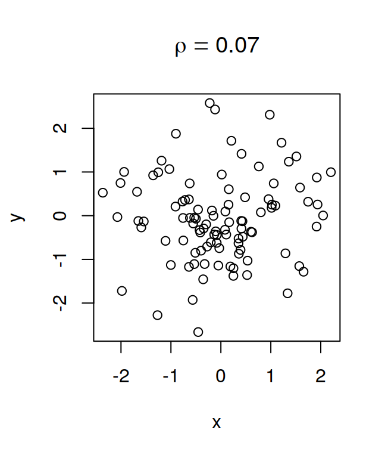

# Graphics: common elements across plotting libraries {#graphicscommon}


Although as we have seen R has a number of different plotting libraries, certain plotting procedures, such as choosing colors, choosing fonts, and annotating plots with mathematical expressions that share the same or similar underlying mechanisms/functions across the different plotting libraries. This chapter will illustrate some of these common functions.

## Colors for graphics {#colorscommon}

The command `colors` gives a list of built-in colors available for graphics in R. You can see some of these colors in Figure \@ref(fig:color1). There are 101 built-in shades of gray, from `gray0`, that is almost black, to `gray100` that is almost white, you can see some of them in Figure \@ref(fig:color1). A complete table of built-in R colors is given in Appendix \@ref(fullcoltable).
<div class="figure">

<p class="caption">(\#fig:color1)Some built-in colors in R.</p>
</div>

You can also specify colors in rgb values. By default R accepts values in the range 0-1, but you can change the range with the `max` option to set the range as 0-255. Please note that changing the range doesn't change the colors you can use, it just changes the values you use to specify them, so for example the following graphs will have the same colors:


```r
vec = c(3,6)
barplot (vec, col= c(rgb(0.176, 0.262, 0.49),
         rgb(0.568, 0.254 0.654)))
barplot (vec, col= c(rgb(45,67,125, max=255),
         rgb(145,65,167, max=255)))
```

the first uses the default range, and the second uses the range 0-255, but I simply derived the values for the first graph, dividing those for the second by 255.

The function `col2rgb` can be used to get the rgb values of a built-in color from its name. The rgb values are given in this case in the range 0-255. Here's an example:


```r
col2rgb("lightslateblue")
```

```
##       [,1]
## red    132
## green  112
## blue   255
```

### Color opacity

The `adjustcolor` function can be used to set the opacity of a color using the `alpha.f` argument:


```r
mycol = adjustcolor("skyblue", alpha.f=0.5) 
x = rnorm(1000)
y = rnorm(1000)
plot(x, y, pch=21, bg=mycol, cex=1.5)
```

<div class="figure">

<p class="caption">(\#fig:coltransp)Color opacity.</p>
</div>

the `adjustcolor` function accepts a vector of colors as an argument, so you can change the transparency of several colors at the same time.

### Color palettes

The [`RColorBrewer`](https://cran.r-project.org/web/packages/RColorBrewer/index.html) package provides a number of discrete color palettes. The complete set is shown in Figure \@ref(fig:displaybrewerall) can be seen with the following function:

```r
library(RColorBrewer) #load package
display.brewer.all()
```

<div class="figure">

<p class="caption">(\#fig:displaybrewerall)`RColorBrewer` palettes.</p>
</div>

to show only colorblind friendly palettes:

```r
display.brewer.all(colorblindFriendly=T)
```

the palettes can be instantiated by calling the `brewer.pal` function as follows:

```r
pal1 = brewer.pal(3, "Pastel2")
```

the first argument is the number of colors and the second argument is the name of the desired palette. Note that `ggplot2` has convenience functions to use `RColorBrewer` palettes (see [here](https://ggplot2.tidyverse.org/reference/scale_brewer.html)).

The [`colorspace`](https://cran.r-project.org/web/packages/colorspace/index.html) package provides an array of utilities for working with colors, including color palettes in [HCL](https://en.wikipedia.org/wiki/HCL_color_space) color space.

The [`viridis`](https://cran.r-project.org/web/packages/viridis/) package provides a number of continuous color palettes that have been designed to be perceptually uniform and robust to color blindness (see the [`viridis` vignette](https://cran.r-project.org/web/packages/viridis/vignettes/intro-to-viridis.html)). Note that `ggplot2` has convenience functions to work with `viridis` palettes (see [here](https://ggplot2.tidyverse.org/reference/scale_viridis.html)).

It is important to make sure that important graphical features distinguished by colors can be seen by everyone, including colorblind people. The [`dichromat`](https://cran.r-project.org/web/packages/dichromat/) package can simulate the effects of different types of color blindness through the `dichromat` function. The [`colorspace`](https://cran.r-project.org/web/packages/colorspace/index.html) package can also simulate color vision deficiencies through the `simulate_cvd` function.

Another useful colorblind friendly palette is that provided by Okabe and Ito [here](https://jfly.uni-koeln.de/color/); you can instantiate this palette with the following code:

```r
cbPalette = c("#000000", "#E69F00", "#56B4E9", "#009E73", "#F0E442",
              "#0072B2", "#D55E00", "#CC79A7", "#999999")
```

## Mathematical expressions and variables {#plotmath}

It is possible to use mathematical symbols in plot labels and text. The base system for providing math symbols in plot annotations has been described by @MurrellAndIhaka2000, which is a recommended reading. An overview of the system with a comprehensive list of all the symbols can be obtained with `?plotmath`. I don't find the system particularly intuitive, and can't claim to fully understand its inner workings, but I'll nevertheless attempt to explain in rough terms how it works.

The basic idea is that instead of providing a string to `text`, `xlab` or other functions through which you want to plot some text, you provide an `expression`, in the sense of a mathematical expression. Two examples are given below:

```r
plot.new(); plot.window(xlim=c(4, 6), ylim=c(0, 5))
text(5, 1, labels=expression(alpha/(x+2)))
text(5, 2.5, labels=expression(frac(alpha, x+2)))
box()
```


note how `alpha` is turned into the corresponding Greek letter. Often you'll want to combine strings with mathematical expressions in labels. This can be achieved using the `paste` function, as shown below:

```r
plot.new(); plot.window(xlim=c(4, 6), ylim=c(0, 5))
text(5, 1, labels=expression(paste("Amplitude (", mu, "V)")))
box()
```


Strings and mathematical expressions can also be combined using the multiplication (`*`) operator (e.g. `expression("Amplitude (" * mu * "V)")`), but this seems somewhat improper and runs into limitations. For example `expression(alpha == 3 * beta == 2)` results in an error, probably because it is not a valid mathematical expression, while `expression(paste(alpha == 3, beta == 2))` works without errors.

Spaces between symbols can be obtained by using one or more tilde (`~`) operators, as shown below:

```r
plot.new(); plot.window(xlim=c(4, 6), ylim=c(0, 5))
text(5, 1, labels=expression(paste("No spaces: ", alpha * beta)))
text(5, 2.5, labels=expression(paste("Spaces: ", alpha ~ beta)))
box()
```


Sometimes you may want to print the value of a variable inside the expression of a plot label. In this case you can use the `substitute` function:

```r
x = rnorm(100); y=rnorm(100)
corrOut = cor.test(x,y)
corrEst = corrOut$estimate
corrPVal = corrOut$p.value
plot(x,y)
title(main=substitute(rho == v1, list(v1=round(corrEst,2))))
```



the second argument to the function is a list of all the variable values that need to be substituted. In the example below two values are substituted:

```r
plot(x,y)
title(main=substitute(paste(rho == v1, "; ", italic(p) == v2),
                      list(v1=round(corrEst,2), v2=round(corrPVal, 2))))
```


A few more example of mathematical expressions in labels are given below:

```r
uVText = expression(paste("Amplitude (", mu, "V)"))
dF0Text = expression(paste( Delta, 'F0 (%)'))
dpText = expression(paste(italic("d' ")))
subText1 = expression(paste(sigma, scriptscriptstyle(c), " (Cents)"))
subText2 = expression(paste(delta, scriptscriptstyle(k)  %+-% 162.5,
                            ' Cents', sep=''))
sqText = expression(paste('F0 Acceleration (Hz/', s^2, ')'))
piText = expression(paste('Start Phase 1.5', pi,))
betaText = expression(beta[0])
log10Text = expression(log[10](nu))
uVsqText = expression(paste('Level ', italic('re'), ' 1 ',
                            mu, V^{2}, ' (dB)'))
bdText = expression(paste( bold("Enhancement ("),
                          italic("d'"), bold("units)")))
zScoreText = expression(paste(italic(z), " Score"))
densText = expression(paste("Density (", kg/m^3, ")"))
beta2Text = expression(mu[beta[0]])
noiseText = expression(paste("Noise [", log[10], "(Energy)]"))
PTAText = expression(paste("PTA"["0.5-2"], " (dB)"))
RSqText = expression("R"^"2")
atopText = expression(atop("PTA"["1-2"],"(dB SPL)"))
latencyText = expression(paste("Latency (", italic(z),
                               " Score)"))

par(mfrow=c(2,2))

plot.new(); plot.window(xlim=c(0, 10), ylim=c(0, 10))
text(5, 1.00, labels=uVText)
text(5, 2.25, dF0Text)
text(5, 3.50, dpText)
text(5, 4.75, subText1)
text(5, 6.00, subText2)
text(5, 7.25, sqText)
text(5, 8.5, piText)
text(5, 9.75, betaText)
box()

plot.new(); plot.window(xlim=c(0, 10), ylim=c(0, 10))
text(5, 1.00, labels=log10Text)
text(5, 2.25, uVsqText)
text(5, 3.50, bdText)
text(5, 4.75, zScoreText)
text(5, 6.00, densText)
text(5, 7.25, beta2Text)
text(5, 8.5, noiseText)
text(5, 9.75, PTAText)
box()

plot.new(); plot.window(xlim=c(0, 10), ylim=c(0, 10))
text(5, 1.00, labels=latencyText)
text(5, 2.25, RSqText)
text(5, 3.50, "")
text(5, 4.75, "")
text(5, 6.00, "")
text(5, 7.25, "")
text(5, 8.5, "")
text(5, 9.75, "")
box()
title(xlab=atopText)
```


## Fonts for graphics {#fonts}

In Section \@ref(parfonts) it was mentioned that it is possible to specify a system font (such as Palatino, or Arial) for the R base graphics via the `par(family=...)` setting, but this may or may not work depending on the specific graphics device (and of course also on whether that font is installed in your system or not). 

I'll focus on the issue of generating pdfs with custom fonts because I mostly use pdf for saving R graphics. The `pdf` device *does not* automaticaly embed the fonts in the file, and works only with a limited number of fonts (see `?pdfFonts` for details). An easy way to get around this issues is to use the `cairo_pdf` device instead of the `pdf` device: the `cairo_pdf` device can access all the true type fonts (TTF) and open type fonts (OTF) in your system and also embeds them in the pdf. The device can be used with both base graphics:


```r
cairo_pdf("base_graphics_ubuntu_font.pdf", family="Ubuntu")
plot(1:10)
dev.off()
```

or with ggplot2, by setting the `device` argument in `ggsave` to `cairo_pdf`:


```r
library(ggplot2)
n=100
dat=data.frame(x=rnorm(n), y=rnorm(n))
p = ggplot(dat, aes(x=x, y=y)) + geom_point()
p = p + xlab("X-Label") + ylab("Y-Label")
p = p + theme(text=element_text(size=12, family="Ubuntu"))
ggsave("ggplot2_cairo_pdf.pdf", p, width=3.4, height=3.4,
       device=cairo_pdf)
```

An alternative solution for using system fonts in pdfs is the [`extrafont`](https://cran.r-project.org/web/packages/extrafont/README.html) package. Another alternative is the [`showtext`](https://cran.rstudio.com/web/packages/showtext/index.html) package. Compared to `extrafont` the `showtext` package has the advantage of being able to use open type fonts; however `showtext` has the disadvantage of not rendering the fonts as "drawings" (you can't copy and paste text). Overall, my favorite solution is to use `cairo_pdf` because it handles both TTF and OTF fonts.


