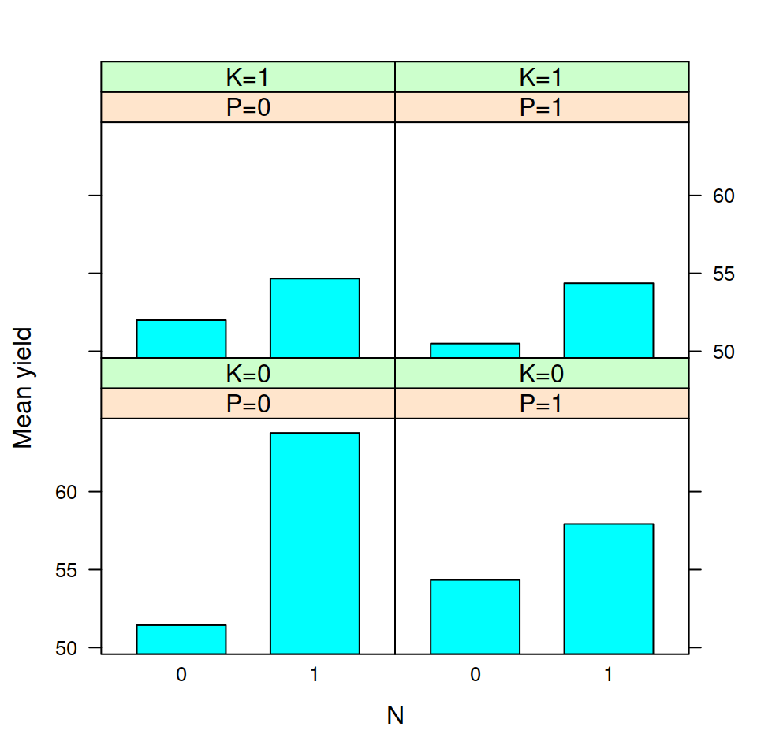

# Lattice graphics {#lattice}


The `lattice` package provides an alternative to the base R graphics system; it is an implementation of the ideas developed and implemented mainly by Rick Becker and Bill Cleveland in the Trellis graphics system for the S language [@Adler2010; @Crawley2013]. Trellis displays were developed as a framework to easily display of the relationship between a dependent variable and multiple factors. 

The best introduction to `lattice` graphics is the book by @Sarkar2008, the author of `lattice`. The `lattice` package documentation, available [here](https://cran.r-project.org/web/packages/lattice/lattice.pdf), is a good reference. The articles of @Sarkar2002, @Sarkar2003, and the book chapter of @Murrell2001 are good introductory resources.

Because `lattice` is mostly compatible with the Trellis graphics system in [S-Plus](https://en.wikipedia.org/wiki/S-PLUS), @BeckerEtAl1996, @BeckerEtAl1996b, @ClevelandAndFuentes1997, and @BeckerAndCleveland2002, which are articles/documents written for Trellis, also provide a good introduction to `lattice` and to the concept of trellis displays.

## Overview of lattice graphics

  Function
  ---------
  `xyplot` 
  `barchart` 
  `dotplot` 
  `stripplot` 
  ` bwplot` 

Table: (\#tab:latticefunctions) Lattice graphics functions.

## Introduction to model formulae and multi-panel conditioning {#lattmpancond}

To illustrate how conditioning on one or more factors works in `lattice` we'll use the `npk` dataset, which contains data from a factorial experiment on the effects of N, P, K (nitrogen, phosphate, potassium) on the growth of peas:

```r
data(npk)
npk$P = factor(npk$P, levels=c("0", "1"), labels=c("P=0", "P=1"))
npk$K = factor(npk$K, levels=c("0", "1"), labels=c("K=0", "K=1"))
```

in the dataset `N`, `P`, and `K` are indicator variables for the application of the respective element (0=no, 1=yes). We renamed the levels of the P and K factors to make legends and strip labels easier to read. We'll first plot the mean yield as a function of N, averaging across the levels of the other factors. In order to do this we'll generate a summary data set:

```r
library(dplyr)
npk_summ_N = npk %>% group_by(N) %>% summarize(mean_yield=mean(yield),
                                               sd_yield=sd(yield))
```

Two basic elements of `lattice` plots consist of a dataframe, and a model formula specifying how you want a given variable to be displayed along the dimensions of one or more factors. In our case, we want `mean_yield ~ N` (you could read the `~`, "as a function of"), the barchart can be produced with the code below, and is displayed in Figure \@ref(fig:lattnpkp1):

```r
library(lattice)
##trellis.device() #optional opens an X11() window on Linux
pl1 = barchart(mean_yield ~ N, data=npk_summ_N,
               xlab="N", ylab="Mean yield")
print(pl1)
```

<div class="figure">

<p class="caption">(\#fig:lattnpkp1)Yield as a function of nitrogen application.</p>
</div>

Now suppose we want to visualise the relation between `yield` and N depending on P administration. In lattice there are two ways of doing it, one is by the use of a "grouping" factor. The second way is by multi-panel factor conditioning. The advantage of multi-panel conditioning, as we will see soon, is that it can be extended to an unlimited number of factors. Let's start with the first solution, in which we use a grouping factor. We first generate a summary dataset as a function of both N and P with:

```r
npk_summ_NP = npk %>% group_by(N,P) %>% summarize(mean_yield=mean(yield),
                                                  sd_yield=sd(yield))
```

and then generate the barplot (shown in Figure \@ref(fig:lattnpkp2)):

```r
pl2 = barchart(mean_yield ~ N, groups=P, 
               data=npk_summ_NP, auto.key=TRUE,
               xlab="N", ylab="Mean yield")
print(pl2)
```

<div class="figure">

<p class="caption">(\#fig:lattnpkp2)Barplot with bars side by side showing yield as a function of nitrogen and potassium application.</p>
</div>

the grouping factor is given by the `groups` argument, note also that we have set `auto.key` to `TRUE` in order to automatically add a legend.

The second way of building the graph is by multi-panel conditioning. We achieve this by setting P as a conditioning factor with the `|` operator. The model formula becomes `mean_yield ~ N | P`, which you could read as "mean yield as a function of N, given P`. The plot shown in Figure \@ref(fig:lattnpkp3):

```r
pl3 = barchart(mean_yield ~ N | P, data=npk_summ_NP,
               xlab="N", ylab="Mean yield")
print(pl3)
```

<div class="figure">

<p class="caption">(\#fig:lattnpkp3)Barplot showing yield as a function of nitrogen and potassium application using multi-panel conditioning.</p>
</div>

We can visualize the effect of all three factors (N, P, K) by showing mean values of K along different panels. We'll first generate a summary dataset as a function of all three factors:

```r
npk_summ_NPK = npk %>% group_by(N,P,K) %>% summarize(mean_yield=mean(yield),
                                                     sd_yield=sd(yield))
```

and then generate the plot (shown in Figure \@ref(fig:lattnpkp4)):

```r
pl4 = barchart(mean_yield ~ N | P+K, data=npk_summ_NPK,
               xlab="N", ylab="Mean yield")
print(pl4)
```

<div class="figure">

<p class="caption">(\#fig:lattnpkp4)Barplot showing yield as a function of nitrogen and potassium application. Panels plot mean yield as a function of the application of phosphate (0=no, 1=yes).</p>
</div>

Also in this case we could have used a grouping variable rather than using two conditioning factors (Figure \@ref(fig:lattnpkp5)):

```r
pl5 = barchart(mean_yield ~ N | P, groups=K, data=npk_summ_NPK,
               xlab="N", ylab="Mean yield", auto.key=T)
print(pl5)
```

<div class="figure">

<p class="caption">(\#fig:lattnpkp5)Barplot showing yield as a function of nitrogen, phosphate, and potassium application. Panels plot mean yield as a function of the application of potassium (0=no, 1=yes).</p>
</div>

what is the best display is up to the user to decide, and depends from case to case.

## `xyplot`

The `xyplot` function can be used to generate scatterplots and time-series plots.

We'll plot a scatterplot using the `iris` dataset (plot shown in Figure \@ref(fig:lattiris2)):

```r
p = xyplot(Sepal.Length~Sepal.Width, groups=Species, data=iris, auto.key=T)
print(p)
```

<div class="figure">

<p class="caption">(\#fig:lattiris2)Scatterplot of sepal length by sepal width for the iris measurements in the `iris` dataset.</p>
</div>

We can also obtain points connected by lines by passing the `type="b"` argument to `xyplot`. To illustrate this we'll plot a time series using the `Orange` built-in R datasets, which contains data on the growth of five orange trees (plot shown in Figure \@ref(fig:lattorange1)):

```r
xyplot(circumference~age, group=Tree, data=Orange,
       type="b", as.table=T,
       xlab="Age (days)", ylab="Circumference (mm)",
       auto.key=list(title="Tree", space="right"))
```

<div class="figure">

<p class="caption">(\#fig:lattorange1)Growth of orange trees: trunk circumference by age (in days) for five trees.</p>
</div>

## `barchart`

We have already seen a few examples of barcharts built with `lattice` in Section \@ref(lattmpancond). We'll loot at a few more examples in this section.

The following dataset contains both positive and negative values:

```r
dat = data.frame(y=c(-0.5, 0.7, 1, -0.8),
                 fct1=c("A", "A", "B", "B"),
                 fct2 = c("1", "2", "1", "2")
                 )
```

in order to plot a barchart with bars going either up or down from a baseline value of zero we have to pass the argument `origin=0`. We'll also change the fill color of the bars by changing the `col` attribute in the `superpose.polygon` list of settings (more info on setting graphical parameters in `lattice` are given in Section \@ref(trellispar)). The code for the barchart is shown below, the resulting plot is shown in Figure \@ref(fig:lattbarorig1).

```r
trellis.par.set(superpose.polygon = 
                    list(col = c("darkslateblue", "indianred"))
                )
p = barchart(y~fct1, origin=0, groups=fct2,
             data=dat)
print(p)
```

<div class="figure">

<p class="caption">(\#fig:lattbarorig1)Barchart with origin set to zero.</p>
</div>

## Histograms and density plots {#latthist}

We'll plot an histogram of sepal length from the `iris` dataset (Figure \@ref(fig:latthist1)):

```r
data(iris)
p = histogram(~Sepal.Length, data=iris)
print(p)
```

<div class="figure">

<p class="caption">(\#fig:latthist1)Histogram of sepal length in the `iris` dataset.</p>
</div>

the model formula for the `histogram` function is somehow unusual because the "y" variable is computed by `lattice`, and we pass the variable for which we want to compute it after the tilde (`~`). As usual it is also possible to use multi-panel conditioning, as shown by the graph in Figure \@ref(fig:latthist2), which plots histograms for sepal length separately for each iris species, and was obtained with the code below:

```r
p = histogram(~Sepal.Length | Species, data=iris)
print(p)
```

<div class="figure">

<p class="caption">(\#fig:latthist2)Histogram of sepal length in the `iris` dataset as a function of iris species.</p>
</div>

Density plots can be obtained with a similar formula (Figure \@ref(fig:lattdens1)):

```r
p = densityplot(~Sepal.Length, data=iris)
print(p)
```

<div class="figure">

<p class="caption">(\#fig:lattdens1)Density plot of sepal length in the `iris` dataset.</p>
</div>

by default `densityplot` plots the individual observation as points. This can be turned off by setting `plot.points=FALSE`:

```r
p = densityplot(~Sepal.Length, plot.points=FALSE,
                data=iris)
```

## Interaction plots

For the next example we'll use the `ToothGrowth` built-in R dataset, which contains measurements of the length of odontoblasts (cells responsible for tooth growth) in 60 guinea pigs. Each guinea pig had received one of three doses of vitamin C (0.5, 1, and 2 mg/day) by one of two delivery methods, orange juice (OJ) or ascorbic acid (VC). 


```r
data(ToothGrowth)
head(ToothGrowth)
```

```
##    len supp dose
## 1  4.2   VC  0.5
## 2 11.5   VC  0.5
## 3  7.3   VC  0.5
## 4  5.8   VC  0.5
## 5  6.4   VC  0.5
## 6 10.0   VC  0.5
```

we'll first generate a summary dataset as a function of delivery method (`supp` variable), and dose:

```r
ToothGrowthSumm = ToothGrowth %>% group_by(supp, dose) %>%
                                  summarize(meanLen=mean(len))
ToothGrowthSumm$dose = factor(ToothGrowthSumm$dose)
```

now we can generate the plot (shown in Figure \@ref(fig:latttoothgrowth1)) with the following code:

```r
p = xyplot(meanLen~supp, groups=dose, data=ToothGrowthSumm,
           panel="panel.superpose", panel.groups="panel.linejoin",
           auto.key=list(points=F, lines=T, title="Dose", space="right"),
           xlab="Delivery method", ylab="Mean growth")
print(p)
```

<div class="figure">

<p class="caption">(\#fig:latttoothgrowth1)Tooth growth by vitamin C dose and delivery method in guinea pigs.</p>
</div>

Obtaining an interaction plot with both lines and points requires writing a custon panel function:

```r
panelint = function(x, y, ...){
    panel.points(x, y, ...)
    panel.linejoin(x, y, ...)
}
```

the plot, shown in Figure \@ref(fig:latttoothgrowth2), can then be obtained by using this custom function:

```r
p = xyplot(meanLen~supp, groups=dose, data=ToothGrowthSumm,
           panel="panel.superpose", panel.groups="panelint",
           auto.key=list(points=T, lines=T, title="Dose", space="right"),
           xlab="Delivery method", ylab="Mean growth")
print(p)
```

<div class="figure">

<p class="caption">(\#fig:latttoothgrowth2)Tooth growth by vitamin C dose and delivery method in guinea pigs.</p>
</div>

## Customizing lattice graphics {#customizingtrellis}

### Themes {#trellispar}

The function `show.settings` gives a graphical overview of the current theme. The settings for the current theme are stored in a list, which you can get with:

```r
curr_theme = trellis.par.get()
```

the list contains many items, which are themselved lists of more basic attributes, we'll take a peak at the names of the itmes:

```r
names(curr_theme)
```

we can modify this list, for example setting filled points instead of hollow circles as `plot.symbol` and `superpose.symbol`

```r
curr_theme$plot.symbol$pch = 16
curr_theme$superpose.symbol$pch = rep(16, 7)
```

once this is done we have to call the `trellis.par.set` function to use the modified list as the current theme:

```r
trellis.par.set(curr_theme)
```


### Textual elements

#### Strip labels

The labels of the panels strips are the names of the levels of the conditioning factor variable. To change their labels you can pass the `factor.levels` argument to the `strip.custom` function:


```r
x = rnorm(20)
y = rnorm(20)
treat = factor(rep(c("A", "B"), each=10))
xyplot(y~x|treat, strip=strip.custom(factor.levels=c("Group A", "Group B")))
```

<div class="figure">

<p class="caption">(\#fig:strip1)Custom strip labels.</p>
</div>

Alternatively, you change the names for the factor levels:

```r
levels(treat) = c("Group A", "Group B")
```

if you have more than one conditioning factor you can customize the strip labels for each by passing a custom strip function. `which.given` specifies the conditioning
variable that the strip corresponds to:


```r
cnd = factor(rep(c("I", "II"), 10))

customstrip = function(which.given, ..., factor.levels){
    levs = if (which.given==1){
        c("Group A", "Group B")
    } else if  (which.given==2){
        c("Cnd. I", "Cnd. II")
    }
    strip.default(which.given, ..., factor.levels = levs)
}
xyplot(y~x | treat + cnd, strip=customstrip, as.table=TRUE)
```

<div class="figure">

<p class="caption">(\#fig:strip2)Custom strip labels with two conditioning factors.</p>
</div>

### Strips

#### Changing the strip background color


```r
data(iris)
ir2 = iris[iris$Species!="virginica",]
xyplot(Sepal.Length~Sepal.Width | Species, data=ir2, as.table=T,
       par.settings=list(strip.background=list(col="gray90")))
```

<div class="figure">

<p class="caption">(\#fig:stripcolor1)Changing strip background color.</p>
</div>

or to set a color for several plots:

```r
trellis.par.set(strip.background=list(col="gray90"))
```

#### Remove "box" and strip borders

The code below plots a figure without a bounding frame and without a strip, the result is shown in Figure \@ref(fig:rmstripbox).

```r
axis.L =  function(side, ..., line.col){
    if (side %in% c("bottom", "left")) {
        col = trellis.par.get("axis.text")$col
        axis.default(side, ..., line.col = col)
        if (side == "bottom")
            grid::grid.lines(y = 0)
        if (side == "left")
            grid::grid.lines(x = 0)
    }
}
xyplot(Sepal.Length~Sepal.Width | Species, data=ir2, axis=axis.L,
       scales=list(x=list(alternating=c(1,1)),
                   y=list(limits=c(min(ir2$Sepal.Length),
                                   max(ir2$Sepal.Length)),
                          relation="free")),
       par.settings=list(strip.border=list(col="transparent"),
                         strip.background=list(col="transparent"),
                         axis.line=list(col="transparent")))
```

<div class="figure">

<p class="caption">(\#fig:rmstripbox)Remove strip and box around the panels.</p>
</div>

The following code is a variant without tick labels on the inner y panel, the result is shown in Figure \@ref(fig:rmstripbox2).

```r
axis.L2 =  function(side, ..., line.col){
    if (side %in% c("bottom", "left")) {
        col = trellis.par.get("axis.text")$col
        if (side == "bottom"){
            grid::grid.lines(y = 0)
            axis.default(side, ..., line.col = col, labels="yes")
        }
        if (side == "left"){
            grid::grid.lines(x = 0)
            drawTickLabels = ifelse(current.column() == 1, "yes", "no")
            axis.default(side, ..., line.col = col, labels=drawTickLabels)
        }
    }
}


p = xyplot(Sepal.Length~Sepal.Width | Species, data=ir2, axis=axis.L2, as.table=T,
           scales=list(x=list(alternating=FALSE),
                       y=list(limits=c(min(ir2$Sepal.Length),
                                       max(ir2$Sepal.Length)),
                              relation="free",
                              alternating=4)),
           par.settings=list(strip.border=list(col="transparent"),
                             strip.background=list(col="transparent"),
                             axis.line=list(col="transparent")))
print(p)
```

<div class="figure">

<p class="caption">(\#fig:rmstripbox2)Remove strip and box around the panels. Do not draw tick labels on the inner y panel.</p>
</div>

### Log axis with pretty tickmarks

The `latticeExtra` package provides a function to get a log axis with pretty tickmarks in lattice, as shown in the code below. The result is shown in Figure \@ref(fig:lattextrlogaxpretty).

```r
library(latticeExtra)
x = as.factor(c("cnd1", "cnd2"))
y = c(0.4, 80)
dat = data.frame(x=x, y=y)
xyplot(y~x, data=dat,
       scales=list(y=list(log=10)),
       yscale.components = yscale.components.log10ticks)
```

<div class="figure">

<p class="caption">(\#fig:lattextrlogaxpretty)Log axis with pretty tickmarks using latticeExtra.</p>
</div>

#### Doing it manually

I had written this before discovering the `yscale.components.log10ticks` function in `latticeExtra`. I'm leaving it here in case it's useful for other similar axis customizations. 

The procedure to get a log axis with pretty tickmarks manually in lattice is a bit involved. We'll only cover the log base 10 case here. The first step is to define a function that returns the tick locations:


```r
log10Ticks = function(lim, onlyMajor=FALSE){
    minPow = floor(log10(lim[1]))
    maxPow = ceiling(log10(lim[2]))
    powSeq = seq(minPow, maxPow)
    majTicks = 10^powSeq
    minTicks = numeric()
    for (i in 1:length(majTicks)){
        bb = (1:10)/10;
        minTicks = c(minTicks, (bb*10^powSeq[i]))
    }
    if (onlyMajor==TRUE){
        axSeq = majTicks
    } else {
        axSeq = minTicks
    }
    axSeq = axSeq[lim[1] <= axSeq & axSeq <= lim[2]]
    return(axSeq)
}
```

by default the function returns both the major (e.g. 1, 10, 100, etc...) and the minor (e.g. 2, 3, 4,...20, 30, 40, etc...) tick locations, but returns only the major tick locations if `onlyMajor=TRUE`. This function will be used by the `yscale.components.log10` function below. This function will be passed as the `yscale.components` argument in the `xyplot` call that generates the graph. The `yscale.components.log10` function will return a list specifying all parameters of the y axis. To simplify this process the function calls the `yscale.components.default` function to retrieve the default parameters, and then simply modifies some of these parameters to draw the pretty log axis:

```r
#the function is automatically passed the limits of the panel as an argument
yscale.components.log10 = function(lim, ...){
    #retrieve default parameters
    ans = yscale.components.default(lim = lim, ...)
    #compute major and minor tick locations
    tick.at = log10Ticks(10^lim, onlyMajor=FALSE)
    #compute major tick locations only
    tick.at.major = log10Ticks(10^lim, onlyMajor=TRUE)
    #which are the major ticks?
    major = tick.at %in% tick.at.major
    #where the ticks should be position
    ans$left$ticks$at = log10(tick.at)
    #set tick length, depending on whether minor or major
    ans$left$ticks$tck = ifelse(major, 1.5, 0.75)
    #labels location
    ans$left$labels$at = log10(tick.at)
    #set tick labels
    ans$left$labels$labels = as.character(tick.at)
    #set minor tick labels as empty
    ans$left$labels$labels[!major] = "" 
    ans$left$labels$check.overlap = FALSE
    return(ans)
}
```

once the `yscale.components.log10` function is ready, we can use it in the call to `xyplot`, note that we also need to set the y scale to log10 in the `scales` argument, as shown in the code below. The result is shown in Figure \@ref(fig:latticelogaxispretty).

```r
x = as.factor(c("cnd1", "cnd2"))
y = c(0.4, 80)
dat = data.frame(x=x, y=y)
xyplot(y~x, data=dat,
       scales=list(y=list(log=10)),
       yscale.components = yscale.components.log10)
```

<div class="figure">

<p class="caption">(\#fig:latticelogaxispretty)Log axis with pretty tickmarks.</p>
</div>

## Writing panel functions {#trellispanel}

### Combining panel functions

Rather than writing a new panel function from scratch, often you just want to add some elements to a plot, for example a regression line, or error bars. The easiest and probably best way to do this is writing a panel function that combines two standard panel functions. There are a number of predefined panel functions (see `?panel.functions`) that can be used to add lines, grids etc..., to a scatterplot, barchart or other higher level lattice plotting function.

We'll start with a very simple example, adding a horizontal line at a fixed height in a dotplot. The `line_matching` dataset  can be visualised through a dotplot (Figure \@ref(fig:lmatchdotplot)):

```r
dat = read.table("datasets/line_matching.txt", header=TRUE)
oldpar = trellis.par.get("superpose.symbol")
trellis.par.set(superpose.symbol = 
                list(col = c("darkslateblue", 
                "indianred"), pch=19))
dotplot(error ~ length | group, groups=color, 
        data=dat, origin=0, ylab="Error (cm)", 
        xlab="Segment Length", auto.key=TRUE, 
        aspect=1, as.table=TRUE)
```

<div class="figure">

<p class="caption">(\#fig:lmatchdotplot)Dotplot of the line matching dataset.</p>
</div>

however, because the data represent positive or negative displacements from zero, it would be useful to add a horizontal line passing at zero. In order to do this, we'll write a panel function that combines the `panel.dotplot` function with the `panel.abline` function. The latter function will be used to add the horizontal line:

```r
panel.hRefDotplot = function(x, y, ref=NULL, ...){
    panel.dotplot(x, y, ...)
    panel.abline(h=ref, ...)
}
```

our new `panel.hRefDotplot` panel function accepts three arguments, `x` and `y`, which are the "standard" arguments given by the higher level plotting functions like `dotplot` to panel functions to specify the data to draw. The third argument represents the position at which to draw the horizontal line of reference for the data, we want it to be zero in this case, but passing the argument as a variable rather than hard-coding the value into the panel function will allow us to recycle this panel function in case we want the horizontal reference line drawn at some other points in the future. Besides these arguments, our panel function accepts also an undefined number of other arguments, which are designated by the `...` notation. These are usually graphics parameters that can be specified in the high level plotting function. The contents of our `panel.hRefDotplot` function are very simple, we call first `panel.dotplot` to draw the standard dotplot, and then we call `panel.abline` giving it the value of `ref` to draw the horizontal line in each panel. The actual plot is done by calling the high level `dotplot` function specifying `panel.hRefDotplot` as the panel function to use:

```r
dotplot(error ~ length | group, groups=color, 
        data=dat, origin=0, ylab="Error (cm)", 
        xlab="Segment Length", auto.key=TRUE, aspect=1, 
        as.table=TRUE, ref=0, panel=panel.hRefDotplot)
```

<div class="figure">

<p class="caption">(\#fig:lmatchdotplotref)Dotplot of the line matching dataset, with a horizontal reference line.</p>
</div>

note the last line of the call, first we're telling `dotplot` to use our `hRefDotplot` function to do the plotting by specifying the `panel` argument, second we're specifying another argument, `ref` in the call, this is not a standard argument, but it will be automatically passed to our panel function to decide at which height to draw the horizontal line. The resulting plot is shown in Figure \@ref(fig:lmatchdotplotref).


## Further resources

### Books, articles, and tutorials

[Creating publication quality graphs in R](https://moc.online.uni-marburg.de/gitbooks/publicationQualityGraphics/_book/index.html) by Tim Appelhans, provides useful notes on both `lattice` and `ggplot2`, including ways to manipulate and arrange plots using `grid`. The git repository of the tutorial is available [here](https://github.com/tim-salabim/publication-quality-graphics).

### Related packages

[`wzRfun`](https://github.com/walmes/wzRfun) contains miscellaneous utilities, including panel functions to add error bars and error bands to `lattice` plots.
