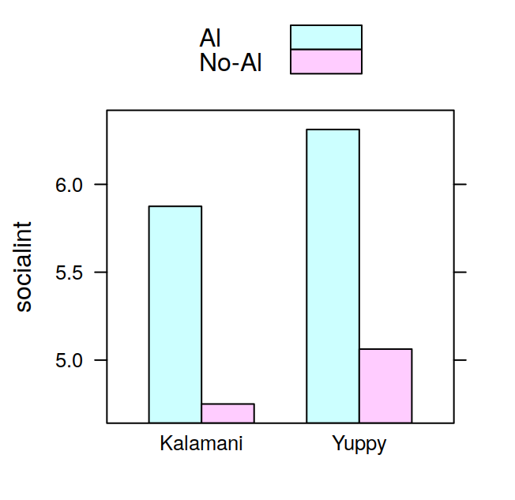

# Lattice Graphics {#lattice}


The `lattice` package in R provides an alternative to the base graphics system, it is an implementation of the ideas developed and implemented by Rick Becker and Bill Cleveland in the Trellis graphics system for the S language. Trellis displays were developed as a framework to make it easy the display of the relationship between a dependent variable and multiple factors. 

The best introduction to `lattice` graphics is the book by Sarkar [@sarkar2008], the author of `lattice`:

- Lattice: Multivariate Data Visualization with R [@sarkar2008]

the `lattice` package documentation is available here:

- Lattice Reference Manual https://cran.r-project.org/web/packages/lattice/lattice.pdf

the following articles also contain useful info:

- Some notes on lattice [@sarkar03] http://www.ci.tuwien.ac.at/Conferences/DSC-2003/Proceedings/Sarkar.pdf
- R Lattice Graphics [@murrell01] http://www.ci.tuwien.ac.at/Conferences/DSC-2001/Proceedings/Murrell.pdf
- Lattice, an implementation of Trellis graphics in R [@sarkar02] http://cran.r-project.org/doc/Rnews/Rnews_2002-2.pdf

Because `lattice` is mostly compatible with the Trellis graphics system in S-Plus, the following documents written for Trellis also provide a good introduction to `lattice` and to the concept of trellis displays:

- S-PLUS Trellis Graphics User's Manual [@becker02]
- A Tour of Trellis Graphics [@becker96]
- The Visual Design and Control of Trellis Display [@becker96b]
- Trellis Display: Modelling Data from Designed Experiments [@cleveland97]


## Overview of Lattice Graphics

  Function
  ---------
  `xyplot` 
  `barchart` 
  `dotplot` 
  `stripplot` 
  ` bwplot` 

Table: (\#tab:latticefunctions) Lattice graphics functions.

## Introduction to model formulae and multi-panel conditioning

We will use the `rats_trellis.txt` dataset to illustrate how conditioning based on one or more factors work in lattice. The dataset contains data from a fictitious experiment in which a researcher is investigating the effects of alcohol and drug consumption on social interactions in rats. The researcher studies two species of rats (Kalamani vs Yuppy), each rat has been observed in four experimental conditions, given by the combination of two factors: administration of drug (Drug vs No-Drug) and administration of alcohol (Al vs No-Al). The dependent variable is the number of social interactions observed in each of the four conditions. We'll read in the data first:


```r
dats = read.table("datasets/rats_trellis.txt", header=TRUE)
dats$subj = as.factor(dats$subj)
head(dats)
```

```
##   subj socialint alcohol    drug species
## 1    1         7      Al    Drug   Yuppy
## 2    1         6   No-Al    Drug   Yuppy
## 3    1         6      Al No-Drug   Yuppy
## 4    1         4   No-Al No-Drug   Yuppy
## 5    2         5      Al    Drug   Yuppy
## 6    2         4   No-Al    Drug   Yuppy
```

we'll start visualising the data along one dimension, the species. This is a single dimension, that can be easily handled by the base graphics system, but can be equally well displayed with lattice. Since the high level lattice plotting functions require the data to be entered as a dataframe, we'll use the `aggregate` function to get a dataframe with the mean values of `socialint`, the dependent variable, on the bases of the species:


```r
bySpec = aggregate(dats$socialint, 
                    by=list(species=dats$species), FUN=mean)
names(bySpec)[which(names(bySpec)=="x")] = "socialint"
bySpec
```

```
##    species socialint
## 1 Kalamani    5.3125
## 2    Yuppy    5.6875
```

lattice uses a model formula syntax, you give it a dataframe, and specify how you want a variable to be displayed along the dimensions of one or more factors. In our case, we want `socialint ~ species` (you could read the `~` "as explained by species"), the barchart can be produced with the code below, and is displayed in Figure \@ref(fig:ratstrellis1)


```r
library(lattice)
##trellis.device() #optional
pl1 = barchart(socialint ~ species, data=bySpec)
print(pl1)
```

<div class="figure">

<p class="caption">(\#fig:ratstrellis1)Social interactions by species</p>
</div>

Now suppose we want to visualise the relationship between `socialint` and `species` on the bases of alcohol administration. We could achieve also this with the barplot in the base graphics system. In lattice there are two ways of doing it, one is by the use of a ``grouping'' factor, this yields a display similar to the barplot function. The second way is by multi-panel factor conditioning. The advantage of multi-panel conditioning, as we will see soon, is that it can be extended to an unlimited number of factors. Let's start with the first solution, in which we use a grouping factor. First we create a suitable dataframe:

```r
bySpecAl = aggregate(dats$socialint, 
                      by=list(species=dats$species, 
                          alcohol=dats$alcohol), FUN=mean)
names(bySpecAl)[which(names(bySpecAl)=="x")] = "socialint"
```

then we produce the barchart which you can see in Figure \@ref(fig:ratstrellis2)


```r
pl2 = barchart(socialint ~ species, groups=alcohol, 
                 data=bySpecAl, auto.key=TRUE)
print(pl2)
```

<div class="figure">

<p class="caption">(\#fig:ratstrellis2)Social interactions by species and alcohol administration with grouping factor</p>
</div>

the grouping factor is given by the `groups` argument, notice also that we have set `auto.key` to `TRUE` in order to add an automatic legend.

the second way of doing the graph is by multi-panel conditioning, we achieve this by putting alcohol as a conditioning factor with the `|` syntax.

```r
pl3 = barchart(socialint ~ species | alcohol, data=bySpecAl)
print(pl3)
```

<div class="figure">

<p class="caption">(\#fig:ratstrellis3)Social Interactions by species and alcohol administration with multi-panel conditioning</p>
</div>

the resulting graph is displayed in Figure \@ref(fig:ratstrellis3). We could have swapped `species` for `alcohol` as the conditioning factor, which way gives the more effective display depends from case to case, and it's up to the user to decide. Finally we'll consider the case in which all factors are included in the display, this cannot be easily achieved with traditional graphics, but it is easily done in lattice, we just add `drug` to the conditioning factors (Figure \@ref(fig:ratstrellis4))


```r
bySpecAlDrug = aggregate(dats$socialint, 
                          by=list(species=dats$species, 
                          alcohol=dats$alcohol, drug=dats$drug), 
                          FUN=mean)
names(bySpecAlDrug)[which(names(bySpecAlDrug)=="x")] = "socialint"
pl4 = barchart(socialint ~ species | alcohol * drug, 
                data=bySpecAlDrug)
print(pl4)
```

<div class="figure">

<p class="caption">(\#fig:ratstrellis4)Social interactions by species, alcohol administration and drug with multi-panel conditioning</p>
</div>

we could have used a grouping variable also in this case rather than using two conditioning factors (Figure \@ref(fig:ratstrellis5))


```r
pl5 = barchart(socialint ~ species | alcohol, 
                groups=drug, data=bySpecAlDrug,
                auto.key=TRUE)
print(pl5)
```

<div class="figure">

<p class="caption">(\#fig:ratstrellis5)Social interactions by species, alcohol administration and drug with grouping factor</p>
</div>

again what is the best display is up to the user to decide and depends from case to case.

## `barchart`

We will look at an example of a barchart display of a dependent measure conditional on three factors. The dataset `line_matching.txt` contains data on an imaginary experiment in which a psychophysicist wants to measure the accuracy of matching the length of a segment for three groups of people (Gr. 1, Gr. 2, Gr. 3) for segments of four different lengths (L1, L2, L3, L4). The third factor the psychophysicist is interested in is whether matching accuracy changes depending on the colour (blue vs red) of the segment to be matched, he measures this as a within subjects factor. The matching accuracy is measured as the error, or displacement (positive or negative) from the actual segment length. The dataset contains the mean values for the three groups. Below is the code for producing the barchart, the resulting plot can be seen in Figure \@ref(fig:linematching):

```r
dats = read.table("datasets/line_matching.txt", header=TRUE)
#trellis.device()
oldpar = trellis.par.get("superpose.polygon")
trellis.par.set(superpose.polygon = 
list(col = c("darkslateblue", "indianred")))
myGraph = barchart(error ~ length | group, groups=color, 
           data=dats, origin=0, ylab="Error (cm)", 
           xlab="Segment Length", 
           auto.key=TRUE, as.table=TRUE)
print(myGraph)
```

<div class="figure">

<p class="caption">(\#fig:linematching)Line matching barchart</p>
</div>

```r
trellis.par.set(superpose.polygon = oldpar)
```

We're showing the bars for the two levels of the "color" factor side by side in the same panel, this is done by using the factor in the `groups` argument. A different display could have been achieved by putting the "color" factor as an additional conditioning variable:


```r
barchart(error ~ length | group * color, 
         data=dats, origin=0, ylab="Error (cm)",
         xlab="Segment Length", 
         auto.key=TRUE, as.table=TRUE)
```
in this case the bars for each level of the factor would have been drawn in different panels (the number of panels would have doubled).

The fill color for the bars can be modified changing the color option for `superpose.polygon`. 

The great thing about trellis graphics is that they allow you to display the relationship between a dependent variable and multiple factors seamlessly. Suppose that, continuing the above example, the psychophysician has tested the line matching accuracy on the three groups both before and after a period of visuo-motor training. The dataset containing the data with this new factor is in the file `line_matching_training.txt`. We just need to add the new factor `session` (pre-training vs post-training) to the conditioning variables to obtain the new plot. The modified call to the `barchart` function is shown below and the resulting graph can be seen in Figure \@ref(fig:linematchingtraining).


```r
dats = read.table("datasets/line_matching_training.txt",
                  header=TRUE)
myGraph = barchart(error ~ length | group * session, groups=color, 
                    data=dats, origin=0, ylab="Error (cm)", 
                    xlab="Segment Length", 
                    auto.key=TRUE, as.table=TRUE)
print(myGraph)
```

<div class="figure">

<p class="caption">(\#fig:linematchingtraining)Line matching training barchart</p>
</div>

## histogram


```r
histogram(dats$adj)
histogram(~dats$adj|dats$congr)
```

## Interaction Plots

Example of interaction plot with 3 factors:


```r
print(bwplot(dats$lat~dats$congr|dats$acc,groups=dats$isi,
     panel='panel.superpose',panel.groups='panel.linejoin',
     auto.key=list(points=FALSE,lines=TRUE,space='top'),
     scales=list(cex=.8),ylim=c(280,400),
     ylab='Medie delle latenze in ms',xlab='SOA'))
```

## Customising Lattice Graphics {#customizingtrellis}

### Textual Elements

#### Strip Labels

The labels of the panels strips are the names of the levels of the conditioning factor variable. To change their labels you can pass the `factor.levels` argument to the `strip.custom` function:


```r
x = rnorm(20)
y = rnorm(20)
treat = factor(rep(c("A", "B"), each=10))
xyplot(y~x|treat, strip=strip.custom(factor.levels=c("Group A", "Group B")))
```

<div class="figure">

<p class="caption">(\#fig:strip1)Custom strip labels</p>
</div>

Alternatively, you change the names for the factor levels:

```r
levels(treat) = c("Group A", "Group B")
```

if you have more than one conditioning factor you can customize the strip labels for each by passing a custom strip function. `which.given` specifies the conditioning
variable that the strip corresponds to:


```r
cnd = factor(rep(c("I", "II"), 10))

customstrip = function(which.given, ..., factor.levels){
    levs = if (which.given==1){
        c("Group A", "Group B")
    } else if  (which.given==2){
        c("Cnd. I", "Cnd. II")
    }
    strip.default(which.given, ..., factor.levels = levs)
}
xyplot(y~x | treat + cnd, strip=customstrip, as.table=TRUE)
```

<div class="figure">

<p class="caption">(\#fig:strip2)Custom strip labels with two conditioning factors</p>
</div>


### Log axis with pretty tickmarks

The procedure to get a log axis with pretty tickmarks in lattice is a bit involved. We'll only cover the log base 10 case here. The first step is to define a function that returns the tick locations:


```r
log10Ticks = function(lim, onlyMajor=FALSE){
    minPow = floor(log10(lim[1]))
    maxPow = ceiling(log10(lim[2]))
    powSeq = seq(minPow, maxPow)
    majTicks = 10^powSeq
    minTicks = numeric()
    for (i in 1:length(majTicks)){
        bb = (1:10)/10;
        minTicks = c(minTicks, (bb*10^powSeq[i]))
    }
    if (onlyMajor==TRUE){
        axSeq = majTicks
    } else {
        axSeq = minTicks
    }
    axSeq = axSeq[lim[1] <= axSeq & axSeq <= lim[2]]
    return(axSeq)
}
```

by default the function returns both the major (e.g. 1, 10, 100, etc...) and the minor (e.g. 2,3,4,...20,30,40, etc...) tick locations, but return only the major tick locations if `onlyMajor=TRUE`.
This function will be used by the `yscale.components.log10` function below. This function will be passed as the `yscale.components` argument in the `xyplot` call that generates the graph. The `yscale.components.log10` function will return a list specifying all parameters of the y axis. To simplify this process the function calls the `yscale.components.default` function to retrieve the default parameters, and then simply modifies some of these parameters to draw the pretty log axis:


```r
#the function is automatically passed the limits of the panel as an argument
yscale.components.log10 = function(lim, ...){
    #retrieve default parameters
    ans = yscale.components.default(lim = lim, ...)
    #compute major and minor tick locations
    tick.at = log10Ticks(10^lim, onlyMajor=FALSE)
    #compute major tick locations only
    tick.at.major = log10Ticks(10^lim, onlyMajor=TRUE)
    #which are the major ticks?
    major = tick.at %in% tick.at.major
    #where the ticks should be position
    ans$left$ticks$at = log10(tick.at)
    #set tick length, depending on whether minor or major
    ans$left$ticks$tck = ifelse(major, 1.5, 0.75)
    #labels location
    ans$left$labels$at = log10(tick.at)
    #set tick labels
    ans$left$labels$labels = as.character(tick.at)
    #set minor tick labels as empty
    ans$left$labels$labels[!major] = "" 
    ans$left$labels$check.overlap = FALSE
    return(ans)
}
```

once the `yscale.components.log10` function is ready, we can use it in the call to `xyplot`, note that we also need to set the y scale to log10 in the `scales` argument:


```r
x = c("cnd1", "cnd2")
y = c(0.4, 80)
dat = data.frame(x=x, y=y)
xyplot(y~x, data=dat,
       scales=list(y=list(log=10)),
       yscale.components = yscale.components.log10)
```

```
## Warning in order(as.numeric(x)): si è prodotto un NA per coercizione
```

```
## Warning in diff(as.numeric(x[ord])): si è prodotto un NA per coercizione
```

```
## Warning in (function (x, y, type = "p", groups = NULL, pch = if
## (is.null(groups)) plot.symbol$pch else superpose.symbol$pch, : si è prodotto un
## NA per coercizione
```

<div class="figure">

<p class="caption">(\#fig:unnamed-chunk-10)Log axis with pretty tickmarks</p>
</div>


## Writing Panel Functions {#trellispanel}

### Combining Panel Functions

Rather than writing a new panel function from scratch, often you just want to add some elements to a plot, for example a regression line, or error bars. The easiest and probably best way to do this is writing a panel function that combines two standard panel functions. There is a number of predefined panel functions (see `?panel.functions`) that can be used to add lines, grids etc..., to a scatterplot, barchart or other higher level plotting lattice function.

We will start with a very simple example, adding a horizontal line at a fixed height in a dotplot. The `line_matching` dataset described in the barchart example, can be very well visualised also through a dotplot (Figure \@ref(fig:lmatchdotplot))


```r
oldpar = trellis.par.get("superpose.symbol")
trellis.par.set(superpose.symbol = 
                list(col = c("darkslateblue", 
                "indianred"), pch=19))
dotplot(error ~ length | group, groups=color, 
        data=dats, origin=0, ylab="Error (cm)", 
        xlab="Segment Length", auto.key=TRUE, 
        aspect=1, as.table=TRUE)
```

<div class="figure">

<p class="caption">(\#fig:lmatchdotplot)Dotplot of the line matching dataset</p>
</div>

however, since the data represent positive or negative displacements from  zero, it would be nice to add a horizontal line passing at zero. In order to have this, we will write a panel function that combines the `panel.dotplot` function with the `panel.abline` function that we'll use to add the horizontal line:


```r
panel.hRefDotplot = function(x, y, ref=NULL, ...){
panel.dotplot(x, y, ...)
panel.abline(h=ref, ...)
}
```

our new `panel.hRefDotplot` panel function accepts three arguments, `x` and `y`, which are the "standard" arguments given by the higher level plotting functions like `dotplot` to panel functions to specify the data to draw. The third argument represents the position at which to draw the horizontal line of reference for the data, we want it to be zero in this case, but passing the argument as a variable rather than hard-coding the value into the panel function will allow us to recycle this panel function in case we want the horizontal reference line drawn at some other points in the future. Besides these arguments, our panel function accepts also an undefined number of other arguments, which are designated by the `...` notation. These are usually graphics parameters that can be specified in the high level plotting function. The contents of our `panel.hRefDotplot` function are very simple, we call first `panel.dotplot` to draw the standard dotplot, and then we call `panel.abline` giving it the value of `ref` to draw the horizontal line in each panel. The actual plot is done by calling the high level `dotplot` function specifying `panel.hRefDotplot` as the panel function to use:


```r
dotplot(error ~ length | group, groups=color, 
        data=dats, origin=0, ylab="Error (cm)", 
        xlab="Segment Length", auto.key=TRUE, aspect=1, 
        as.table=TRUE, ref=0, panel=panel.hRefDotplot)
```

<div class="figure">

<p class="caption">(\#fig:lmatchdotplotref)Dotplot of the line matching dataset, with horizontal reference line</p>
</div>

notice the last line of the call, first we're telling `dotplot` to use our `hRefDotplot` function to do the plotting by specifying the `panel` argument, second we're specifying another argument, `ref` in the call, this is not a standard argument, but it will be automatically passed to our panel function to decide at which height to draw the horizontal line. The resulting plot can be visualised in Figure \@ref(fig:lmatchdotplotref).
