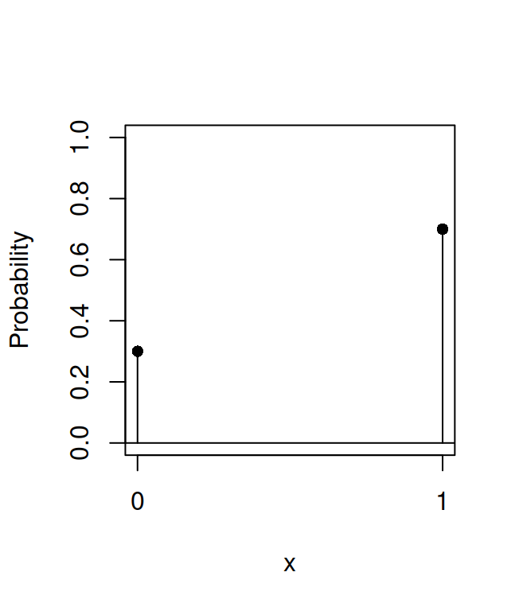
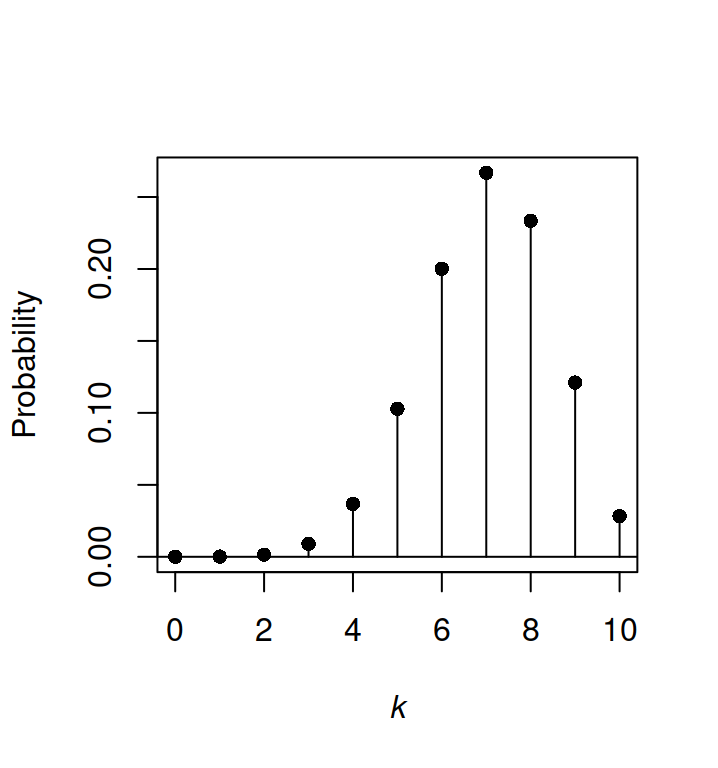
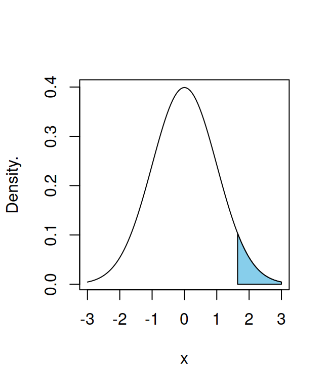
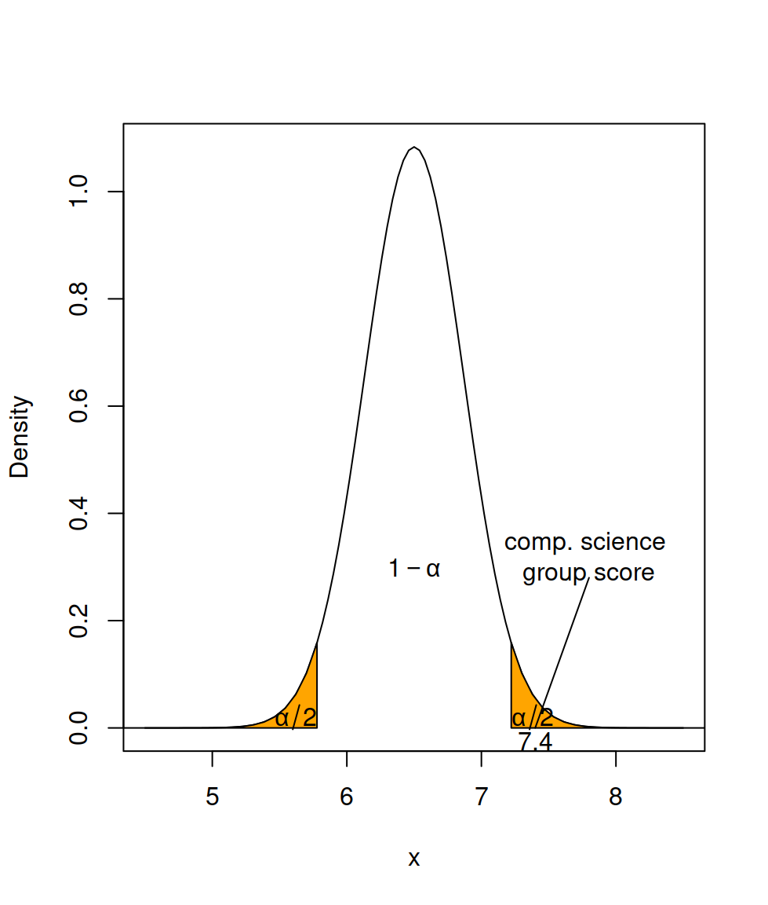

# Probability distributions


## The Bernoulli distribution {#bernoulli}

A random variable $X$ that takes a value of 0 or 1 depending on the result of an experiment that can have only two possible outcomes, follows a Bernoulli distribution. If the probability of one outcome is $p$, the probability of the other outcome will be $p-1$:
$$ P(X=1) = p$$
$$ P(X=0) = p-1$$
The expected value of a Bernoulli random variable is $p$:
$$ E[X]= 1\cdot p + 0\cdot p = p$$
the variance of a Bernoulli random variable is given by:
$$ Var(X) = E[X^2] - E[X]^2 = 1^2\cdot p + 0^2\cdot p - p^2 $$
$$Var(X) = p-p^2 = p\cdot(1-p)$$

Figure \@ref(fig:bernmass) shows the probability mass function of a Bernoulli random variable with $p=0.7$.

<div class="figure">

<p class="caption">(\#fig:bernmass)Probability mass function for a Bernoulli random variable.</p>
</div>

As far as I know, there are no special functions in R for computations related to the Bernoulli distribution (mass function, distribution, and quantile function). However, since the Bernoulli distribution is a special case of the binomial distribution, with the parameter $n$ equal to 1, the R functions for the binomial distribution can be used for the Bernoulli distribution as well. Most of the calculations involved are quite simple anyway. The probability mass function can be calculated as follows:

```r
dbinom(x=0, size=1, prob=0.7)
```

```
## [1] 0.3
```

```r
dbinom(x=1, size=1, prob=0.7)
```

```
## [1] 0.7
```

note that the parameter $n$ of the binomial distribution in R functions is passed through the `size` argument.

The cumulative distribution function can be computed as follows:

```r
pbinom(q=0, size=1, prob=0.7)
```

```
## [1] 0.3
```

```r
pbinom(q=1, size=1, prob=0.7)
```

```
## [1] 1
```

The quantile function can be computed as follows:

```r
qbinom(p=0.3, size=1, prob=0.7)
```

```
## [1] 0
```

```r
qbinom(p=1, size=1, prob=0.7)
```

```
## [1] 1
```

Finally, one can generate a random sample from a Bernoulli distribution as follows:

```r
rbinom(n=10, size=1, prob=0.7)
```

```
##  [1] 1 1 1 1 1 1 0 0 1 0
```

## The binomial distribution {#binomial}

The binomial distribution with parameters $n$ and $p$ represents the number of "successes" in a sequence of $n$ independent Bernoulli trials, each with a $p$ probability of success. The probability mass function is given by Eq. \@ref(eq:binommass):
\begin{equation} 
	P(X=k) = \dbinom{n}{k} p^k (1-p)^{n-k}
	(\#eq:binommass)
\end{equation} 
where $k$ is the number of successes. Figure \@ref(fig:binommass) shows the probability mass function for a binomial random variable with $n=10$, and $p=0.7$.

<div class="figure">

<p class="caption">(\#fig:binommass)Probability mass function for a binomial random variable with $n=10$ and $p=0.7$. The plot shows the probability of obtaining exactly $k$ successes out of $n$ trials.</p>
</div>

In R the probability mass function can be computed via the `dbinom` function. For example, the probability of obtaining exactly 7 success out of 10 trials with $p$ for each trial = 0.7 is:

```r
dbinom(x=7, size=10, prob=0.7)
```

```
## [1] 0.2668279
```

The binomial cumulative distribution function represents the probability of obtaining $\leq k$ successes in $n$ trials in which the probability of success for a single trial is $p$. In R it can be computed with the `pbinom` function. For example, the probability of obtaining $\leq 7$ success in 10 trials, with $p=0.7$ is:

```r
pbinom(q=7, size=10, p=0.7)
```

```
## [1] 0.6172172
```

The quantile function can be computed with the `qbinom` function:

```r
qbinom(p=pbinom(q=7, size=10, prob=0.7), size=10, prob=0.7)
```

```
## [1] 7
```

Random binomial samples can be obtained with the `rbinom` function:

```r
rbinom(n=5, size=10, prob=0.7)
```

```
## [1] 8 6 7 9 8
```

note that `n` here represents the number of samples to draw, while `size` refers to the number of Bernoulli trials of the binomial distribution.

## The normal distribution {#normal}

The desnity function for the normal distribution in R is given by `dnorm`. For example the density function for a value of 0.5 for a normal distribution with a mean of zero and a standard deviation of one can be computed with:

```r
dnorm(x=0.5, mean=0, sd=1)
```

```
## [1] 0.3520653
```

The code below plots a standard normal distribution between -3 and 3 using the `dnorm` function, and shades its right $0.05\%$ tail. The resulting plot is shown in Figure \@ref(fig:norm).

```r
curve(dnorm(x, 0, 1), from=-3, to=3, ylab="Density.")
coord = seq(from=0+qnorm(.95)*1, to=3, length=30)
dcoord = dnorm(coord, 0, 1)
polygon(x=c(0+qnorm(.95)*1, coord, 3),
        y=c(0, dcoord, 0), col = "skyblue")
```

<div class="figure">

<p class="caption">(\#fig:norm)The standard normal distribution</p>
</div>

The cumulative normal distribution function in R is given by `pnorm`. For example `pnorm` can be used to find the probability value associated with a given $z$ point of the standard normal distribution:

```r
pnorm(1.96, mean=0, sd=1)
```

```
## [1] 0.9750021
```

will give the value of the area under the standard normal distribution curve from $-\infty$ to $1.96$.

The quantal function of the normal distribution in R is given by `qnorm`. For a standard normal distribution, `qnorm` gives the *z* point associated with a given probability area under the curve. For example:

```r
qnorm(0.975, mean=0, sd=1)
```

```
## [1] 1.959964
```

### Using the normal distribution to run a *z*-test 

We can use the `pnorm` function to test hypotheses with a *z*-test. Suppose we have a sample of 40 computer science students with a mean short term memory span of $7.4$ digits (that is, they can repeat in sequence, about $7$ digits you read them, without making a mistake), and standard deviation of $2.3$. The mean for the general population is $6.5$ digits, and the variance in the population is unknown. We're interested in seeing if the memory span for computer science students is higher than that of the general population. We'll run a *z*-test as
$$z=\frac{\overline x - \mu_{\overline x} }{\frac{s}{\sqrt{n-1}}}$$
where $\overline x$ is the mean short term memory span for our sample, and $s$ is its standard deviation. The z value for our sample is:

```r
z = (7.4-6.5)/(2.3/sqrt(40-1))
z
```

```
## [1] 2.443695
```

we then get the area under the curve from  $-\infty$ to our *z*-value, which gives us the probability of a score lower than $7.4$:

```r
pnorm(z)
```

```
## [1] 0.9927311
```

To get the *p*-value we subtract that probability value from $1$, this would give us the probability of getting a score equal to or higher than $7.4$ for a one-tailed test. Because we want a two-tailed test instead, we multiply that value by two, to get the *p*-value.

```r
1-pnorm(z) #this would do for a one tailed test
```

```
## [1] 0.007268858
```

```r
(1-pnorm(z))*2 #p-value for two-tailed test
```

```
## [1] 0.01453772
```

  

The `qnorm` command on the other hand, can be used to set confidence limits on the mean, for the example above we would use the following formula:
$$CI= \overline x \pm z_{\alpha/2} \frac{s}{\sqrt{n-1}}$$
to set a $95\%$ confidence interval on the mean short term memory span for the computer science students:


```r
alpha = 0.05
s = (2.3/sqrt(40-1))
zp = (1-alpha/2)
ciup = 7.4 + zp*s
cilow = 7.4 - zp*s
cat("The 95% CI is: \n", cilow, "<", "mu", "<", ciup, "\n")
```

```
## The 95% CI is: 
##  7.040913 < mu < 7.759087
```

The following code summarizes the situation graphically, as shown in Figure \@ref(fig:compscience).


```r
s = (2.3/sqrt(40-1))
up = seq(from = 6.5+qnorm(.975)*s, to = 9.5, length = 30)
low = seq(from =3.5 , to =6.5-qnorm(.975)*s , length = 30)
dup = dnorm(up, 6.5, s)
dlow = dnorm(low, 6.5, s)
curve(dnorm(x, 6.5, s), from= 4.5, to= 8.5, ylab="Density")
polygon(x = c( 6.5+qnorm(.975)*s, up, 9.5),
        y = c(0, dup, 0), col = "orange")
polygon(x = c(3.5,low, 6.5-qnorm(.975)*s),
        y = c(0, dlow, 0), col = "orange")
text(x=c(7.38,5.62), y=c(0.02,0.02), expression(alpha/2))
text(x=c(6.5), y=c(0.3), expression(1-alpha))
lines(x=c(7.8, 7.4), y=c(0.28,0))
text(x=c(7.4), y=c(-0.025), expression(7.4))
text(x=c(7.8), y=c(0.32), "comp. science \ngroup score")
```

<div class="figure">

<p class="caption">(\#fig:compscience)Illustration of the *z*-test for the short term memory span experiment.</p>
</div>

## Further resources

### Related packages

The [distributions3](https://cran.r-project.org/web/packages/distributions3/) package provides an alternative interface to computations of functions related to probability distributions.
