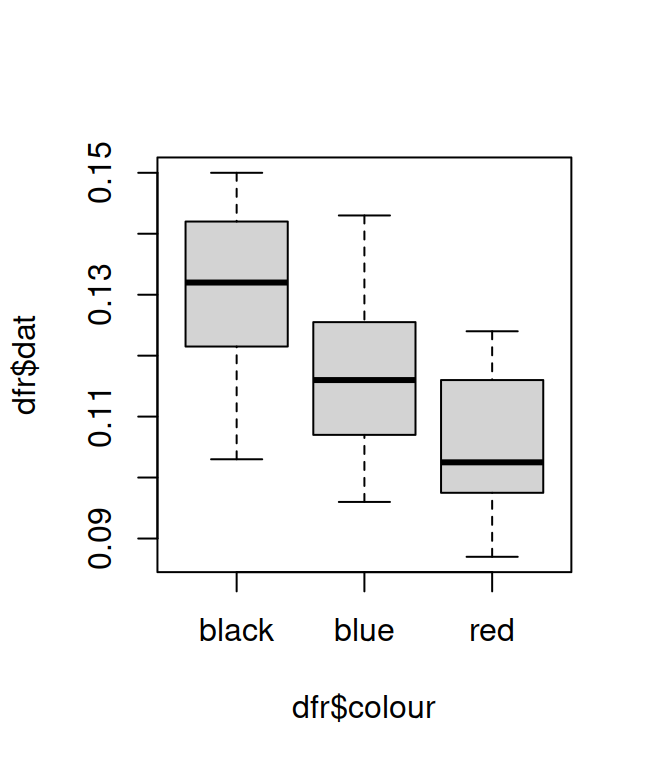

# ANOVA


## One-Way ANOVA

We'll start directly with an example to show how to perform a one-way ANOVA. Let's imagine an experimenter is studying the effects of sleep deprivation on verbal memory. He selects a random sample of healthy subjects, and assigns them to three treatments: 4 hours, 6 hours and 8 hours of total sleep. The subjects are then given a memory test, consisting of a long list of words to remember after a minute of delay from their presentation. The dependent variable is the number of words correctly recalled in a minute time. The data are shown in table \@ref(tab:sleep): 

4 hours   6 hours    8 hours 
--------  ---------  ---------
12        13         15
9         12         17
9         11         15 
8         7          13 
7         14         16 
12        10         17 
8         10         12 
7         10         16 
10        12         14 
7         9          15

Table: (\#tab:sleep) Data for the one-way ANOVA example.

The data are stored in a text file `sleepdep.txt` in the above format, but without any header. First we read in the data with the `scan` function and assign them to a  vector that we'll call `recalled`: 


```r
recalled <- scan("datasets/sleepdep.txt")
```

then we need to create another vector which holds the *level* of the factor "hours of sleep" for each observation. Since our data, stored in the vector "recalled" are organised in an ordered sequence, with observations belonging to treatment 4 h, 6 h, 8 h, etc... repeated 10 times, we need to mimic this structure to create our new vector. We'll use the `rep` function to do this, we'll call our levels 1, 2, and 3 for sake of simplicity.


```r
treatment <- as.factor(rep(1:3, 10))
```

now we'll put the two vectors together into a data frame:


```r
sleepdata <- data.frame(recalled, treatment)
```

well, the data are now in a proper format to perform our analysis of variance, we can call this format "one row per observation", since in each row of our data frame we hold the  value of the dependent variable in one column and the level of the factor that we are manipulating in the other column for a single observation. As for the analysis, we go like this:


```r
aov1 = oneway.test(recalled~treatment, data=sleepdata, var.equal=TRUE)
```

the `summary` function tells R to print out a nicely formatted summary with the results of our analysis. The actual function that performs the analysis is `aov`, and what follows this command is the specification of our model for the analysis. In this case we want to see if the number of words recalled depends on the treatment, the `(recalled ~ treatment)` statement does just this, because the tilde `~` means "explain recalled on the basis of treatment". Finally, the `data` statement specifies the object in which are stored the data for this analysis.

Below there is the summary produced by R for this analysis.


```r
aov1
```

```
## 
## 	One-way analysis of means
## 
## data:  recalled and treatment
## F = 27.838, num df = 2, denom df = 27, p-value = 2.746e-07
```

We have the sums of squares for the treatment effect and for the error term and the F value for the treatment effect with its significance value. Since the p value in this case is very, very small, it is written in scientific notation. However we can use the significance codes given at the bottom of the print out to interpret the p value as very close to zero, at least smaller than 0.001, so it is highly significant. 


## Repeated Measures ANOVA

### One Within Subjects Factor

The syntax for performing a repeated measures ANOVA is a little more complex than the syntax for fully randomised designs. In a repeated measures design we take into account the effects of the subjects on our measures, that is the fact that different subjects will have different different baseline means on a given measure (e.g. on a reaction time test). In this way we are able to tell apart the variability given by inter individual differences between our subjects, from the variability due to the manipulation of one or more independent variables, with a view to identify the latter with more precision. A consequence of this procedure is that while with other designs we used a common error term, in a repeated measures design we have to use different error terms to test the effects we are interested in and we have to specify this in the formula we use with R for `aov`. A good explanation of repeated measures designs in R is given by Baron and Li [@baron03], and what follows in this discussion is mainly inspired by their work.

We will start with a simple example of a repeated measures design with one within subject factor at three levels. Let's imagine we want to test the effects of three different colours on a simple detection task. The data are presented in Table \@ref(tab:rts), and represent subjects' reaction times (measured with a button press) for the detection of squares of three different colours (blue, black and red). Each subject was tested under all the three conditions. The data are store in the file `rts.txt`, with the same format as that shown in the table, but without any header and without the column specifying the subject's number.

Subj  Blue   Black  Red
----  -----  -----  -----
1     0.120  0.132  0.102
2     0.096  0.103  0.087
3     0.113  0.134  0.109
4     0.132  0.147  0.123
5     0.124  0.139  0.124
6     0.105  0.115  0.102
7     0.109  0.129  0.097
8     0.143  0.150  0.119
9     0.127  0.145  0.113
10    0.098  0.117  0.092
11    0.115  0.126  0.098
12    0.117  0.132  0.103

Table: (\#tab:rts) Example for repeated measures ANOVA with one within subjects factor.

We will first read in the data and apply the usual transformations to get the one row per observation format:

```r
dat <- scan("datasets/rts.txt") #read in the data
colour <- as.factor(rep(c("blue","black","red"),12)) #create a factor for colours with 3 lev.
subj <- as.factor(rep(1:12,each=3)) #create factor for subjects
dfr <- data.frame(dat,colour,subj) #put everything in a dataframe
```

Now the data are ready for further analyses. We can first have a look at variability for the three colours by drawing a boxplot.


```r
boxplot(dfr$dat ~ dfr$colour)
```

<div class="figure">

<p class="caption">(\#fig:rts)Boxplot showing the distribution of RTs for the three colours</p>
</div>

As you can see from Figure \@ref(fig:rts), the variability for the three conditions is pretty much the same and the three distributions seems to be approximately normal. The medians for the three distributions seems to differ, our analysis will tell us if these differences are significant.


Below is shown the syntax for the analysis and with its output:

```r
summary(aov(dat ~ colour + Error(subj/colour), data=dfr))
```

```
## 
## Error: subj
##           Df   Sum Sq   Mean Sq F value Pr(>F)
## Residuals 11 0.005386 0.0004897               
## 
## Error: subj:colour
##           Df   Sum Sq   Mean Sq F value   Pr(>F)    
## colour     2 0.003772 0.0018861   95.36 1.45e-11 ***
## Residuals 22 0.000435 0.0000198                     
## ---
## Signif. codes:  0 '***' 0.001 '**' 0.01 '*' 0.05 '.' 0.1 ' ' 1
```

The statement


```r
Error(subj/colour)
```
is a shorthand for


```r
Error(subj + subj:colour)
```

It tells R to partition the residuals into two error terms, one represents the effects of the differences between subjects (`subj`) and the other is the subjects by colour interaction (`subj:colour`) which is the appropriate error term for testing the effects of `colour` on the RTs.

To understand this procedure we have to remember that while in a fully randomised design we use a common error term to test the effects of all the different factors and their interactions, in a repeated measures design we have to split up this error term into different partitions, some of which we will use to test the effects of our factors and their interactions.

In the case at hand the subjects' error term will not be used to test any effects, it will just be subtracted from the common residuals entry, so that the variability due to differences between subjects doesn't inflate the error term we will use to test for the effects of colours. The subjects' error terms is in this case just the Sum of Squares Between. 

The second error term, the subject by colour interaction is the one we want to use to test for the effects of `colour`. This term is what's left from the Sum of Squares Total once you have subtracted the effects do to the subjects and the effects due to the colour, so in the specific design of this experiment it represents just random variability, errors, (A subject is faster with blue stimuli and gets depressed with black ones, while another subject does just the opposite?! We're not interested in these differences in this experiment, though we might want to test similar effects in other case. So for this time this interaction is just errors.)

All this is quite tricky at first. Don't worry, remember as a rule of thumb that in a repeated measures design with R you have to add the `Error()` term to the formula, and this error term is defined as `subjects/your within subj factors`. More examples with Between and Within Subjects factors will be presented in the next sections.

As for the results of this analysis, the *F* statistics for the colour effect is significant. The RTs for detecting stimuli of these three different colours are different.


### Two Within Subjects Factors

The basic principles for running a repeated measures ANOVA with more than one within subject factors are the same as in the case of a within subjects factor only, with just some further complications due to the fact that now we also want to test for interactions between our factors. We'll start straight with an example. Let's say your data look something like the ones in Table \@ref(tab:rats),

Drug Alchohol  Drug No-Alcohol  No-Drug Alcohol  No-Drug No-Alcohol
-------------  ---------------  ---------------  ------------------
7              6                6                4 
5              4                5                2 
8              7                7	             4 
8              8                6	             5 
6              5                5	             3 
8              7                7	             6 
5          	   5                5	             4 
7          	   6                6	             5 
8          	   7                6	             5 
7          	   6                5	             4 
9          	   8                5	             4 
4          	   4                3	             2 
7          	   7                5	             3 
7          	   5                5	             0 
8          	   7                6	             3

Table: (\#tab:rats) Data for the repeated measures ANOVA example.

imagining that you have 15 rats exposed to two factors (Alcohol and Drug), with two levels each (administered and not-administered), and the dependent variable is the number of social interaction in a cage with other rats. Here each row represents a subject, you need to reorganise the data so that each row contains a single observation, and the different columns represent:

- an identifier for the subject 
- the values of the dependent variable (the data that you see in the table) 
- the level of the first factor for each observation 
- the level of the second factor for each observation

The measures you have collected are stored in a text file `rats.txt`, in the format of the table above, but with no header and no number indicating each subject. The first thing we can do, is to read in these data in R as a number vector:


```r
socialint <- scan("datasets/rats.txt")
```

then we need a column specifying  to which subject, each observation of the `socialint` vector belongs to. In addition, we want this new vector to be considered as a factor vector rather than as numerical vector. We can use the `rep()} function to do this:


```r
subj <- as.factor(rep(1:15, each = 4))
```

next we need to specify in a new vector the levels of the first factor for each observation. If we use a character vector to store the levels of the factor, it is not necessary to use the `as.factor()` command, as later, when we will put the all the vectors in a data frame, R will automatically interpret character vectors as factors.


```r
alcohol <- rep(c("Al","No-Al"), 30)
```

we do basically the same for the second factor:


```r
drug <- rep( c("Drug","No-Drug"), 15, each = 2)
```

It's almost done, we need now to put all this vectors in a data frame:


```r
rats <- data.frame (subj, socialint, alcohol, drug)
```

Done! Now the analysis:


```r
aovRats = summary(aov(socialint ~ alcohol * drug + Error(subj/(alcohol * drug)),
                      data = rats))
```

the above formula specifies our model for the analysis, we are telling R we want to explain the variable `socialint` by the effects of the factors `alcohol`, `drug` and their interaction, in the case of a repeated measures ANOVA however, we also have to specify the error terms that R will use to calculate the F statistics. The statement


```r
Error(subj/(alcohol * drug))
```

is a shorthand for


```r
Error(subj + subj:alcohol + subj:drug + subj:alcohol:drug)
```

Again, as in the example with only one within subjects factor, we are telling R to partition  the residuals into different error terms. The first is the effect due to differences between subjects. It will not be used to test any effects, it will just be subtracted from the residuals to compute the other error terms. The `subj:alcohol` and the `subj:drug` interactions are the error terms to be used to test the effects of `alcohol` and `drug` respectively, while the `subj:alcohol:drug` interaction will be used to test the interaction between between `alcohol` and `drug`. Below there is the output from the analysis:


```r
aovRats
```

```
## 
## Error: subj
##           Df Sum Sq Mean Sq F value Pr(>F)
## Residuals 14  69.43    4.96               
## 
## Error: subj:alcohol
##           Df Sum Sq Mean Sq F value  Pr(>F)    
## alcohol    1 26.667  26.667   42.26 1.4e-05 ***
## Residuals 14  8.833   0.631                    
## ---
## Signif. codes:  0 '***' 0.001 '**' 0.01 '*' 0.05 '.' 0.1 ' ' 1
## 
## Error: subj:drug
##           Df Sum Sq Mean Sq F value   Pr(>F)    
## drug       1   60.0   60.00   57.93 2.43e-06 ***
## Residuals 14   14.5    1.04                     
## ---
## Signif. codes:  0 '***' 0.001 '**' 0.01 '*' 0.05 '.' 0.1 ' ' 1
## 
## Error: subj:alcohol:drug
##              Df Sum Sq Mean Sq F value   Pr(>F)    
## alcohol:drug  1  4.267   4.267   18.47 0.000736 ***
## Residuals    14  3.233   0.231                     
## ---
## Signif. codes:  0 '***' 0.001 '**' 0.01 '*' 0.05 '.' 0.1 ' ' 1
```

As you can see R splits the summary into different sections, based on the partition of the error terms that we have specified. Each effect is then tested against its appropriate error term.

The results tell us that there is a significant effect of both the `alcohol` and the `drug` factors, as well as their interaction. 

### Two Within Subjects Factors and One Between

Now let's see the case in which we also have a between subjects factor. Suppose we want to run again the experiment on the effects of alcohol and drug on the social interactions in rats, but this time we want to use two different species of rats, the yuppy rats and the kilamany rats, as we have reasons to believe that the kilamany will have different reactions to alcohol and drugs from the yuppy, that is the species that we had tested before. So we manage to gather 8 rats from each species and run our experiment. The results are shown in Table \@ref(tab:ratsbetween).


Species   Drug Alchohol  Drug No-Alcohol  No-Drug Alcohol  No-Drug No-Alcohol
--------  -------------  ---------------  ---------------  ------------------
Yuppy     7          	 6                6                4 
Yuppy     5           	 4                5                2 
Yuppy     8          	 7                7	               4 
Yuppy     8          	 8                6	               5 
Yuppy     6          	 5                5	               3 
Yuppy     8          	 7                7	               6 
Yuppy     5          	 5                5	               4 
Yuppy     7          	 6                6	               5 
Kalamani  7          	 6                6                4 
Kalamani  5          	 4                5                2 
Kalamani  8          	 7                7	               4 
Kalamani  8          	 8                6	               5 
Kalamani  6          	 5                5	               3 
Kalamani  8          	 7                7	               6 
Kalamani  5          	 5                5	               4 
Kalamani  7          	 6                6	               5 

Table: (\#tab:ratsbetween) Data for the repeated measures ANOVA example with two within-subject factors and one between-subject factor.

the data are in the file `two_within_one_between.txt`, in each row of this file are recorded the number of social interactions for a rat under the 4  experimental conditions it participated in. We need to get the "one row per observation format":


```r
socialint <- scan("datasets/two_within_one_between.txt")
subj <- rep(1:16,each=4)  ##read in the data
subj <- as.factor(subj)
alcohol <- rep(c("Al","No-Al"),32)
alcohol <- as.factor(alcohol)
drug <- rep(c("Drug","No-Drug"),16,each=2)
drug <- as.factor(drug)
group <- rep(c("Yuppy","Kalamani"),each=32)
group <- as.factor(group)
dats <- data.frame(subj,socialint,alcohol,drug,group)
```

now the ANOVA


```r
summary(aov(socialint~alcohol*drug*group + Error(subj/(alcohol*drug)),
            data=dats))
```

```
## 
## Error: subj
##           Df Sum Sq Mean Sq F value Pr(>F)
## group      1   2.25   2.250   0.462  0.508
## Residuals 14  68.25   4.875               
## 
## Error: subj:alcohol
##               Df Sum Sq Mean Sq F value   Pr(>F)    
## alcohol        1 22.562  22.562  22.766 0.000298 ***
## alcohol:group  1  0.062   0.062   0.063 0.805367    
## Residuals     14 13.875   0.991                     
## ---
## Signif. codes:  0 '***' 0.001 '**' 0.01 '*' 0.05 '.' 0.1 ' ' 1
## 
## Error: subj:drug
##            Df Sum Sq Mean Sq F value   Pr(>F)    
## drug        1  60.06   60.06  81.048 3.38e-07 ***
## drug:group  1   5.06    5.06   6.831   0.0204 *  
## Residuals  14  10.38    0.74                     
## ---
## Signif. codes:  0 '***' 0.001 '**' 0.01 '*' 0.05 '.' 0.1 ' ' 1
## 
## Error: subj:alcohol:drug
##                    Df Sum Sq Mean Sq F value  Pr(>F)   
## alcohol:drug        1    4.0    4.00      16 0.00132 **
## alcohol:drug:group  1    0.0    0.00       0 1.00000   
## Residuals          14    3.5    0.25                   
## ---
## Signif. codes:  0 '***' 0.001 '**' 0.01 '*' 0.05 '.' 0.1 ' ' 1
```


