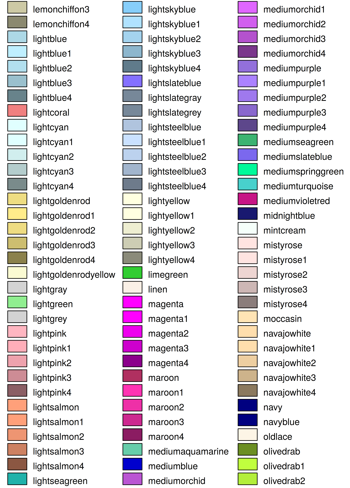

# Full colors table {#fullcoltable}

All named colors are listed below:

(\#fig:fullcoltab1)Complete color table, part I.

(\#fig:fullcoltab2)Complete color table, part II.

(\#fig:fullcoltab3)Complete color table, part III.

(\#fig:fullcoltab4)Complete color table, part IV.

(\#fig:fullcoltab5)Complete color table, part V.

(\#fig:fullcoltab6)Complete color table, part VI.

(\#fig:fullcoltab7)Complete color table, part VII.

# References {-}

