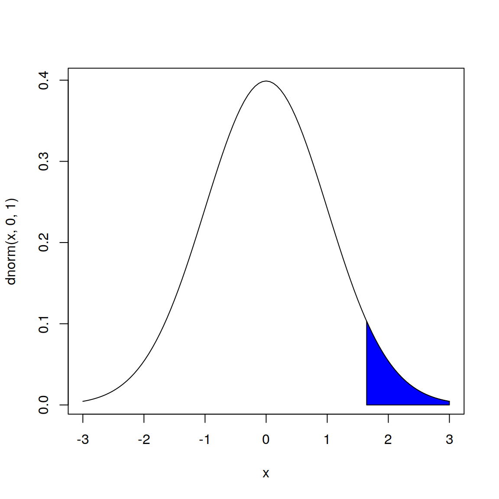
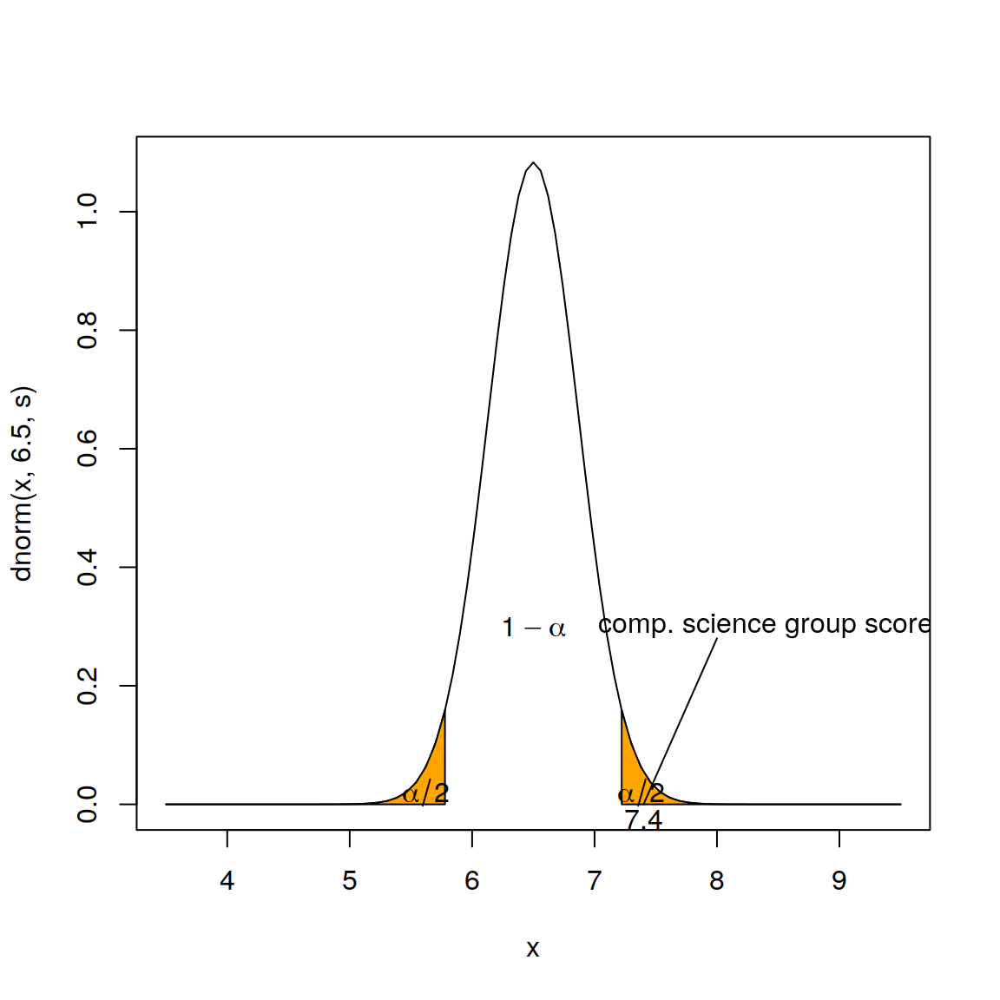

# Probability Distribution Functions


## The Bernoulli distribution {#bernoulli}

A random variable $X$ that takes a value of 0 or 1 depending on the result of an experiment 
that can have only two possible outcomes, follows a Bernoulli distribution. If the probability
of one outcome is $p$, the probability of the other outcome will be $p-1$:
$$ P(X=1) = p$$
$$ P(X=0) = p-1$$
The expected value of a Bernoulli random variable is $p$:
$$ E[X]= 1\cdot p + 0\cdot p = p$$
the variance of a Bernoulli random variable is given by:
$$ Var(X) = E[X^2] - E[X]^2 = 1^2\cdot p + 0^2\cdot p - p^2 =$$
$$Var(X) = p-p^2 = p\cdot(1-p)$$

As far as I know, there are no special functions in R for computations related to the Bernoulli distribution (density, distribution, and quantile function). However, since the Bernoulli distribution is a special case of the binomial distribution, with parameter \emph{size} equal to 1, the R functions for the binomial distribution can be used for the Bernoulli distribution as well. Most of the calculations involved are quite simple anyway.
The density function can be calculated as follows:


```r
dbinom(x=0, size=1, prob=0.7)
```

```
## [1] 0.3
```

```r
dbinom(x=1, size=1, prob=0.7)
```

```
## [1] 0.7
```

The cumulative distribution function can be computed as follows:


```r
pbinom(q=0, size=1, prob=0.7)
```

```
## [1] 0.3
```

```r
pbinom(q=1, size=1, prob=0.7)
```

```
## [1] 1
```

The quantile function can be computed as follows:


```r
qbinom(p=0.3, size=1, prob=0.7)
```

```
## [1] 0
```

```r
qbinom(p=1, size=1, prob=0.7)
```

```
## [1] 1
```

Finally, one can generate a random sample from a Bernoulli
distribution as follows:


```r
rbinom(n=10, size=1, prob=0.7)
```

```
##  [1] 0 1 1 0 1 0 1 0 0 1
```

## The binomial distribution {#binomial}


## The normal distribution {#normal}

#### pnorm
You can use the `pnorm` command to find out the probability value associated with a given z point in the normal distribution. For example:

```r
pnorm(1.96)
```

```
## [1] 0.9750021
```
will give the value of the area under the normal distribution curve from $-\infty$ to $1.96$.

#### qnorm
The `qnorm` command is the inverse of the `pnorm` command, in that it gives the z point associated with a given probability area under the normal curve. For example:

```r
qnorm(0.975)
```

```
## [1] 1.959964
```

#### dnorm
The `dnorm` function provides the density function for the normal distribution. Using the `dnorm` function we can for example make a nice plot of a normal distribution with mean equal to $0$ and a standard deviation of $1$ and colour its extreme right $0.05\%$ tail with the following code. The result is displayed in Figure \@ref(fig:norm)


```r
curve(dnorm(x,0,1), from=-3, to=3)
coord <- seq(from=0+qnorm(.95)*1, to=3, length=30)
dcoord <- dnorm(coord, 0, 1)
polygon(x=c(0+qnorm(.95)*1, coord, 3),
        y=c(0, dcoord, 0), col = "blue")
```

<div class="figure">

<p class="caption">(\#fig:norm)The normal distribution</p>
</div>

We can use the `pnorm` function to test hypotheses with a z-test. Suppose we have a sample of 40 computer science students with a mean short term memory span of $7.4$ digits (that is, they can repeat in sequence, about $7$ digits you read them, without making a mistake), and standard deviation of $2.3$. The mean for the general population is $6.5$ digits, and the variance in the population is unknown. We're interested in seeing if the memory span for computer science students is higher than that of the general population. We'll run a z-test as$$z=\frac{\overline x - \mu_{\overline x} }{\frac{s}{\sqrt{n-1}}}$$
where $\overline x$ is the mean short term memory span for our sample, and $s$ is its standard deviation.

```r
z <- (7.4-6.5)/(2.3/sqrt(40-1))
z
```

```
## [1] 2.443695
```

```r
pnorm(z)
```

```
## [1] 0.9927311
```

```r
1-pnorm(z) #this would do for a one tailed test
```

```
## [1] 0.007268858
```

```r
(1-pnorm(z))*2
```

```
## [1] 0.01453772
```

so the z value for our sample is $2.443695$, we then get the area under the curve from  $-\infty$ to our z-value, which gives us the probability of a score lower than $7.4$. To get the p-value we subtract that probability value from $1$, this would give us the probability of getting a score equal to or higher than $7.4$ for a one tailed test. Since we want a two-tailed test instead, we multiply that value by two, to get our p-value, which is nonetheless significant. 

The `qnorm` command on the other hand, can be used to set confidence limits on the mean, for the example above we would use the following formula:
$$CI= \overline x \pm z_{\alpha/2} \frac{s}{\sqrt{n-1}}$$
to set a $95\%$ confidence interval on the mean short term memory span for the computer science students:


```r
alpha <- 0.05
s <- (2.3/sqrt(40-1))
zp <- (1-alpha/2)
ciup <- 7.4+zp*s
cilow <- 7.4-zp*s
cat("The 95% CI is: \n",cilow,"<","mu","<",ciup,"\n")
```

```
## The 95% CI is: 
##  7.040913 < mu < 7.759087
```

The following code summarises the situation graphically, as shown in Figure \@ref(fig:compscience)


```r
s <- (2.3/sqrt(40-1))
up <- seq(from = 6.5+qnorm(.975)*s, to = 9.5, length = 30)
low <- seq(from =3.5 , to =6.5-qnorm(.975)*s , length = 30)
dup <- dnorm(up,6.5,s)
dlow <-dnorm(low,6.5,s)
curve(dnorm(x,6.5,s), from= 3.5, to= 9.5)
polygon(x = c( 6.5+qnorm(.975)*s, up, 9.5),
        y = c(0, dup, 0), col = "orange")
polygon(x = c(3.5,low, 6.5-qnorm(.975)*s),
        y = c(0, dlow, 0), col = "orange")
text(x=c(7.38,5.62),y=c(0.02,0.02),expression(alpha/2))
text(x=c(6.5),y=c(0.3),expression(1-alpha))
lines(x=c(8,7.4),y=c(0.28,0))
text(x=c(7.4),y=c(-0.025),expression(7.4))
text(x=c(8.4),y=c(0.3),"comp. science group score")
```

<div class="figure">

<p class="caption">(\#fig:compscience)Short term memory span experiment, z-test</p>
</div>

