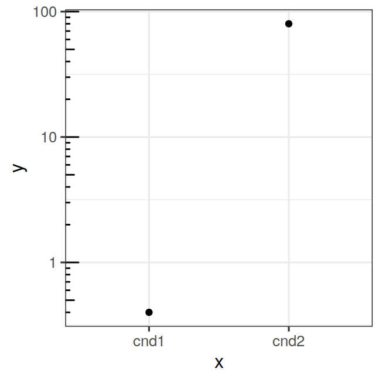

# ggplot2 {#ggplot2}


The book "ggplot2. Elegant graphics for data analysis" [@Wickham2009] is the best
reference for learning ggplot2

Other useful resources include:

- AVML 2012: ggplot2 http://www.ling.upenn.edu/~joseff/avml2012/ by
  Josef Fruehwald. This is one of the best introductions to ggplot2,
  highly recommended! There is a more recent version of this tutorial
  also here: http://jofrhwld.github.io/teaching/courses/2017_lvc/practicals/7_practical_r.html#inheritance

All the examples in this chapter assume that ggplot2 has been
installed and is loaded in your R session. If not, you can install it with:

```r
install.packages("ggplot2")
```

and load it with:


```r
library(ggplot2)
```

### Log axis with pretty tickmarks


```r
x = c("cnd1", "cnd2")
y = c(0.4, 80)

dat = data.frame(x=x, y=y)

p = ggplot(dat, aes(x=x, y=y)) + geom_point()
p = p + scale_y_continuous(trans="log10")
p = p + annotation_logticks(sides="l")
p = p + theme_bw(base_size=12)
p
```

<div class="figure">

<p class="caption">(\#fig:unnamed-chunk-3)log axis with pretty tickmarks</p>
</div>
