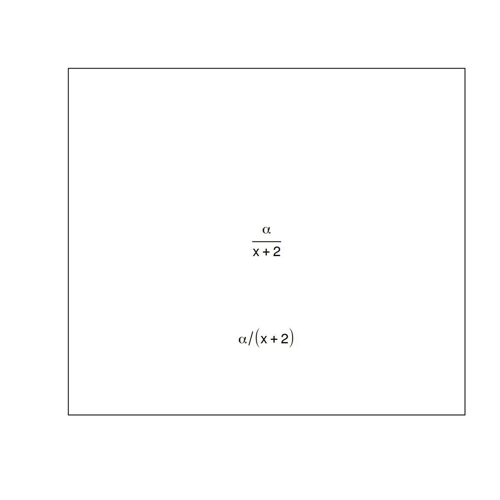
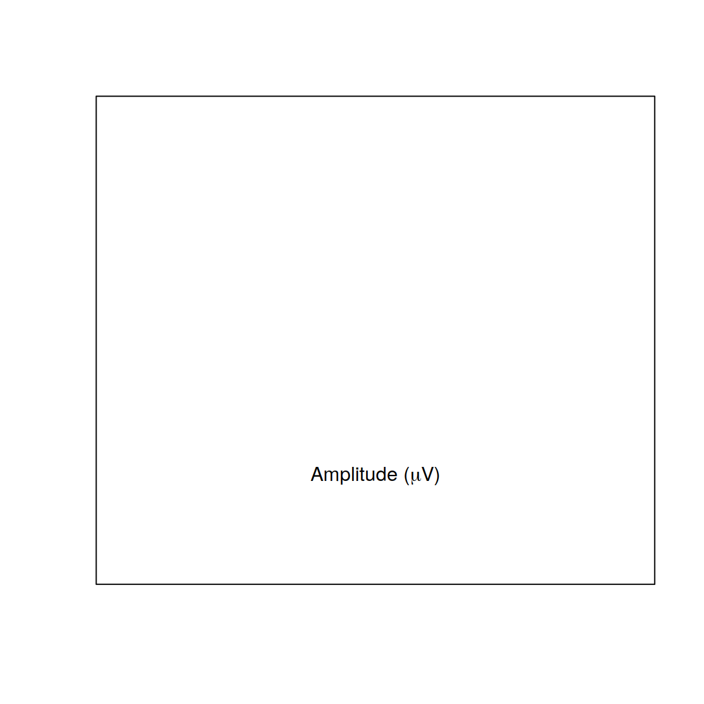
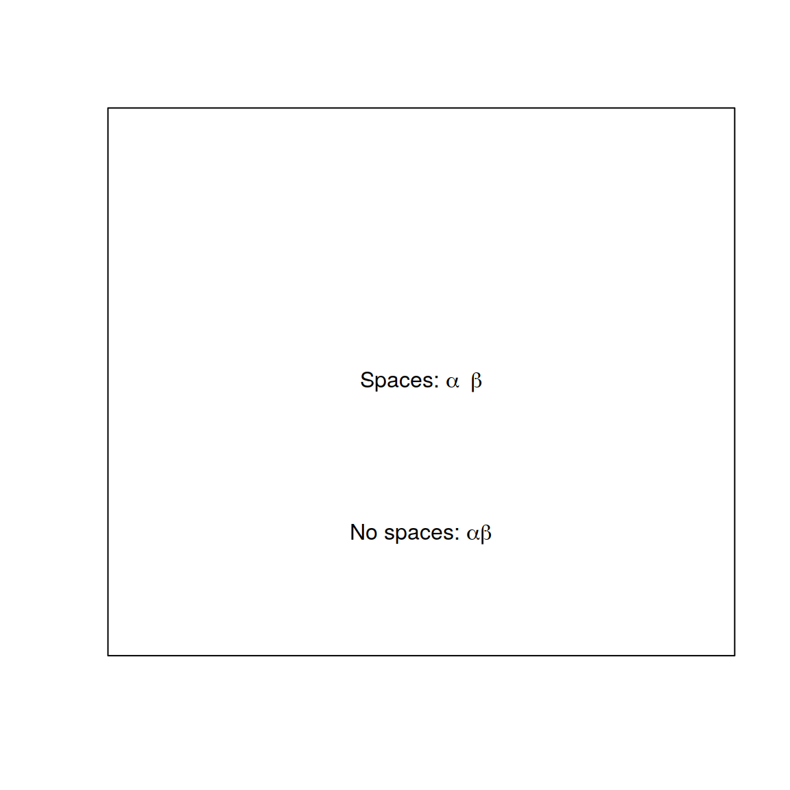
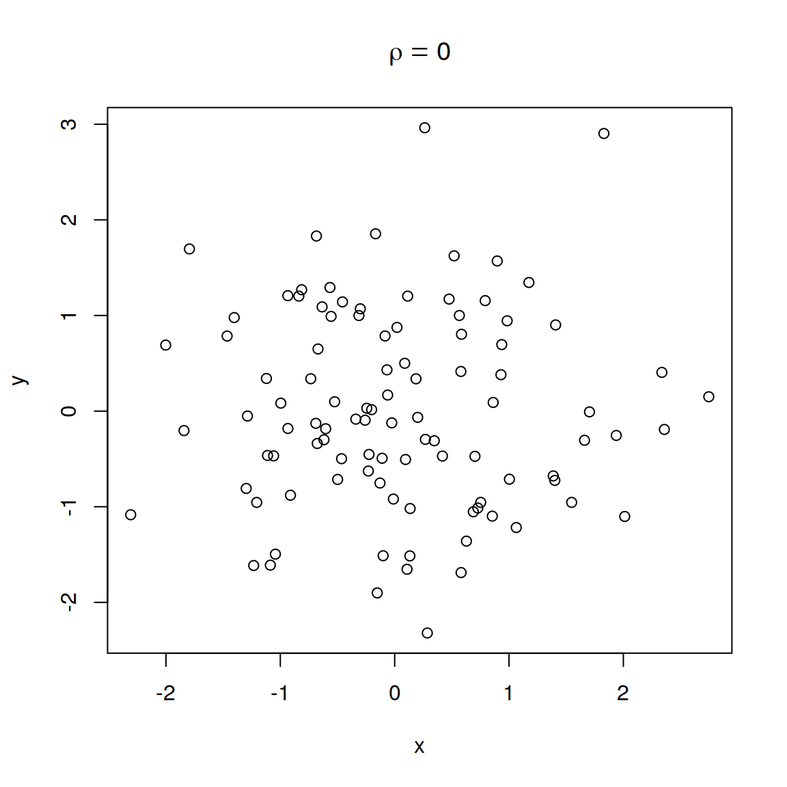
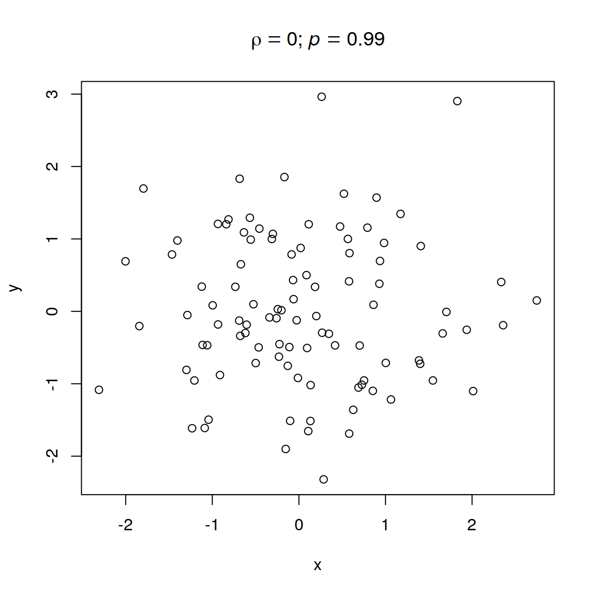
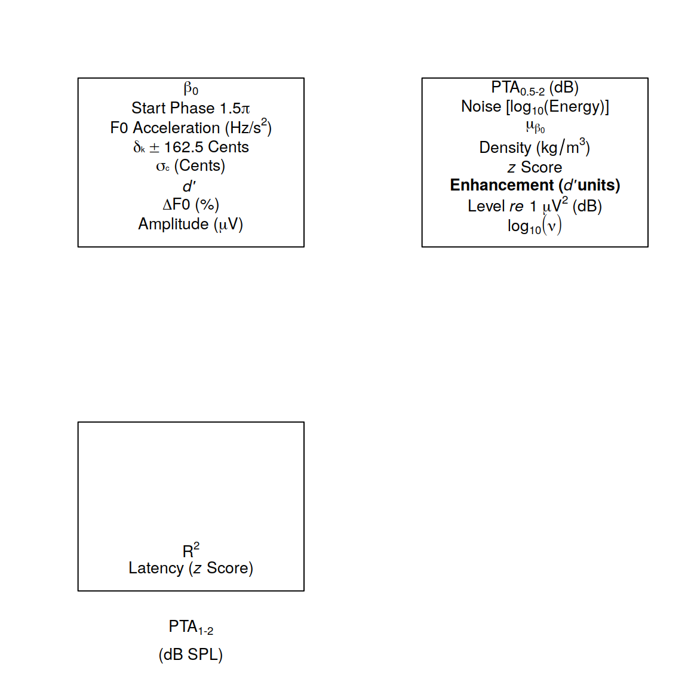

# Graphics labels and text


## Mathematical expressions and variables

It is possible to use mathematical symbols in plot labels and text. The base system for providing math symbols in plot annotations has been described by @MurrellAndIhaka2000, which is a recommended reading. An overview of the system with a comprehensive list of all the symbols can be obtained with `?plotmath`. I don't find the system particularly intuitive, and can't claim to fully understand its inner workings, but I'll nevertheless attempt to explain in rough terms how it works.

The basic idea is that instead of providing a string to `text`, `xlab` or other functions through which you want to plot some text, you provide an `expression`, in the sense of a mathematical expression. Two examples are given below:

```r
plot.new(); plot.window(xlim=c(4, 6), ylim=c(0, 5))
text(5, 1, labels=expression(alpha/(x+2)))
text(5, 2.5, labels=expression(frac(alpha, x+2)))
box()
```



note how `alpha` is turned into the corresponding Greek letter. Often you'll want to combine strings with mathematical expressions in labels. This can be achieved using the `paste` function, as shown below:

```r
plot.new(); plot.window(xlim=c(4, 6), ylim=c(0, 5))
text(5, 1, labels=expression(paste("Amplitude (", mu, "V)")))
box()
```



Strings and mathematical expressions can also be combined using the multiplication (`*`) operator (e.g. `expression("Amplitude (" * mu * "V)")`), but this seems somewhat improper and runs into limitations. For example `expression(alpha == 3 * beta == 2)` results in an error, probably because it is not a valid mathematical expression, while `expression(paste(alpha == 3, beta == 2))` works without errors.

Spaces between symbols can be obtained by using one or more tilde (`~`) operators, as shown below:

```r
plot.new(); plot.window(xlim=c(4, 6), ylim=c(0, 5))
text(5, 1, labels=expression(paste("No spaces: ", alpha * beta)))
text(5, 2.5, labels=expression(paste("Spaces: ", alpha ~ beta)))
box()
```



Sometimes you may want to print the value of a variable inside the expression of a plot label. In this case you can use the `substitute` function:

```r
x = rnorm(100); y=rnorm(100)
corrOut = cor.test(x,y)
corrEst = corrOut$estimate
corrPVal = corrOut$p.value
plot(x,y)
title(main=substitute(rho == v1, list(v1=round(corrEst,2))))
```



the second argument to the function is a list of all the variable values that need to be substituted. In the example below two values are substituted:

```r
plot(x,y)
title(main=substitute(paste(rho == v1, "; ", italic(p) == v2),
                      list(v1=round(corrEst,2), v2=round(corrPVal, 2))))
```



A few more example of mathematical expressions in labels are given below:

```r
uVText = expression(paste("Amplitude (", mu, "V)"))
dF0Text = expression(paste( Delta, 'F0 (%)'))
dpText = expression(paste(italic("d' ")))
subText1 = expression(paste(sigma, scriptscriptstyle(c), " (Cents)"))
subText2 = expression(paste(delta, scriptscriptstyle(k)  %+-% 162.5,
                            ' Cents', sep=''))
sqText = expression(paste('F0 Acceleration (Hz/', s^2, ')'))
piText = expression(paste('Start Phase 1.5', pi,))
betaText = expression(beta[0])
log10Text = expression(log[10](nu))
uVsqText = expression(paste('Level ', italic('re'), ' 1 ',
                            mu, V^{2}, ' (dB)'))
bdText = expression(paste( bold("Enhancement ("),
                          italic("d'"), bold("units)")))
zScoreText = expression(paste(italic(z), " Score"))
densText = expression(paste("Density (", kg/m^3, ")"))
beta2Text = expression(mu[beta[0]])
noiseText = expression(paste("Noise [", log[10], "(Energy)]"))
PTAText = expression(paste("PTA"["0.5-2"], " (dB)"))
RSqText = expression("R"^"2")
atopText = expression(atop("PTA"["1-2"],"(dB SPL)"))
latencyText = expression(paste("Latency (", italic(z),
                               " Score)"))

par(mfrow=c(2,2))

plot.new(); plot.window(xlim=c(0, 10), ylim=c(0, 10))
text(5, 1.00, labels=uVText)
text(5, 2.25, dF0Text)
text(5, 3.50, dpText)
text(5, 4.75, subText1)
text(5, 6.00, subText2)
text(5, 7.25, sqText)
text(5, 8.5, piText)
text(5, 9.75, betaText)
box()

plot.new(); plot.window(xlim=c(0, 10), ylim=c(0, 10))
text(5, 1.00, labels=log10Text)
text(5, 2.25, uVsqText)
text(5, 3.50, bdText)
text(5, 4.75, zScoreText)
text(5, 6.00, densText)
text(5, 7.25, beta2Text)
text(5, 8.5, noiseText)
text(5, 9.75, PTAText)
box()

plot.new(); plot.window(xlim=c(0, 10), ylim=c(0, 10))
text(5, 1.00, labels=latencyText)
text(5, 2.25, RSqText)
text(5, 3.50, "")
text(5, 4.75, "")
text(5, 6.00, "")
text(5, 7.25, "")
text(5, 8.5, "")
text(5, 9.75, "")
box()
title(xlab=atopText)
```




